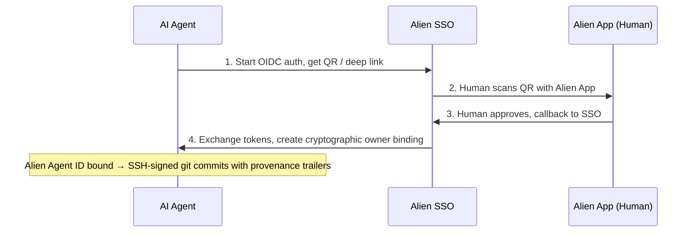
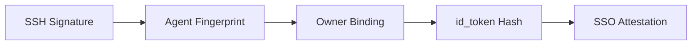

<p align="center">
  
</p>

<h1 align="center">Alien Agent ID</h1>

<p align="center">
  Verifiable cryptographic identity for AI agents, linked to human owners<br>
  via <a href="https://alien.org">Alien Network</a> SSO.
</p>

When an AI agent has an Alien Agent ID, every git commit it makes is SSH-signed and carries trailers
that trace back to the specific agent and the human who authorized it. The provenance chain is
fully verifiable: **commit → agent key → owner binding → SSO attestation → verified AlienID holder**.

## Table of Contents

- [How It Works](#how-it-works)
- [Quick Start (Claude Code)](#quick-start)
- [What a Signed Commit Looks Like](#what-a-signed-commit-looks-like)
- [Verifying Provenance](#verifying-provenance)
- [Service Authentication](#service-authentication)
- [Credential Vault](#credential-vault)
- [Session Refresh](#session-refresh)
- [Prerequisites](#prerequisites)
- [Agent State](#agent-state)
- [CLI Commands](#cli-commands)
- [Security](#security)

---

## How It Works



1. Agent starts OIDC auth, gets a QR code / deep link
2. Human scans QR with Alien App
3. Human approves, Alien App calls back to SSO
4. Agent exchanges tokens, creates cryptographic owner binding

The agent now has an Ed25519 keypair with a signed binding proving a verified human authorized it.

---

## What's in the Box

| Path | Purpose |
| --- | --- |
| `skills/alien-agent-id/SKILL.md` | Instructions for AI agents — point your agent here |
| `skills/alien-agent-id/cli.mjs` | CLI tool — all agent operations |
| `skills/alien-agent-id/lib.mjs` | Portable library — crypto, OIDC, signing engine, verification (zero npm deps) |
| `skills/alien-agent-id/qrcode.cjs` | Vendored QR code generator (terminal output) |
| `skills/alien-agent-id/default-provider.txt` | Default SSO provider address |
| `docs/AGENT-SSO.md` | System documentation for humans |
| `docs/INTEGRATION.md` | Integration guide for service providers |
| `tests/test-refresh.mjs` | Test suite for session refresh flow |
| `package.json` | Minimal metadata |

---

## Quick Start

### 1. Install the skill

```bash
npx skills add alien-id/agent-id
```

#### Claude Code only

Alternatively, install via the plugin marketplace:

```text
/plugin marketplace add alien-id/agent-id
/plugin install alien-agent-id@alien-agent-id
/reload-plugins
```

Sometimes the reload does not work properly the first time — restarting
Claude usually helps.

### 2. Set up your Alien Agent ID

When the plugin is loaded, run the skill:

```text
/alien-agent-id
```

Follow the instructions — the agent will generate a keypair, show a
QR code, and wait for you to approve in the Alien App. Once done,
your Alien Agent ID is created and bound.

### 3. Add the signing key to GitHub

The agent will output an SSH public key after setup. Add it to your
GitHub account:

Go to GitHub → Settings → SSH and GPG keys → New SSH key →
Key type: **Signing Key**.
Commits will then show a "Verified" badge.

### 4. Use the skill to commit and push

You can pass arguments to the skill for common operations:

```text
/alien-agent-id stage, commit and push all files in the repo, follow previous commits naming convention
```

### Other agents

Any agent with shell access can use `skills/alien-agent-id/SKILL.md` directly. The agent
needs Node.js 18+, git 2.34+, and permission to run
`node skills/alien-agent-id/cli.mjs ...` commands.

---

## What a Signed Commit Looks Like

```text
✓ Verified  — This commit was signed with the committer's verified signature.

feat: implement auth flow

Agent-ID-Fingerprint: 945d41991dac118776409673019ed0fba36e13fc9d6b5534145f9e31128a3ec6
Agent-ID-Owner: 00000003010000000000539c741e0df8
Agent-ID-Binding: a1b2c3d4-e5f6-7890-abcd-ef1234567890
```

Anyone can trace: **this code** → **this agent** (fingerprint) → **this human** (owner session)
→ **verified AlienID holder**.

Each `git-commit` also attaches a **proof bundle** as a git note (`refs/notes/agent-id`)
containing the agent's public key, owner binding, and base64url-encoded SSO id_token — everything
needed for anyone to verify the provenance chain without access to the agent's local state.

---

## Verifying Provenance

```bash
node skills/alien-agent-id/cli.mjs git-verify --commit HEAD
```

Verification is **self-contained** — `git-commit` attaches a proof bundle as a git note
(`refs/notes/agent-id`) containing the agent's public key, owner binding, and base64url-encoded
SSO id_token. Anyone
who clones the repo and fetches the notes can verify the full chain without access to the agent's
machine.

```bash
# Fetch proof notes from remote
git fetch origin refs/notes/agent-id:refs/notes/agent-id

# Verify any commit
node skills/alien-agent-id/cli.mjs git-verify --commit abc123
```

### Verification chain



1. **SSH signature** — commit is signed, verified against the agent's public key from the proof note
2. **Agent fingerprint** — public key hash matches the `Agent-ID-Fingerprint` trailer
3. **Owner binding** — Ed25519-signed by the agent, links agent to human owner
4. **id_token hash** — binding contains the hash of the SSO id_token, proving they're linked
5. **SSO attestation** — id_token RS256 signature verified against Alien SSO's JWKS

Falls back to the agent's local state (`~/.agent-id/`) if no git note is found.

---

## Service Authentication

Agents can authenticate to Alien-aware services using self-issued Ed25519 signed tokens:

```bash
# Generate a signed auth header (valid for 5 minutes)
node skills/alien-agent-id/cli.mjs auth-header --raw
# → Authorization: AgentID eyJ...

# Use in API calls
AUTH=$(node skills/alien-agent-id/cli.mjs auth-header --raw)
curl -H "$AUTH" https://service.example.com/api/whoami
```

The token is self-contained — it includes the agent's public key, fingerprint, owner identity,
owner proof chain, and an Ed25519 signature. Services verify tokens using
[`@alien-id/sso-agent-id`](https://www.npmjs.com/package/@alien-id/sso-agent-id) with no
prior key registration needed.

---

## Credential Vault

The vault stores credentials for external services (GitHub, AWS, Slack, etc.) encrypted
with AES-256-GCM. The encryption key is derived from the agent's Ed25519 private key via
HKDF — only the agent that stored the credential can decrypt it.

```bash
# Store a credential (most secure — from file)
echo 'ghp_xxx' > /tmp/tok && chmod 600 /tmp/tok
node skills/alien-agent-id/cli.mjs vault-store --service github --type api-key --credential-file /tmp/tok
rm /tmp/tok

# Store from environment variable
node skills/alien-agent-id/cli.mjs vault-store --service github --type api-key --credential-env GITHUB_TOKEN

# Retrieve
node skills/alien-agent-id/cli.mjs vault-get --service github
# → {"ok": true, "service": "github", "type": "api-key", "credential": "ghp_xxx..."}

# List all stored credentials (no secrets shown)
node skills/alien-agent-id/cli.mjs vault-list

# Remove
node skills/alien-agent-id/cli.mjs vault-remove --service github
```

Supported credential types: `api-key`, `password`, `oauth`, `bearer`, `custom`.

---

## Session Refresh

After bootstrap, the agent receives SSO tokens including a `refresh_token`. The `refresh`
command renews the `access_token` without requiring human interaction:

```bash
# Explicit refresh
node skills/alien-agent-id/cli.mjs refresh

# Transparent — auth-header automatically refreshes expired sessions
node skills/alien-agent-id/cli.mjs auth-header
```

If the human revokes the agent's authorization via the Alien App, the refresh will fail
and the agent will need to re-bootstrap.

---

## Prerequisites

- **Node.js 18+** — uses built-in `crypto`, `fetch`, `fs` (zero npm dependencies)
- **git 2.34+** — SSH commit signing support
- **Alien App** with a verified AlienID
- **Provider address** — registered in the [Developer Portal][dev-portal] (optional)

---

## Agent State

All state is stored in `~/.agent-id/` (configurable via `--state-dir` or `AGENT_ID_STATE_DIR`):

```text
~/.agent-id/
├── keys/main.json           # Ed25519 keypair (mode 0600)
├── ssh/
│   ├── agent-id             # SSH private key (mode 0600)
│   ├── agent-id.pub         # SSH public key
│   └── allowed_signers      # For git signature verification
├── vault/                   # Encrypted credentials (mode 0600)
│   ├── github.json
│   ├── aws.json
│   └── ...
├── owner-binding.json       # Cryptographic human ↔ agent link
├── owner-session.json       # SSO tokens (mode 0600)
├── nonces.json              # Per-agent nonce tracking
├── sequence.json            # Operation sequence counter
└── audit/operations.jsonl   # Hash-chained signed operation log
```

---

## CLI Commands

| Command | Purpose |
| --- | --- |
| `bootstrap` | One-command setup: init + auth + bind + git-setup |
| `init` | Generate Ed25519 keypair |
| `status` | Check if Alien Agent ID exists and is bound |
| `auth --provider-address <addr>` | Start OIDC auth, get QR / deep link |
| `bind` | Poll for user approval, create owner binding |
| `git-setup [--email E]` | Configure git SSH signing |
| `git-commit --message "..." [--push]` | Signed commit with trailers + proof note + audit log |
| `git-verify [--commit <hash>]` | Verify provenance chain of a commit |
| `auth-header [--raw]` | Generate signed auth token for service calls |
| `refresh` | Refresh SSO session tokens |
| `vault-store --service S` | Store encrypted credential |
| `vault-get --service S` | Retrieve decrypted credential |
| `vault-list` | List stored credentials (no secrets shown) |
| `vault-remove --service S` | Remove a credential |
| `sign --type T --action A --payload JSON` | Sign any operation for audit trail |
| `verify` | Verify state chain integrity |
| `export-proof` | Export proof bundle |

Run `node skills/alien-agent-id/cli.mjs --help` for all flags.

---

## Security

- **Private keys** stored with `0600` permissions; state directories created with `0700`
- **PKCE (S256)** prevents authorization code interception
- **Owner binding** is Ed25519-signed by the agent's key
- **SSO id_token** (RS256) provides server attestation of the human-agent link
- **Hash-chained audit log** — any tampering breaks the chain
- **Vault encryption** — AES-256-GCM with HKDF-derived key from agent's private key
- **JWT alg:none rejected** — unsigned tokens are refused at parse level
- **Subject validation** — token refresh verifies the subject claim still matches the bound owner
- **Auth tokens** are short-lived (5 minutes) with random nonces for replay protection
- `owner-session.json` contains tokens — never commit or share it

---

## Additional Resources

- [System Documentation](docs/AGENT-SSO.md) — detailed SSO flow, credential storage, service auth
- [Integration Guide](docs/INTEGRATION.md) — how to integrate token verification into your service
- [Alien Network][alien]
- [Developer Portal][dev-portal]

[alien]: https://alien.org
[dev-portal]: https://dev.alien.org
