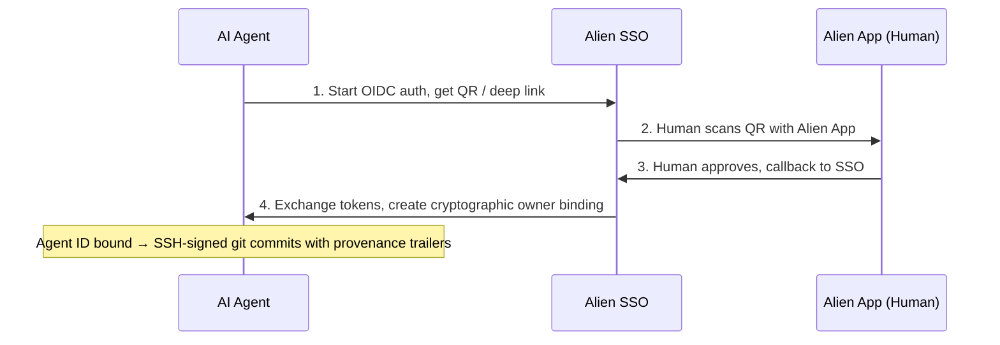
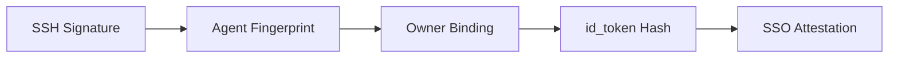

# Agent ID

> Verifiable cryptographic identity for AI agents, linked to human owners
> via [Alien Network][alien] SSO.

When an AI agent has an Agent ID, every git commit it makes is SSH-signed and carries trailers
that trace back to the specific agent and the human who authorized it. The provenance chain is
fully verifiable: **commit → agent key → owner binding → SSO attestation → verified AlienID holder**.

## Table of Contents

- [How It Works](#how-it-works)
- [Quick Start (Claude Code)](#quick-start)
- [What a Signed Commit Looks Like](#what-a-signed-commit-looks-like)
- [Verifying Provenance](#verifying-provenance)
- [Prerequisites](#prerequisites)
- [Agent State](#agent-state)
- [CLI Commands](#cli-commands)
- [Security](#security)

---

## How It Works



1. Agent starts OIDC auth, gets a QR code / deep link
2. Human scans QR with Alien App
3. Human approves, Alien App calls back to SSO
4. Agent exchanges tokens, creates cryptographic owner binding

The agent now has an Ed25519 keypair with a signed binding proving a verified human authorized it.

---

## What's in the Box

| File | Purpose |
| --- | --- |
| `SKILL.md` | Instructions for AI agents — point your agent here |
| `cli.mjs` | CLI tool (`status`, `auth`, `bind`, `git-setup`, `git-commit`, `git-verify`, etc.) |
| `lib.mjs` | Portable library — crypto, OIDC, signing engine, verification (zero npm deps) |
| `qrcode.cjs` | Vendored QR code generator |
| `default-provider.txt` | Default SSO provider address |
| `package.json` | Minimal metadata |

---

## Quick Start

### 1. Install the plugin

Register the repo as a plugin marketplace:

```text
/plugin marketplace add alien-id/agent-id
```

Install the plugin:

```text
/plugin install alien-agent-id@alien-agent-id
```

Reload plugins:

```text
/reload-plugins
```

Sometimes the reload does not work properly the first time — restarting
Claude usually helps.

### 2. Set up your Agent ID

When the plugin is loaded, run the skill:

```text
/alien-agent-id
```

Follow the instructions — the agent will generate a keypair, show a
QR code, and wait for you to approve in the Alien App. Once done,
your Agent ID is created and bound.

### 3. Add the signing key to GitHub

The agent will output an SSH public key after setup. Add it to your
GitHub account:

Go to GitHub → Settings → SSH and GPG keys → New SSH key →
Key type: **Signing Key**.
Commits will then show a "Verified" badge.

### 4. Use the skill to commit and push

You can pass arguments to the skill for common operations:

```text
/alien-agent-id stage, commit and push all files in the repo, follow previous commits naming convention
```

### Other agents

Any agent with shell access can use `SKILL.md` directly. The agent
needs Node.js 18+, git 2.34+, and permission to run
`node cli.mjs ...` commands.

---

## What a Signed Commit Looks Like

```text
✓ Verified  — This commit was signed with the committer's verified signature.

feat: implement auth flow

Agent-ID-Fingerprint: 945d41991dac118776409673019ed0fba36e13fc9d6b5534145f9e31128a3ec6
Agent-ID-Owner: 00000003010000000000539c741e0df8
Agent-ID-Binding: a1b2c3d4-e5f6-7890-abcd-ef1234567890
```

Anyone can trace: **this code** → **this agent** (fingerprint) → **this human** (owner session)
→ **verified AlienID holder**.

Each `git-commit` also attaches a **proof bundle** as a git note (`refs/notes/agent-id`)
containing the agent's public key, owner binding, and SSO id_token — everything needed for
anyone to verify the provenance chain without access to the agent's local state.

---

## Verifying Provenance

```bash
node cli.mjs git-verify --commit HEAD
```

Verification is **self-contained** — `git-commit` attaches a proof bundle as a git note
(`refs/notes/agent-id`) containing the agent's public key, owner binding, and SSO id_token. Anyone
who clones the repo and fetches the notes can verify the full chain without access to the agent's
machine.

```bash
# Fetch proof notes from remote
git fetch origin refs/notes/agent-id:refs/notes/agent-id

# Verify any commit
node cli.mjs git-verify --commit abc123
```

### Verification chain



1. **SSH signature** — commit is signed, verified against the agent's public key from the proof note
2. **Agent fingerprint** — public key hash matches the `Agent-ID-Fingerprint` trailer
3. **Owner binding** — Ed25519-signed by the agent, links agent to human owner
4. **id_token hash** — binding contains the hash of the SSO id_token, proving they're linked
5. **SSO attestation** — id_token RS256 signature verified against Alien SSO's JWKS

Falls back to the agent's local state (`~/.agent-id/`) if no git note is found.

---

## Prerequisites

- **Node.js 18+** — uses built-in `crypto`, `fetch`, `fs` (zero npm dependencies)
- **git 2.34+** — SSH commit signing support
- **Alien App** with a verified AlienID
- **Provider address** — registered in the [Developer Portal][dev-portal] (optional)

---

## Agent State

All state is stored in `~/.agent-id/` (configurable via `--state-dir` or `AGENT_ID_STATE_DIR`):

```text
~/.agent-id/
├── keys/main.json           # Ed25519 keypair (mode 0600)
├── ssh/
│   ├── agent-id             # SSH private key (mode 0600)
│   ├── agent-id.pub         # SSH public key
│   └── allowed_signers      # For git signature verification
├── owner-binding.json       # Cryptographic human ↔ agent link
├── owner-session.json       # SSO tokens (mode 0600)
├── nonces.json              # Per-agent nonce tracking
├── sequence.json            # Operation sequence counter
└── audit/operations.jsonl   # Hash-chained signed operation log
```

---

## CLI Commands

| Command | Purpose |
| --- | --- |
| `status` | Check if Agent ID exists and is bound |
| `auth --provider-address <addr>` | Start OIDC auth, get QR page |
| `bind` | Poll for user approval, create owner binding |
| `git-setup` | Configure git SSH signing with agent key |
| `git-commit --message "..." [--push]` | Signed commit with trailers + audit log |
| `git-verify [--commit <hash>]` | Verify provenance chain of a commit |
| `sign --type T --action A --payload JSON` | Sign any operation |
| `verify` | Verify state chain integrity |
| `export-proof` | Export proof bundle |

Run `node cli.mjs --help` for all flags.

---

## Security

- Private keys stored with `0600` permissions
- PKCE prevents authorization code interception
- Owner binding is Ed25519-signed by the agent's key
- SSO id_token (RS256) provides server attestation of the human-agent link
- Hash-chained audit log — any tampering breaks the chain
- `owner-session.json` contains tokens — never commit or share it

---

## Additional Resources

- [Alien Network][alien]
- [Developer Portal][dev-portal]

[alien]: https://alien.org
[dev-portal]: https://dev.alien.org
