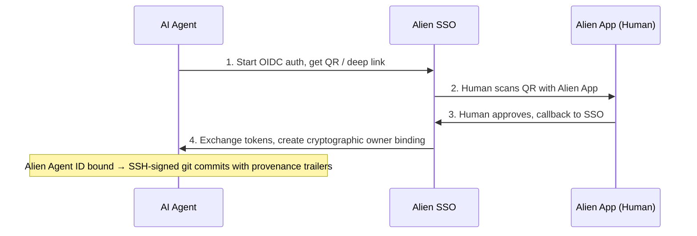
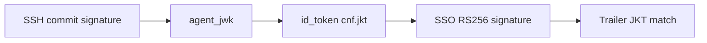

<p align="center">
  
</p>

<h1 align="center">Alien Agent ID</h1>

<p align="center">
  Verifiable cryptographic identity for AI agents, linked to human owners<br>
  via <a href="https://alien.org">Alien Network</a> SSO.
</p>

When an AI agent has an Alien Agent ID, every git commit it makes is SSH-signed and carries trailers that trace back
to the specific agent and the human who authorized it. The provenance chain is fully verifiable:
**commit → agent key → SSO `id_token` (with `cnf.jkt`) → verified AlienID holder**.

[💻 Watch the setup demo on X](https://x.com/kirillzzy/status/2042269104359563500)

## Table of Contents

- [How It Works](#how-it-works)
- [Plugin Layout](#plugin-layout)
- [Quick Start (Claude Code)](#quick-start)
- [What a Signed Commit Looks Like](#what-a-signed-commit-looks-like)
- [Verifying Provenance](#verifying-provenance)
- [Service Authentication](#service-authentication)
- [Service Discovery](#service-discovery)
- [Credential Vault](#credential-vault)
- [Session Refresh](#session-refresh)
- [Prerequisites](#prerequisites)
- [Agent State](#agent-state)
- [CLI Reference](#cli-reference)
- [Security](#security)

---

## How It Works


```mermaid
sequenceDiagram
    participant Agent as AI Agent
    participant SSO as Alien SSO
    participant App as Alien App (Human)

    Agent->>SSO: 1. Start OIDC auth, get QR / deep link
    SSO->>App: 2. Human scans QR with Alien App
    App->>SSO: 3. Human approves, callback to SSO
    SSO->>Agent: 4. Exchange tokens, create cryptographic owner binding
    Note over Agent: Alien Agent ID bound → SSH-signed git commits with provenance trailers
```

1. Agent starts OIDC auth, gets a QR code / deep link
2. Human scans QR with Alien App
3. Human approves, Alien App calls back to SSO
4. Agent exchanges tokens, creates cryptographic owner binding

The agent now has an Ed25519 keypair with a signed binding proving a verified human authorized it.

---

## Plugin Layout

Alien Agent ID ships as a Claude Code plugin marketplace with four focused plugins. Each plugin has a narrow responsibility and depends on `agent-id-core` for the shared library + bootstrap surface:

| Plugin | Skill | What it does |
| --- | --- | --- |
| `agent-id-core` | `/agent-id-core` | Bootstrap (`init` / `auth` / `bind` / `bootstrap`), session lifecycle (`refresh`, `status`, `setup-owner-session`), and universal operations (`sign`, `verify`, `export-proof`). Owns the shared library that every other plugin imports: crypto primitives, the v3 bundle format + universal verifier (`verifyBundle`), `SignatureEngine`, OIDC, state I/O. |
| `agent-id-git` | `/agent-id-git` | SSH-signed git commits with Agent-ID provenance trailers and v3 proof notes. `setup`, `commit`, `verify`. Verify calls into core's universal verifier and adds the SSH-signature + trailer checks on top — auditors and CI runners can verify any commit without a bound identity. |
| `agent-id-vault` | `/agent-id-vault` | AES-256-GCM credential vault for external-service secrets (GitHub PAT, Slack token, AWS keys, …). Encryption key derived from the agent's Ed25519 private key via HKDF, so credentials are only readable on the same machine as the bound agent. `store`, `get`, `list`, `remove`. |
| `agent-id-auth` | `/agent-id-auth` | RFC 9449 DPoP-signed calls to Alien-aware services. `header` emits the two-header pair for one request; `call` is a one-shot signed HTTP request. `discover` fetches and validates `/.well-known/alien-agent-id.json`; `capabilities` renders the manifest as actionable markdown; `support` probes for the meta-tag support signal. |

Repository layout:

```text
plugins/
├── agent-id-core/
│   ├── .claude-plugin/plugin.json
│   ├── lib/                    # crypto, bundle, state, errors, oidc,
│   │                           # signature-engine, cli-runtime
│   ├── bin/cli.mjs             # 10 subcommands
│   ├── bin/qrcode.cjs          # zero-dep terminal QR renderer
│   └── skills/agent-id-core/SKILL.md
├── agent-id-git/
│   ├── .claude-plugin/plugin.json
│   ├── bin/cli.mjs             # setup, commit, verify
│   └── skills/agent-id-git/SKILL.md
├── agent-id-vault/
│   ├── .claude-plugin/plugin.json
│   ├── lib/vault.mjs           # AES-256-GCM + HKDF
│   ├── bin/cli.mjs             # store, get, list, remove
│   └── skills/agent-id-vault/SKILL.md
└── agent-id-auth/
    ├── .claude-plugin/plugin.json
    ├── lib/manifest.mjs        # /.well-known parser + validator
    ├── bin/cli.mjs             # header, call, discover, capabilities, support
    └── skills/agent-id-auth/SKILL.md
.claude-plugin/marketplace.json # lists all four plugins
examples/                       # demo-service.mjs, dev-sso.mjs
tests/                          # unit + integration suites
docs/                           # AGENT-SSO.md, INTEGRATION.md
```

Every plugin is **zero npm dependencies** — Node.js built-ins only.

---

## Quick Start

### 1. Add the marketplace

```text
/plugin marketplace add alien-id/agent-id
```

### 2. Install the plugins you need

```text
/plugin install agent-id-core@alien-id-agent-id
/plugin install agent-id-git@alien-id-agent-id      # for signed commits
/plugin install agent-id-vault@alien-id-agent-id    # for credential storage
/plugin install agent-id-auth@alien-id-agent-id     # for DPoP service calls
/reload-plugins
```

`agent-id-core` is required by the other three. Install only what you need — auditors who just want to verify commits can install `agent-id-core` + `agent-id-git` and skip the rest.

If `/reload-plugins` does not pick up the new plugins on first run, restarting Claude Code usually helps.

### 3. Bootstrap your Alien Agent ID

```text
/agent-id-core
```

Follow the instructions — the agent will generate a keypair, show a QR code, and wait for you to approve in the Alien App. Once done, your Alien Agent ID is created and bound.

### 4. Configure git signing

```text
/agent-id-git
```

The plugin writes the SSH key files and prints the public key. Add it to your GitHub account: GitHub → Settings → SSH and GPG keys → New SSH key → Key type: **Signing Key**. Commits will then show a "Verified" badge.

### 5. Use it

```text
/agent-id-git stage, commit and push all files in the repo, follow the previous commits naming convention
```

### Other agents

Any agent with shell access can use the plugin CLIs directly. Requirements: Node.js 18+, git 2.34+, and permission to run `node plugins/agent-id-<X>/bin/cli.mjs ...` commands.

---

## What a Signed Commit Looks Like

```text
✓ Verified  — This commit was signed with the committer's verified signature.

feat: implement auth flow

Agent-ID-JKT: wEf6o2ux8sBAUG4oQYhP284gfpZwUJMTxXDPH5XxthY
Agent-ID-Owner: 00000003010000000000539c741e0df8
```

Anyone can trace: **this code** → **this agent** (JKT) → **this human** (id_token `sub`)
→ **verified AlienID holder**.

Each commit also attaches a **v3 proof bundle** as a git note (`refs/notes/agent-id`) containing the SSO-signed id_token and the agent's public JWK — everything a verifier needs to prove the provenance chain without access to the agent's local state.

---

## Verifying Provenance

```bash
node plugins/agent-id-git/bin/cli.mjs verify --commit HEAD
```

Verification is **self-contained**: the v3 git-note bundle is `{ version: 3, id_token, agent_jwk }`. Anyone who clones the repo and fetches the notes can verify the chain without access to the agent's machine.

```bash
# Fetch proof notes from remote
git fetch origin refs/notes/agent-id:refs/notes/agent-id

# Verify any commit
node plugins/agent-id-git/bin/cli.mjs verify --commit abc123
```

### Verification chain (v3)


```mermaid
flowchart LR
    A[SSH commit signature] --> B[agent_jwk]
    B --> C["id_token cnf.jkt"]
    C --> D[SSO RS256 signature]
    D --> E[Trailer JKT match]
```

1. **id_token signature** — RS256 verified against Alien SSO's JWKS (`iss` matches discovery)
2. **`cnf.jkt` anchor** — id_token's RFC 7800 §3.1 confirmation claim binds the SSO-attested owner to a specific Ed25519 key thumbprint
3. **agent_jwk thumbprint** — bundle's `agent_jwk` thumbprint (RFC 7638) must equal `cnf.jkt` and the `Agent-ID-JKT` trailer
4. **SSH commit signature** — git's native SSH signature must verify against `agent_jwk`

Steps 1–3 are the **universal** verification — they live in `agent-id-core/lib/bundle.mjs` as `verifyBundle()` and run against the bundle alone, without any git knowledge. Step 4 is the git-specific layer that `agent-id-git` adds on top. The same universal verifier can be called on any future v3 bundle (signed tool calls, exported proofs, …) without growing a git dependency.

Pre-v3 (legacy `Agent-ID-Fingerprint` / `Agent-ID-Binding`) commits are **intentionally not supported**. Their `id_tokens` predate the RFC 7800 `cnf.jkt` binding and cannot anchor the chain; see [CHANGELOG.md](CHANGELOG.md) for the 3.0.0 cutover notes.

---

## Service Authentication

Agents authenticate to Alien-aware services with RFC 9449 DPoP. The agent presents the SSO-issued access_token in the `Authorization` header and a fresh per-request proof JWT (signed by the agent's Ed25519 key) in the `DPoP` header.

The one-shot path: let the CLI sign and send the request for you.

```bash
node plugins/agent-id-auth/bin/cli.mjs call --url https://service.example.com/api/whoami
node plugins/agent-id-auth/bin/cli.mjs call --url https://service.example.com/api/posts \
  --method POST --body-file ./body.json
```

The two-header path: emit the headers and drive the HTTP yourself.

```bash
node plugins/agent-id-auth/bin/cli.mjs header \
  --url https://service.example.com/api/whoami --method GET --raw
# → Authorization: DPoP <access_token>
# → DPoP: <proof JWT>
```

Each DPoP proof is **single-use and request-bound**: a fresh `jti`, current `iat`, and the `htm`/`htu`/`ath` claims bind the proof to one specific (method, URL, access_token) tuple. Reusing a proof on a different URL or with a different access token will be rejected.

Owner ↔ agent binding lives entirely in standard claims: the access_token carries `sub` (owner), `aud`, `iss`, and `cnf.jkt` (the agent key thumbprint, RFC 7800 §3.1). The DPoP proof binds the request to that same key per RFC 9449 §6.1. Services verify with [`@alien-id/sso-agent-id`](https://www.npmjs.com/package/@alien-id/sso-agent-id)'s `verifyDPoPRequest` — no custom envelope, no key registration.

---

## Service Discovery

Alien-aware services publish a JSON manifest at `https://<host>/.well-known/alien-agent-id.json`. Agents fetch and validate it before talking to the service.

```bash
node plugins/agent-id-auth/bin/cli.mjs discover --url https://example.com
```

The CLI enforces an 8 KiB body cap, rejects redirects, requires `application/json`, and validates against a closed schema (`version`, `auth.header`, `auth.scheme`, `api.base`, optional `api.specUrl`, optional `service.name`/`service.url`, optional `api.operations[]` for v2). Every URL in the manifest must share the same authority as the service URL the user gave the agent — see [`plugins/agent-id-auth/skills/agent-id-auth/SKILL.md`](plugins/agent-id-auth/skills/agent-id-auth/SKILL.md) for the full trust boundary. *Same authority* means `host[:port]` exactly, or a subdomain of it; no public-suffix-list expansion.

Services that publish an OpenAPI / JSON Schema document can declare it via `api.specUrl`, or can inline a closed-schema operations list via `api.operations[]` (manifest v2). To render the operations as actionable markdown:

```bash
node plugins/agent-id-auth/bin/cli.mjs capabilities --url https://example.com
```

> **Replaces ALIEN-SKILL.md.** Earlier 2.2.0 docs proposed a Markdown file (`ALIEN-SKILL.md`) at the service root for the same purpose. That format is removed: free-form Markdown is too permissive a channel for a third-party server to feed an LLM. The well-known JSON manifest is the only supported discovery mechanism.

### Optional support signal

Services may also publish a closed-enum HTML meta tag advertising agent-id support:

```html
<meta name="alien-agent-id" content="v1">
```

The tag's `content` is a closed enum (`v1`, future versions) — no URLs, no prose. It exists so agents and crawlers can detect support without probing every host's `/.well-known/`. The manifest path is fixed; the meta tag never tells the agent where to go, only *whether* a service claims support. Probe it with:

```bash
node plugins/agent-id-auth/bin/cli.mjs support --url https://example.com
# → {"ok": true, "supported": true, "version": "v1"}
```

---

## Credential Vault

The vault stores credentials for external services (GitHub, AWS, Slack, etc.) encrypted with AES-256-GCM. The encryption key is derived from the agent's Ed25519 private key via HKDF-SHA256 — only the agent that stored the credential can decrypt it.

```bash
# Store a credential (most secure — from file)
echo 'ghp_xxx' > /tmp/tok && chmod 600 /tmp/tok
node plugins/agent-id-vault/bin/cli.mjs store --service github --type api-key --credential-file /tmp/tok
rm /tmp/tok

# Store from environment variable
GITHUB_TOKEN=ghp_xxx node plugins/agent-id-vault/bin/cli.mjs store --service github \
  --type api-key --credential-env GITHUB_TOKEN

# Piped via stdin
echo "$GITHUB_TOKEN" | node plugins/agent-id-vault/bin/cli.mjs store --service github

# Retrieve
node plugins/agent-id-vault/bin/cli.mjs get --service github
# → {"ok": true, "service": "github", "type": "api-key", "credential": "ghp_xxx...", ...}

# List all stored credentials (metadata only, no secrets)
node plugins/agent-id-vault/bin/cli.mjs list

# Remove
node plugins/agent-id-vault/bin/cli.mjs remove --service github
```

Supported credential types: `api-key`, `password`, `oauth`, `bearer`, `custom`. Never accept a secret pasted into chat — transcripts persist. Use a file or env var as the transport.

---

## Session Refresh

After bootstrap, the agent receives SSO tokens including a `refresh_token`. The `refresh` command renews the `access_token` without requiring human interaction.

```bash
# Explicit refresh
node plugins/agent-id-core/bin/cli.mjs refresh

# Transparent — every per-plugin CLI internally calls SignatureEngine.ensureValidSession()
# before signing, so most consumers do not need to refresh explicitly.
node plugins/agent-id-auth/bin/cli.mjs header --url https://example.com/api/x
```

If the human revokes the agent's authorization via the Alien App, `refresh` surfaces `auth-revoked` and the agent will need to re-bootstrap.

---

## Prerequisites

- **Node.js 18+** — uses built-in `crypto`, `fetch`, `fs` (zero npm dependencies)
- **git 2.34+** — SSH commit signing support (only needed for `agent-id-git`)
- **Alien App** with a verified AlienID
- **Provider address** — registered in the [Developer Portal][dev-portal] (optional)

---

## Agent State

All state is stored in `~/.agent-id/` (configurable via `--state-dir` or `AGENT_ID_STATE_DIR`). The layout is the same regardless of which plugins you have installed — every plugin reads and writes through `agent-id-core/lib/state.mjs`.

```text
~/.agent-id/
├── keys/main.json           # Ed25519 keypair (mode 0600)
├── ssh/
│   ├── agent-id             # SSH private key (mode 0600)
│   ├── agent-id.pub         # SSH public key
│   └── allowed_signers      # For git signature verification
├── vault/                   # Encrypted credentials (mode 0600)
│   ├── github.json
│   ├── aws.json
│   └── ...
├── owner-session.json       # SSO tokens — id_token IS the chain attestation (mode 0600)
├── nonces.json              # Per-agent nonce tracking
├── sequence.json            # Operation sequence counter
└── audit/operations.jsonl   # Hash-chained signed operation log
```

---

## CLI Reference

Each plugin has its own CLI under `plugins/agent-id-<NAME>/bin/cli.mjs`. The common `--state-dir <path>` flag is accepted by every subcommand and defaults to `AGENT_ID_STATE_DIR` then `~/.agent-id`.

### `agent-id-core` — bootstrap + lifecycle + universal operations

| Command | Purpose |
| --- | --- |
| `bootstrap` | One-shot setup: `init` + `auth` + `bind`. Blocks ≤5 min while waiting for Alien App approval. |
| `init` | Generate the Ed25519 agent keypair. |
| `auth --provider-address <addr>` | Start OIDC authorization (emits deep-link + QR). |
| `bind [--timeout-sec N]` | Poll for approval, exchange tokens, verify `cnf.jkt`, persist `owner-session.json`. |
| `setup-owner-session` | Force a fresh OAuth flow against the existing keypair (used to migrate pre-v3 bindings). |
| `status` | Check whether an identity exists and is bound. |
| `refresh` | Refresh the SSO access_token + id_token (DPoP-bound). |
| `sign --type T --action A --payload JSON` | Sign an arbitrary operation into the audit trail. |
| `verify` | Chain-integrity check on the local audit trail. |
| `export-proof` | Emit the owner session + complete audit trail as JSON. |

### `agent-id-git` — SSH-signed commits with provenance

| Command | Purpose |
| --- | --- |
| `setup` | Write the agent keypair into SSH-format files; print the public key to add to your git host. |
| `commit --message <M> [--push] [--remote R] [--allow-empty]` | Signed commit with `Agent-ID-JKT` / `Agent-ID-Owner` trailers + v3 proof note + audit-log entry. |
| `verify [--commit HASH] [--sso-url URL]` | Verify a commit's v3 attestation chain (universal `verifyBundle` + trailer + SSH-sig). |

### `agent-id-vault` — encrypted credential storage

| Command | Purpose |
| --- | --- |
| `store --service <NAME> [--type T] [--credential-file F \| --credential-env V \| --credential S \| -]` | Store a credential. Reading order: `--credential-file`, `--credential-env`, stdin, `--credential`. |
| `get --service <NAME>` | Retrieve and decrypt a credential. |
| `list` | List stored credentials (metadata only — never returns plaintext). |
| `remove --service <NAME>` | Remove a credential. |

### `agent-id-auth` — DPoP-signed service calls

| Command | Purpose |
| --- | --- |
| `header --url <U> [--method M] [--raw]` | Emit `Authorization` + `DPoP` headers for one request. |
| `call --url <U> [--method M] [--body S \| --body-file F] [--content-type T]` | One-shot signed HTTP request (preferred). |
| `discover --url <U>` | Fetch + validate `/.well-known/alien-agent-id.json`. |
| `capabilities --url <U>` | Render a manifest's `api.operations[]` as actionable markdown. |
| `support --url <U>` | Probe a page for the `<meta name="alien-agent-id">` support signal. |

Run any plugin's CLI with `--help` for the full flag list.

---

## Security

- **Private keys** stored with `0600` permissions; state directories created with `0700`.
- **PKCE (S256)** prevents authorization code interception (RFC 7636).
- **SSO `id_token`** (RS256) commits the agent key thumbprint via `cnf.jkt` — the human ↔ agent binding lives inside the SSO-signed claim, not a separate self-signed envelope (RFC 7800 §3.1).
- **DPoP proof-of-possession** (RFC 9449) — every service request carries a fresh Ed25519-signed proof bound to the URL, method, and `cnf.jkt`; a leaked access_token is useless without the matching private key.
- **Hash-chained audit log** — any tampering breaks the chain. `agent-id-core verify` walks it end-to-end.
- **Vault encryption** — AES-256-GCM with HKDF-SHA256-derived key from agent's private key. Credentials are only readable on the same machine as the bound agent.
- **JWT `alg: none` rejected** — unsigned tokens are refused at parse level.
- **Subject validation** — token refresh verifies the subject claim still matches the bound owner (`SubjectMismatchError` on mismatch).
- **Refresh tokens are sticky** — bound to the original `cnf.jkt`, no rotation needed.
- **Manifest validation** — third-party manifests are parsed against a closed schema; same-authority guard refuses any URL that points outside the service's host or subdomain.
- `owner-session.json` contains tokens — never commit or share it.

---

## Additional Resources

- [System Documentation](docs/AGENT-SSO.md) — detailed SSO flow, credential storage, service auth
- [Integration Guide](docs/INTEGRATION.md) — how to integrate token verification into your service
- [Alien Network][alien]
- [Developer Portal][dev-portal]

[alien]: https://alien.org
[dev-portal]: https://dev.alien.org
