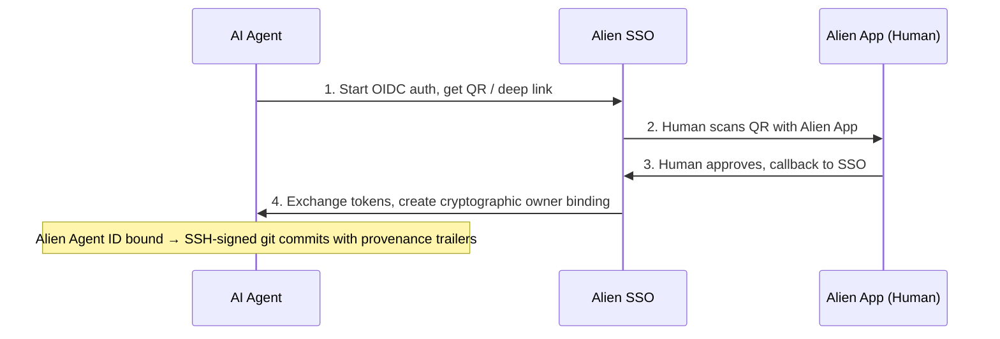
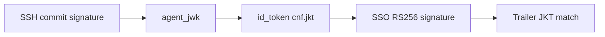

<p align="center">
  
</p>

<h1 align="center">Alien Agent ID</h1>

<p align="center">
  Verifiable cryptographic identity for AI agents, linked to human owners<br>
  via <a href="https://alien.org">Alien Network</a> SSO.
</p>

When an AI agent has an Alien Agent ID, every git commit it makes is SSH-signed and carries trailers that trace back
to the specific agent and the human who authorized it. The provenance chain is fully verifiable:
**commit → agent key → SSO `id_token` (with `cnf.jkt`) → verified AlienID holder**.

[💻 Watch the setup demo on X](https://x.com/kirillzzy/status/2042269104359563500)

## Table of Contents

- [How It Works](#how-it-works)
- [Quick Start (Claude Code)](#quick-start)
- [What a Signed Commit Looks Like](#what-a-signed-commit-looks-like)
- [Verifying Provenance](#verifying-provenance)
- [Service Authentication](#service-authentication)
- [Service Discovery](#service-discovery)
- [Credential Vault](#credential-vault)
- [Session Refresh](#session-refresh)
- [Prerequisites](#prerequisites)
- [Agent State](#agent-state)
- [CLI Commands](#cli-commands)
- [Security](#security)

---

## How It Works


```mermaid
sequenceDiagram
    participant Agent as AI Agent
    participant SSO as Alien SSO
    participant App as Alien App (Human)

    Agent->>SSO: 1. Start OIDC auth, get QR / deep link
    SSO->>App: 2. Human scans QR with Alien App
    App->>SSO: 3. Human approves, callback to SSO
    SSO->>Agent: 4. Exchange tokens, create cryptographic owner binding
    Note over Agent: Alien Agent ID bound → SSH-signed git commits with provenance trailers
```

1. Agent starts OIDC auth, gets a QR code / deep link
2. Human scans QR with Alien App
3. Human approves, Alien App calls back to SSO
4. Agent exchanges tokens, creates cryptographic owner binding

The agent now has an Ed25519 keypair with a signed binding proving a verified human authorized it.

---

## What's in the Box

| Path | Purpose |
| --- | --- |
| `skills/alien-agent-id/SKILL.md` | Instructions for AI agents — point your agent here |
| `skills/alien-agent-id/cli.mjs` | CLI tool — all agent operations |
| `skills/alien-agent-id/lib.mjs` | Portable library — crypto, OIDC, DPoP, signing, verification (zero npm deps) |
| `skills/alien-agent-id/qrcode.cjs` | Vendored QR code generator (terminal output) |
| `skills/alien-agent-id/default-provider.txt` | Default SSO provider address |
| `examples/demo-service.mjs` | Reference DPoP-verifying service (~426 LOC, no SDK dependency) |
| `examples/dev-sso.mjs` | Local SSO that auto-approves authorize requests for end-to-end testing |
| `tests/` | Unit + integration test suites |
| `docs/AGENT-SSO.md` | System documentation for humans |
| `docs/INTEGRATION.md` | Integration guide for service providers |
| `CHANGELOG.md` | Release history |
| `package.json` | Minimal metadata (no runtime dependencies) |

---

## Quick Start

### 1. Install the skill

```bash
npx skills add alien-id/agent-id
```

#### Claude Code only

Alternatively, install via the plugin marketplace:

```text
/plugin marketplace add alien-id/agent-id
/plugin install alien-agent-id@alien-agent-id
/reload-plugins
```

Sometimes the reload does not work properly the first time — restarting
Claude usually helps.

### 2. Set up your Alien Agent ID

When the plugin is loaded, run the skill:

```text
/alien-agent-id
```

Follow the instructions — the agent will generate a keypair, show a
QR code, and wait for you to approve in the Alien App. Once done,
your Alien Agent ID is created and bound.

### 3. Add the signing key to GitHub

The agent will output an SSH public key after setup. Add it to your
GitHub account:

Go to GitHub → Settings → SSH and GPG keys → New SSH key →
Key type: **Signing Key**.
Commits will then show a "Verified" badge.

### 4. Use the skill to commit and push

You can pass arguments to the skill for common operations:

```text
/alien-agent-id stage, commit and push all files in the repo, follow previous commits naming convention
```

### Other agents

Any agent with shell access can use `skills/alien-agent-id/SKILL.md` directly. The agent
needs Node.js 18+, git 2.34+, and permission to run
`node skills/alien-agent-id/cli.mjs ...` commands.

---

## What a Signed Commit Looks Like

```text
✓ Verified  — This commit was signed with the committer's verified signature.

feat: implement auth flow

Agent-ID-JKT: wEf6o2ux8sBAUG4oQYhP284gfpZwUJMTxXDPH5XxthY
Agent-ID-Owner: 00000003010000000000539c741e0df8
```

Anyone can trace: **this code** → **this agent** (JKT) → **this human** (id_token `sub`)
→ **verified AlienID holder**.

Each `git-commit` also attaches a **v3 proof bundle** as a git note (`refs/notes/agent-id`)
containing the SSO-signed id_token and the agent's public JWK — everything a verifier needs to
prove the provenance chain without access to the agent's local state.

---

## Verifying Provenance

```bash
node skills/alien-agent-id/cli.mjs git-verify --commit HEAD
```

Verification is **self-contained**: the v3 git-note bundle is `{ version: 3, id_token, agent_jwk }`.
Anyone who clones the repo and fetches the notes can verify the chain without access to the
agent's machine.

```bash
# Fetch proof notes from remote
git fetch origin refs/notes/agent-id:refs/notes/agent-id

# Verify any commit
node skills/alien-agent-id/cli.mjs git-verify --commit abc123
```

### Verification chain (v3)


```mermaid
flowchart LR
    A[SSH commit signature] --> B[agent_jwk]
    B --> C["id_token cnf.jkt"]
    C --> D[SSO RS256 signature]
    D --> E[Trailer JKT match]
```

1. **id_token signature** — RS256 verified against Alien SSO's JWKS (`iss` matches discovery)
2. **`cnf.jkt` anchor** — id_token's RFC 7800 §3.1 confirmation claim binds the SSO-attested
   owner to a specific Ed25519 key thumbprint
3. **agent_jwk thumbprint** — bundle's `agent_jwk` thumbprint (RFC 7638) must equal `cnf.jkt`
   and the `Agent-ID-JKT` trailer
4. **SSH commit signature** — git's native SSH signature must verify against `agent_jwk`

Pre-v3 (legacy `Agent-ID-Fingerprint` / `Agent-ID-Binding`) commits are **intentionally not supported**. Their
`id_tokens` predate the RFC 7800 `cnf.jkt` binding and cannot anchor the chain; see [CHANGELOG.md](CHANGELOG.md)
for the 3.0.0 cutover notes.

Falls back to the agent's local state (`~/.agent-id/`) if no git note is found.

---

## Service Authentication

Agents authenticate to Alien-aware services with RFC 9449 DPoP. The agent presents the SSO-issued
access_token in the `Authorization` header and a fresh per-request proof JWT (signed by the agent's
Ed25519 key) in the `DPoP` header:

```bash
# Generate the two-header pair for a specific request (URL and method are bound into the proof)
node skills/alien-agent-id/cli.mjs auth-header \
  --url https://service.example.com/api/whoami --method GET
# → Authorization: DPoP <access_token>
# → DPoP: <proof JWT>

# Use in API calls
eval $(node skills/alien-agent-id/cli.mjs auth-header \
  --url https://service.example.com/api/whoami --method GET --shell)
curl -H "Authorization: $AUTHORIZATION" -H "DPoP: $DPOP" https://service.example.com/api/whoami
```

Owner ↔ agent binding lives entirely in standard claims: the access_token carries `sub` (owner),
`aud`, `iss`, and `cnf.jkt` (the agent key thumbprint, RFC 7800 §3.1). The DPoP proof binds the
request to that same key per RFC 9449 §6.1. Services verify with
[`@alien-id/sso-agent-id`](https://www.npmjs.com/package/@alien-id/sso-agent-id)'s
`verifyDPoPRequest` — no custom envelope, no key registration.

---

## Service Discovery

Alien-aware services publish a JSON manifest at `https://<host>/.well-known/alien-agent-id.json`.
Agents fetch and validate it before talking to the service:

```bash
node skills/alien-agent-id/cli.mjs discover-service --url https://example.com
```

The CLI enforces an 8 KiB body cap, rejects redirects, requires `application/json`, and validates
against a closed v1 schema (`version`, `auth.header`, `auth.scheme`, `api.base`, optional
`api.specUrl`, `service.name`/`service.url`). Every URL in the manifest must share the same
authority as the service URL the user gave the agent — see `SKILL.md` for the full trust
boundary. *Same authority* means `host[:port]` exactly, or a subdomain of it; no
public-suffix-list expansion.

Services that publish an OpenAPI / JSON Schema document can declare it via `api.specUrl`. Agents
fetch it at runtime and refresh API knowledge without a skill update — the API contract becomes
dynamic structured data instead of static skill prose.

> **Replaces ALIEN-SKILL.md.** Earlier 2.2.0 docs proposed a Markdown file (`ALIEN-SKILL.md`) at
> the service root for the same purpose. That format is removed: free-form Markdown is too
> permissive a channel for a third-party server to feed an LLM. The well-known JSON manifest is
> the only supported discovery mechanism.

### Optional support signal

Services may also publish a closed-enum HTML meta tag advertising agent-id support:

```html
<meta name="alien-agent-id" content="v1">
```

The tag's `content` is a closed enum (`v1`, future versions) — no URLs, no prose. It exists so
agents and crawlers can detect support without probing every host's `/.well-known/`. The
manifest path is fixed; the meta tag never tells the agent where to go, only *whether* a service
claims support. Probe it with:

```bash
node skills/alien-agent-id/cli.mjs service-support --url https://example.com
# → {"ok": true, "supported": true, "version": "v1"}
```

---

## Credential Vault

The vault stores credentials for external services (GitHub, AWS, Slack, etc.) encrypted
with AES-256-GCM. The encryption key is derived from the agent's Ed25519 private key via
HKDF — only the agent that stored the credential can decrypt it.

```bash
# Store a credential (most secure — from file)
echo 'ghp_xxx' > /tmp/tok && chmod 600 /tmp/tok
node skills/alien-agent-id/cli.mjs vault-store --service github --type api-key --credential-file /tmp/tok
rm /tmp/tok

# Store from environment variable
node skills/alien-agent-id/cli.mjs vault-store --service github --type api-key --credential-env GITHUB_TOKEN

# Retrieve
node skills/alien-agent-id/cli.mjs vault-get --service github
# → {"ok": true, "service": "github", "type": "api-key", "credential": "ghp_xxx..."}

# List all stored credentials (no secrets shown)
node skills/alien-agent-id/cli.mjs vault-list

# Remove
node skills/alien-agent-id/cli.mjs vault-remove --service github
```

Supported credential types: `api-key`, `password`, `oauth`, `bearer`, `custom`.

---

## Session Refresh

After bootstrap, the agent receives SSO tokens including a `refresh_token`. The `refresh`
command renews the `access_token` without requiring human interaction:

```bash
# Explicit refresh
node skills/alien-agent-id/cli.mjs refresh

# Transparent — auth-header automatically refreshes expired sessions
node skills/alien-agent-id/cli.mjs auth-header
```

If the human revokes the agent's authorization via the Alien App, the refresh will fail
and the agent will need to re-bootstrap.

---

## Prerequisites

- **Node.js 18+** — uses built-in `crypto`, `fetch`, `fs` (zero npm dependencies)
- **git 2.34+** — SSH commit signing support
- **Alien App** with a verified AlienID
- **Provider address** — registered in the [Developer Portal][dev-portal] (optional)

---

## Agent State

All state is stored in `~/.agent-id/` (configurable via `--state-dir` or `AGENT_ID_STATE_DIR`):

```text
~/.agent-id/
├── keys/main.json           # Ed25519 keypair (mode 0600)
├── ssh/
│   ├── agent-id             # SSH private key (mode 0600)
│   ├── agent-id.pub         # SSH public key
│   └── allowed_signers      # For git signature verification
├── vault/                   # Encrypted credentials (mode 0600)
│   ├── github.json
│   ├── aws.json
│   └── ...
├── owner-session.json       # SSO tokens — id_token IS the chain attestation (mode 0600)
├── nonces.json              # Per-agent nonce tracking
├── sequence.json            # Operation sequence counter
└── audit/operations.jsonl   # Hash-chained signed operation log
```

---

## CLI Commands

| Command | Purpose |
| --- | --- |
| `bootstrap` | One-command setup: init + auth + bind + git-setup |
| `init` | Generate Ed25519 keypair |
| `status` | Check if Alien Agent ID exists and is bound |
| `auth --provider-address <addr>` | Start OIDC auth, get QR / deep link |
| `bind` | Poll for user approval, exchange tokens, verify `cnf.jkt`, persist `owner-session.json` |
| `setup-owner-session` | Re-run the auth + bind flow against the existing keypair (re-auth) |
| `git-setup [--email E]` | Configure git SSH signing |
| `git-commit --message "..." [--push]` | Signed commit with trailers + v3 proof note + audit log |
| `git-verify [--commit <hash>]` | Verify provenance chain of a commit |
| `auth-header --url <URL> --method <M>` | Emit `Authorization: DPoP <at>` and `DPoP: <proof>` for one request |
| `discover-service --url <URL>` | Fetch + validate `/.well-known/alien-agent-id.json` |
| `service-support --url <URL>` | Probe page for `<meta name="alien-agent-id">` support signal |
| `refresh` | Refresh SSO session tokens (DPoP-bound) |
| `vault-store --service S` | Store encrypted credential |
| `vault-get --service S` | Retrieve decrypted credential |
| `vault-list` | List stored credentials (no secrets shown) |
| `vault-remove --service S` | Remove a credential |
| `sign --type T --action A --payload JSON` | Sign any operation for audit trail |
| `verify` | Verify state chain integrity |
| `export-proof` | Export proof bundle |

Run `node skills/alien-agent-id/cli.mjs --help` for all flags.

---

## Security

- **Private keys** stored with `0600` permissions; state directories created with `0700`
- **PKCE (S256)** prevents authorization code interception (RFC 7636)
- **SSO `id_token`** (RS256) commits the agent key thumbprint via `cnf.jkt` — the human ↔ agent binding lives
  inside the SSO-signed claim, not a separate self-signed envelope (RFC 7800 §3.1)
- **DPoP proof-of-possession** (RFC 9449) — every service request carries a fresh Ed25519-signed proof bound
  to the URL, method, and `cnf.jkt`; a leaked access token is useless without the matching private key
- **Hash-chained audit log** — any tampering breaks the chain
- **Vault encryption** — AES-256-GCM with HKDF-SHA256-derived key from agent's private key
- **JWT alg:none rejected** — unsigned tokens are refused at parse level
- **Subject validation** — token refresh verifies the subject claim still matches the bound owner
- **Refresh tokens are sticky** — bound to the original `cnf.jkt`, no rotation needed
- `owner-session.json` contains tokens — never commit or share it

---

## Additional Resources

- [System Documentation](docs/AGENT-SSO.md) — detailed SSO flow, credential storage, service auth
- [Integration Guide](docs/INTEGRATION.md) — how to integrate token verification into your service
- [Alien Network][alien]
- [Developer Portal][dev-portal]

[alien]: https://alien.org
[dev-portal]: https://dev.alien.org
