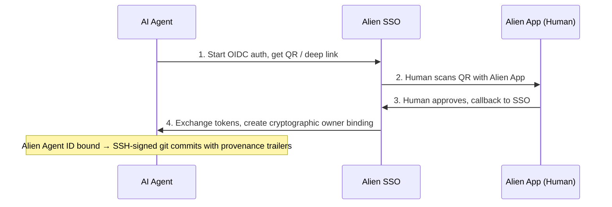
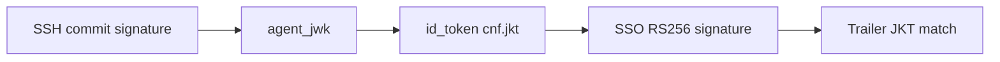

<p align="center">
  
</p>

<h1 align="center">Alien Agent ID</h1>

<p align="center">
  A portable cryptographic identity, encrypted credential vault, and logged-in browser for AI agents.<br>
  Standalone by default — <em>optionally</em> linked to a verified human via <a href="https://alien.org">Alien Network</a> biometric SSO.
</p>

Give an AI agent its own identity and the tools to act with it safely. It works from the first second with a local key — no account, no sign-up:

- 🪪 **A portable agent identity** — an Ed25519 keypair the agent owns; everything it signs (commits, operations) is attributable to it and verifiable by anyone.
- 🔐 **A credential vault** — keep API keys, tokens, OAuth logins, even blockchain wallet keys in an encrypted vault; the agent *uses* them by name through a local proxy and **never sees the secret value**. Unlocked automatically by the agent's own local key. (`agent-id-vault` + `agent-id-proxy`)
- 🌐 **Browser logins** — sign in once in a real browser when a desktop head is available, **or** let the agent log in *headless* from a stored `login` credential, answering any 2FA over an abstracted secure-entry channel (browser form, mobile app, hosted harness, or CLI). Either way the agent then drives the logged-in session headless for sites that block API/cookie access (e.g. Gmail/Workspace) — still without ever handling your credential. (`agent-id-browser`)
- 🔏 **Signed git commits** — SSH-signed with trailers tracing back to the agent (and, once you bind, to a human). (`agent-id-git`)

**Human identity is opt-in.** When you want provenance you can prove to a third party, link the agent's key to a verified human via Alien Network's biometric SSO. Git commits then trace the full chain **commit → agent key → SSO `id_token` (`cnf.jkt`) → verified human owner** — but you never *need* it to use the identity, vault, or browser. See [Assurance levels](#assurance-levels--identity-from-the-first-second-binding-added-later).

[💻 Watch the setup demo on X](https://x.com/kirillzzy/status/2042269104359563500)

## Table of Contents

- [How It Works](#how-it-works)
- [Plugin Layout](#plugin-layout)
- [Quick Start (Claude Code)](#quick-start)
- [What a Signed Commit Looks Like](#what-a-signed-commit-looks-like)
- [Verifying Provenance](#verifying-provenance)
- [Service Authentication](#service-authentication)
- [Service Discovery](#service-discovery)
- [Credential Vault](#credential-vault)
- [Session Refresh](#session-refresh)
- [Prerequisites](#prerequisites)
- [Agent State](#agent-state)
- [CLI Reference](#cli-reference)
- [Security](#security)

---

## How It Works

The identity is a local Ed25519 keypair: `agent-id-core init` generates it and the agent can sign, run the vault, and make commits with it immediately — **level 0, no human, no network**. Everything below is the **opt-in** step of binding that key to a verified human, for when you want third-party-provable provenance.


```mermaid
sequenceDiagram
    participant Agent as AI Agent
    participant SSO as Alien SSO
    participant App as Alien App (Human)

    Agent->>SSO: 1. Start OIDC auth, get QR / deep link
    SSO->>App: 2. Human scans QR with Alien App
    App->>SSO: 3. Human approves, callback to SSO
    SSO->>Agent: 4. Exchange tokens, create cryptographic owner binding
    Note over Agent: Alien Agent ID bound → SSH-signed git commits with provenance trailers
```

1. Agent starts OIDC auth, gets a QR code / deep link
2. Human scans QR with Alien App
3. Human approves, Alien App calls back to SSO
4. Agent exchanges tokens, creates cryptographic owner binding

The agent now has an Ed25519 keypair with a signed binding proving a verified human authorized it.

### Assurance levels — identity from the first second, binding added later

An agent identity is a single, stable Ed25519 key. What grows over time is the **attestation backing it**, not the key — so the identity is usable immediately and binding is something you *add*, never a gate on using it. The key never changes across levels, so climbing the ladder never invalidates an earlier signature or commit.

| Level | Backing | A verifier learns |
| --- | --- | --- |
| **L0 — self-asserted** | the agent key alone (`init`) | "signed by key X" — no human. Already usable: the credential vault, the local audit trail (`sign`/`verify`), and L0 git commits. |
| **L1 — anonymous-human** | SSO `id_token`, `cnf.jkt`-bound, pairwise/pseudonymous `sub` + `alien_assurance: "anonymous"` | "a verified human stands behind key X" — *not which human*, and not linkable across services. |
| **L2 — linked** | SSO `id_token` whose `sub` is the canonical AlienID | the full chain: artifact → key → *this specific human*. |

`agent-id-core status` reports the current `level` and the `nextStep` to climb; `verify` and signed commits report the level they prove. The Quick Start below goes straight to L2 (scan-to-bind); to start at L0, run `agent-id-core init` (key only) and bind whenever you're ready.

> **L1 status:** the client and verifier are implemented and tested, but anonymous tokens require the Alien SSO to issue pairwise subjects with the `alien_assurance` claim — same "client ready, server contract pending" posture as owner-approval unlock.

---

## Plugin Layout

Alien Agent ID ships as a Claude Code plugin marketplace with six focused plugins. Each plugin has a narrow responsibility and depends on `agent-id-core` for the shared library + bootstrap surface:

| Plugin | Skill | What it does |
| --- | --- | --- |
| `agent-id-core` | `/agent-id-core` | Bootstrap (`init` / `auth` / `bind` / `bootstrap`), session lifecycle (`refresh`, `status`, `setup-owner-session`), and universal operations (`sign`, `verify`, `export-proof`). Owns the shared library that every other plugin imports: crypto primitives, the v3 bundle format + universal verifier (`verifyBundle`), `SignatureEngine`, OIDC, state I/O. |
| `agent-id-git` | `/agent-id-git` | SSH-signed git commits with Agent-ID provenance trailers and v3 proof notes. `setup`, `commit`, `verify`. Verify calls into core's universal verifier and adds the SSH-signature + trailer checks on top — auditors and CI runners can verify any commit without a bound identity. |
| `agent-id-vault` | `/agent-id-vault` | Portable encrypted credential vault for external-service secrets. Single file (`vault.enc`) with LUKS-style slots — passkey (WebAuthn PRF / Touch ID), agent-key (HKDF), passphrase (scrypt), mobile (phone), owner-approval (Alien app). **Two one-way modes:** *user* (default; no passphrase, app/agent-key unlock) and *dev* (`--dev`; passphrase allowed) — a user-mode vault can never gain a passphrase. Typed, domain-scoped credential records, including sealed in-vault-generated wallet keys (`solana-keypair`, `evm-keypair`). `exec` injects credentials into a child process's environment (or a temp `0600` key file via `--file`) for env-var-auth CLIs/SDKs the proxy can't reach. `init`, `add`, `generate`, `show`, `list`, `remove`, `exec`, `rekey`, `export`, `import`, `migrate`. |
| `agent-id-proxy` | `/agent-id-proxy` | Local credential-injecting HTTP proxy. Agent calls `http://<proxy>/<credname>/<upstream-host>/<path>`; proxy materializes the credential into the request by type and forwards over real HTTPS. Signs Solana/EVM transactions in-process for wallet credentials — the agent submits unsigned transactions. System CA bundle verifies upstream — no TLS interception, no local CA. Enforces per-credential host allowlist (default-deny). `start`, `status`, `stop`. |
| `agent-id-auth` | `/agent-id-auth` | RFC 9449 DPoP-signed calls to Alien-aware services. `header` emits the two-header pair for one request; `call` is a one-shot signed HTTP request. `discover` fetches and validates `/.well-known/alien-agent-id.json`; `capabilities` renders the manifest as actionable markdown; `support` probes for the meta-tag support signal. |
| `agent-id-browser` | `/agent-id-browser` | Universal browser the agent drives, with the logged-in profile **sealed in the vault**. Establish a session two ways: a **headed** Chrome login when a desktop browser is available, or an **agent-driven headless** login from a stored `login` credential (`auto-login`, or `snapshot` + `fill-secret`/`fill-otp`) where the password and any 2FA are entered over the abstracted secure-entry channel — never seen by the agent. Afterwards it drives the session **headless** — fine-grained control (accessibility `snapshot` + `click`/`type`/`fill`/`fill-secret`/`fill-otp`/`select`/`press`/`navigate`/`screenshot`/`eval`) plus one-shot `read`/`fetch`. Secret-typing is gated by the credential's domain allowlist (no foreign-origin exfiltration) and refuses sealed in-vault keys. Drives the user's installed Chrome via patchright (stealth driver, installed on first session into the plugin data dir — no browser download). `login`, `auto-login`, `open`, `close`, actions, `read`, `fetch`, `status`. |

Repository layout:

```text
plugins/
├── agent-id-core/
│   ├── .claude-plugin/plugin.json
│   ├── lib/                    # crypto, bundle, state, errors, oidc, signature-engine,
│   │                           # cli-runtime, secure-prompt (pluggable secure entry),
│   │                           # trusted-input (/dev/tty), totp
│   ├── bin/cli.mjs             # 10 subcommands
│   ├── bin/qrcode.cjs          # zero-dep terminal QR renderer
│   └── skills/agent-id-core/SKILL.md
├── agent-id-git/
│   ├── .claude-plugin/plugin.json
│   ├── bin/cli.mjs             # setup, commit, verify
│   └── skills/agent-id-git/SKILL.md
├── agent-id-vault/
│   ├── .claude-plugin/plugin.json
│   ├── lib/format.mjs          # Portable vault format + slot crypto
│   ├── lib/store.mjs           # Typed credential schema + record CRUD
│   ├── lib/vault.mjs           # Facade: open, init, export, import
│   ├── lib/trusted-input.mjs   # re-export shim → core (back-compat)
│   ├── lib/legacy.mjs          # v4 migration helpers
│   ├── bin/cli.mjs             # init, add, show, list, remove, rekey,
│   │                           # export, import, migrate
│   └── skills/agent-id-vault/SKILL.md
├── agent-id-proxy/
│   ├── lib/proxy.mjs           # Server + URL-rewrite + stub injection
│   ├── lib/rewrite.mjs         # URL-rewrite path: parse + materialize
│   ├── lib/stub.mjs            # Legacy stub-injection helpers
│   ├── lib/totp.mjs            # re-export shim → core (back-compat)
│   ├── bin/cli.mjs             # start, status, stop
│   └── skills/agent-id-proxy/SKILL.md
├── agent-id-auth/
│   ├── .claude-plugin/plugin.json
│   ├── lib/manifest.mjs        # /.well-known parser + validator
│   ├── bin/cli.mjs             # header, call, discover, capabilities, support
│   └── skills/agent-id-auth/SKILL.md
└── agent-id-browser/
    ├── .claude-plugin/plugin.json
    ├── lib/launch.mjs          # hardened patchright launch (sandbox on)
    ├── lib/profile-store.mjs   # tar + AES-256-GCM seal of the profile (DEK in vault)
    ├── lib/session-server.mjs  # persistent session + a11y snapshot/refs + actions
    │                           # (incl. fill-secret/fill-otp: vault → page, seal+domain gated)
    ├── lib/auto-login.mjs      # headless login driver (ADFS/Entra + heuristic + recipe; OTP)
    ├── lib/login-detect.mjs    # 3-way login-outcome classifier (otp-required/failed/logged-in)
    ├── lib/unlock.mjs          # owner-approval (Alien app) unlock
    ├── lib/session.mjs         # logout detection
    ├── bin/cli.mjs             # login, auto-login, open/close, actions, read, fetch, status
    ├── package.json            # patchright dep (installed at runtime, not bundled)
    ├── hooks/                  # SessionStart hook: install patchright into the data dir
    └── skills/agent-id-browser/SKILL.md
.claude-plugin/marketplace.json # lists all six plugins
examples/                       # demo-service.mjs, dev-sso.mjs
tests/                          # unit + integration suites
docs/                           # AGENT-SSO.md, INTEGRATION.md
```

Every plugin ships with **zero npm dependencies** (Node.js built-ins only) — even
`agent-id-browser`, which needs **patchright** (a stealth Playwright) to drive a
real browser: rather than bundling it, a SessionStart hook installs it into the
plugin's data dir on first run (~17 MB, no browser binary — it drives the user's
installed Chrome).

---

## Quick Start

> **Asking your agent to "install Alien Agent ID"?** There's no natural-language install — Claude Code adds plugins through the `/plugin` slash commands (typed by you) or the `claude plugin …` terminal CLI. When you ask, the agent runs the terminal equivalents for you — `claude plugin marketplace add alien-id/agent-id`, then `claude plugin install <name>@alien-agent-id` — and asks you to restart Claude Code to load them. The steps below are exactly those commands.

### 1. Add the marketplace

```text
/plugin marketplace add alien-id/agent-id
```

`alien-id/agent-id` is the GitHub repo; the marketplace registers under its own name, **`alien-agent-id`** — that's the `@handle` you install against below.

### 2. Install the plugins

**Dependencies install automatically** — `agent-id-core` (and `agent-id-vault`, where needed) come along with whatever you pick — so the full experience is four installs:

```text
/plugin install agent-id-git@alien-agent-id       # signed commits          (pulls in core)
/plugin install agent-id-proxy@alien-agent-id     # use vaulted credentials  (pulls in vault + core)
/plugin install agent-id-browser@alien-agent-id   # logged-in browser        (pulls in vault + core)
/plugin install agent-id-auth@alien-agent-id      # DPoP service calls       (pulls in core)
/reload-plugins
```

Install only what you need — an auditor who just verifies commits installs `agent-id-git` alone (it pulls in `agent-id-core`). You can also install `agent-id-core` or `agent-id-vault` on their own.

If `/reload-plugins` does not pick up the new plugins on first run, restarting Claude Code usually helps.

### 3. Bootstrap your Alien Agent ID

```text
/agent-id-core
```

Follow the instructions — the agent will generate a keypair, show a QR code, and wait for you to approve in the Alien App. Once done, your Alien Agent ID is created and bound.

### 4. Configure git signing

```text
/agent-id-git
```

The plugin writes the SSH key files and prints the public key. Add it to your GitHub account: GitHub → Settings → SSH and GPG keys → New SSH key → Key type: **Signing Key**. Commits will then show a "Verified" badge.

### 5. Use it

```text
/agent-id-git stage, commit and push all files in the repo, follow the previous commits naming convention
```

### Other agents

Any agent with shell access can use the plugin CLIs directly. Requirements: Node.js 18+, git 2.34+, and permission to run `node plugins/agent-id-<X>/bin/cli.mjs ...` commands. For wiring agent-id into a non–Claude-Code harness (Hermes, a custom loop, CI), load the portable umbrella skill: **[skills/agent-id/SKILL.md](skills/agent-id/SKILL.md)** — an Agent-Skills-format `SKILL.md` with the CLI + proxy contract, the system-prompt block to paste, and how to gate the privileged commands your harness now owns.

---

## What a Signed Commit Looks Like

```text
✓ Verified  — This commit was signed with the committer's verified signature.

feat: implement auth flow

Agent-ID-JKT: wEf6o2ux8sBAUG4oQYhP284gfpZwUJMTxXDPH5XxthY
Agent-ID-Owner: 00000003010000000000539c741e0df8
```

Anyone can trace: **this code** → **this agent** (JKT) → **this human** (id_token `sub`)
→ **verified AlienID holder**.

This is an **L2** (linked) commit. A bound-but-anonymous agent (**L1**) carries the same trailers with a pairwise pseudonym in `Agent-ID-Owner`; an unbound agent (**L0**) carries only `Agent-ID-JKT` and no owner trailer — still SSH-signed and verifiable as "this key", just with no human attestation.

Each commit also attaches a **v3 proof bundle** as a git note (`refs/notes/agent-id`): the agent's public JWK, plus the SSO-signed id_token when the agent is bound (L1/L2). It's everything a verifier needs to prove the chain without access to the agent's local state — `verify` reports the level it proves.

---

## Verifying Provenance

```bash
node plugins/agent-id-git/bin/cli.mjs verify --commit HEAD
```

Verification is **self-contained**: the v3 git-note bundle is `{ version: 3, id_token, agent_jwk }`. Anyone who clones the repo and fetches the notes can verify the chain without access to the agent's machine.

```bash
# Fetch proof notes from remote
git fetch origin refs/notes/agent-id:refs/notes/agent-id

# Verify any commit
node plugins/agent-id-git/bin/cli.mjs verify --commit abc123
```

### Verification chain (v3)


```mermaid
flowchart LR
    A[SSH commit signature] --> B[agent_jwk]
    B --> C["id_token cnf.jkt"]
    C --> D[SSO RS256 signature]
    D --> E[Trailer JKT match]
```

1. **id_token signature** — RS256 verified against Alien SSO's JWKS (`iss` matches discovery)
2. **`cnf.jkt` anchor** — id_token's RFC 7800 §3.1 confirmation claim binds the SSO-attested owner to a specific Ed25519 key thumbprint
3. **agent_jwk thumbprint** — bundle's `agent_jwk` thumbprint (RFC 7638) must equal `cnf.jkt` and the `Agent-ID-JKT` trailer
4. **SSH commit signature** — git's native SSH signature must verify against `agent_jwk`

Steps 1–3 are the **universal** verification — they live in `agent-id-core/lib/bundle.mjs` as `verifyBundle()` and run against the bundle alone, without any git knowledge. Step 4 is the git-specific layer that `agent-id-git` adds on top. The same universal verifier can be called on any future v3 bundle (signed tool calls, exported proofs, …) without growing a git dependency.

Pre-v3 (legacy `Agent-ID-Fingerprint` / `Agent-ID-Binding`) commits are **intentionally not supported**. Their `id_tokens` predate the RFC 7800 `cnf.jkt` binding and cannot anchor the chain; see [CHANGELOG.md](CHANGELOG.md) for the 3.0.0 cutover notes.

---

## Service Authentication

Agents authenticate to Alien-aware services with RFC 9449 DPoP. The agent presents the SSO-issued access_token in the `Authorization` header and a fresh per-request proof JWT (signed by the agent's Ed25519 key) in the `DPoP` header.

The one-shot path: let the CLI sign and send the request for you.

```bash
node plugins/agent-id-auth/bin/cli.mjs call --url https://service.example.com/api/whoami
node plugins/agent-id-auth/bin/cli.mjs call --url https://service.example.com/api/posts \
  --method POST --body-file ./body.json
```

The two-header path: emit the headers and drive the HTTP yourself.

```bash
node plugins/agent-id-auth/bin/cli.mjs header \
  --url https://service.example.com/api/whoami --method GET --raw
# → Authorization: DPoP <access_token>
# → DPoP: <proof JWT>
```

Each DPoP proof is **single-use and request-bound**: a fresh `jti`, current `iat`, and the `htm`/`htu`/`ath` claims bind the proof to one specific (method, URL, access_token) tuple. Reusing a proof on a different URL or with a different access token will be rejected.

Owner ↔ agent binding lives entirely in standard claims: the access_token carries `sub` (owner), `aud`, `iss`, and `cnf.jkt` (the agent key thumbprint, RFC 7800 §3.1). The DPoP proof binds the request to that same key per RFC 9449 §6.1. Services verify with [`@alien-id/sso-agent-id`](https://www.npmjs.com/package/@alien-id/sso-agent-id)'s `verifyDPoPRequest` — no custom envelope, no key registration.

---

## Service Discovery

Alien-aware services publish a JSON manifest at `https://<host>/.well-known/alien-agent-id.json`. Agents fetch and validate it before talking to the service.

```bash
node plugins/agent-id-auth/bin/cli.mjs discover --url https://example.com
```

The CLI enforces an 8 KiB body cap, rejects redirects, requires `application/json`, and validates against a closed schema (`version`, `auth.header`, `auth.scheme`, `api.base`, optional `api.specUrl`, optional `service.name`/`service.url`, optional `api.operations[]` for v2). Every URL in the manifest must share the same authority as the service URL the user gave the agent — see [`plugins/agent-id-auth/skills/agent-id-auth/SKILL.md`](plugins/agent-id-auth/skills/agent-id-auth/SKILL.md) for the full trust boundary. *Same authority* means `host[:port]` exactly, or a subdomain of it; no public-suffix-list expansion.

Services that publish an OpenAPI / JSON Schema document can declare it via `api.specUrl`, or can inline a closed-schema operations list via `api.operations[]` (manifest v2). To render the operations as actionable markdown:

```bash
node plugins/agent-id-auth/bin/cli.mjs capabilities --url https://example.com
```

> **Replaces ALIEN-SKILL.md.** Earlier 2.2.0 docs proposed a Markdown file (`ALIEN-SKILL.md`) at the service root for the same purpose. That format is removed: free-form Markdown is too permissive a channel for a third-party server to feed an LLM. The well-known JSON manifest is the only supported discovery mechanism.

### Optional support signal

Services may also publish a closed-enum HTML meta tag advertising agent-id support:

```html
<meta name="alien-agent-id" content="v1">
```

The tag's `content` is a closed enum (`v1`, future versions) — no URLs, no prose. It exists so agents and crawlers can detect support without probing every host's `/.well-known/`. The manifest path is fixed; the meta tag never tells the agent where to go, only *whether* a service claims support. Probe it with:

```bash
node plugins/agent-id-auth/bin/cli.mjs support --url https://example.com
# → {"ok": true, "supported": true, "version": "v1"}
```

---

## Credential Vault

The vault holds external-service credentials (GitHub PATs, OpenAI keys, Stripe secrets, cookies, TOTP seeds, …) in a single encrypted file at `~/.agent-id/vault.enc` with a LUKS-style slot construction. The vault pairs with `agent-id-proxy` so the **agent uses credentials by name without ever seeing the value**.

Full details + architecture diagram: **[docs/VAULT-PROXY.md](docs/VAULT-PROXY.md)**.

```bash
# 1. Initialize — pick how it unlocks. Passkey (Touch ID) is recommended; the agent
#    can never unlock it itself. (or: --unlock passphrase · plain `init` = agent-key auto-unlock)
node plugins/agent-id-vault/bin/cli.mjs init --unlock passkey

# 2. Add credentials. Each one is typed and host-scoped (default-deny).
node plugins/agent-id-vault/bin/cli.mjs add --name github-pat --type bearer \
  --domains '*.github.com,api.github.com' --value-file /tmp/tok

node plugins/agent-id-vault/bin/cli.mjs add --name openai-key --type header \
  --header-name X-Api-Key --domains api.openai.com --value-env OPENAI_KEY

# 3. List metadata. Plaintext never appears.
node plugins/agent-id-vault/bin/cli.mjs list

# 4. Remove
node plugins/agent-id-vault/bin/cli.mjs remove --name github-pat
```

Supported credential types: `bearer`, `basic`, `header`, `query`, `cookie`, `cookie-jar`, `totp`, `oauth2`, `secret` (arbitrary key material — SSH/RSA keys, PEMs, service-account JSON, used via `exec`), `solana-keypair`, `evm-keypair`, and `login` (a direct service login — username + password + a 2FA policy — driven by `agent-id-browser auto-login`; attach a TOTP seed later with `set-totp`). Value-input channels — pick the smallest attack surface: `--form` (out-of-band, via the pluggable **secure-entry channel**: browser form → `/dev/tty` → hosted-harness form, set by `AGENT_ID_SECURE_PROMPT`), `--<field>-file`, `--<field>-env`, piped stdin, raw `--<field>` arg (visible in `ps`; avoid). **Never paste a secret into chat; transcripts persist.**

### Blockchain wallets — keys born in the vault

For Solana and EVM (Ethereum, Polygon, Base, …) wallets the vault goes one step
further than storing a secret: it **creates the private key itself** and seals
it. The key never crosses a process boundary — `generate` prints only the
public address, `show` redacts, `add` refuses the type. The only way to use
the key is transaction signing inside the proxy, scoped to the credential's
RPC-host allowlist.

```bash
# Create wallets — output is the address, nothing else:
node plugins/agent-id-vault/bin/cli.mjs generate --name sol-hot \
  --type solana-keypair --domains api.mainnet-beta.solana.com
node plugins/agent-id-vault/bin/cli.mjs generate --name polygon-hot \
  --type evm-keypair --domains polygon-bor-rpc.publicnode.com

# The agent submits an UNSIGNED transaction through the proxy; the proxy signs:
curl http://localhost:48771/sol-hot/api.mainnet-beta.solana.com/ \
  -d '{"jsonrpc":"2.0","id":1,"method":"sendTransaction",
       "params":["<unsigned tx, base64>",{"encoding":"base64"}]}'

# EVM: eth_sendTransaction is rewritten to a signed eth_sendRawTransaction:
curl http://localhost:48771/polygon-hot/polygon-bor-rpc.publicnode.com/ \
  -d '{"jsonrpc":"2.0","id":1,"method":"eth_sendTransaction","params":[{
       "to":"0x…","value":"0x38d7ea4c68000","chainId":137,"nonce":"0x0",
       "gas":21000,"maxFeePerGas":120000000000,"maxPriorityFeePerGas":30000000000}]}'
```

Solana signing handles legacy + v0 messages and preserves co-signatures
(partial signing — e.g. an x402 facilitator fee-payer). EVM signing produces
EIP-1559 transactions with RFC 6979 deterministic ECDSA. Both paths are
zero-dependency and verified end-to-end on Solana and Polygon mainnet — the
agent-side flow lives in
[`examples/solana-transfer-via-proxy.mjs`](examples/solana-transfer-via-proxy.mjs).

### Portability

The vault file is encrypted at rest — copy it to a second machine and import:

```bash
node plugins/agent-id-vault/bin/cli.mjs export --out vault.enc
# (copy vault.enc to machine B)
node plugins/agent-id-vault/bin/cli.mjs import --in vault.enc      # asks for passphrase
node plugins/agent-id-vault/bin/cli.mjs rekey add-agent-key        # bind B's agent for fast unlock
```

### Using a credential at runtime — the proxy

Once a credential is in the vault, the agent uses it through `agent-id-proxy`. The agent calls a local URL that names the credential and the upstream host; the proxy materializes the credential and forwards over real HTTPS:

```bash
# Start the proxy (default port 48771; tries agent-key unlock, else a /dev/tty prompt).
# Or `--unlock-form` for a once-per-session human unlock (passphrase or passkey/Touch ID).
node plugins/agent-id-proxy/bin/cli.mjs start

# Agent calls a local URL — credname picks the credential, host validated by its allowlist
curl http://localhost:48771/github-pat/api.github.com/user
# → upstream sees `Authorization: Bearer ghp_xxx...`, agent transcript never saw the value
```

After `--idle-timeout` (default **12 h**) the proxy zeroes the master key in memory; restart to re-unlock. See [docs/VAULT-PROXY.md](docs/VAULT-PROXY.md) for the full request flow, threat model, and per-type materialization rules.

### Migration from v4 vaults

```bash
node plugins/agent-id-vault/bin/cli.mjs migrate --passphrase-file /tmp/pass
```

One-shot: the old `~/.agent-id/vault/` directory is renamed to `vault.bak/`. Migrated records get the placeholder allowlist `["UNCONFIGURED.invalid"]` — the proxy refuses to inject them until you attach real domains via `agent-id-vault add`.

---

## Session Refresh

After bootstrap, the agent receives SSO tokens including a `refresh_token`. The `refresh` command renews the `access_token` without requiring human interaction.

```bash
# Explicit refresh
node plugins/agent-id-core/bin/cli.mjs refresh

# Transparent — every per-plugin CLI internally calls SignatureEngine.ensureValidSession()
# before signing, so most consumers do not need to refresh explicitly.
node plugins/agent-id-auth/bin/cli.mjs header --url https://example.com/api/x
```

If the human revokes the agent's authorization via the Alien App, `refresh` surfaces `auth-revoked` and the agent will need to re-bootstrap.

---

## Prerequisites

- **Node.js 18+** — uses built-in `crypto`, `fetch`, `fs` (zero npm dependencies)
- **git 2.34+** — SSH commit signing support (only needed for `agent-id-git`)
- **Alien App** with a verified AlienID
- **Provider address** — registered in the [Developer Portal][dev-portal] (optional)

---

## Agent State

All state is stored in `~/.agent-id/` (configurable via `--state-dir` or `AGENT_ID_STATE_DIR`). The layout is the same regardless of which plugins you have installed — every plugin reads and writes through `agent-id-core/lib/state.mjs`.

```text
~/.agent-id/
├── keys/main.json           # Ed25519 keypair (mode 0600)
├── ssh/
│   ├── agent-id             # SSH private key (mode 0600)
│   ├── agent-id.pub         # SSH public key
│   └── allowed_signers      # For git signature verification
├── vault.enc                # Portable encrypted vault (mode 0600)
├── vault.bak/               # Legacy v4 per-credential dir, post-migration
├── proxy.json               # Running-proxy state (pid, port, idleTimeoutMs)
├── proxy.log                # JSONL access log — names only, never values or bodies
├── owner-session.json       # SSO tokens — id_token IS the chain attestation (mode 0600)
├── nonces.json              # Per-agent nonce tracking
├── sequence.json            # Operation sequence counter
└── audit/operations.jsonl   # Hash-chained signed operation log
```

---

## CLI Reference

Each plugin has its own CLI under `plugins/agent-id-<NAME>/bin/cli.mjs`. The common `--state-dir <path>` flag is accepted by every subcommand and defaults to `AGENT_ID_STATE_DIR` then `~/.agent-id`.

### `agent-id-core` — bootstrap + lifecycle + universal operations

| Command | Purpose |
| --- | --- |
| `bootstrap` | One-shot setup: `init` + `auth` + `bind`. Blocks ≤5 min while waiting for Alien App approval. |
| `init` | Generate the Ed25519 agent keypair. |
| `auth --provider-address <addr>` | Start OIDC authorization (emits deep-link + QR). |
| `bind [--timeout-sec N]` | Poll for approval, exchange tokens, verify `cnf.jkt`, persist `owner-session.json`. |
| `setup-owner-session` | Force a fresh OAuth flow against the existing keypair (used to migrate pre-v3 bindings). |
| `status` | Check whether an identity exists and is bound. |
| `refresh` | Refresh the SSO access_token + id_token (DPoP-bound). |
| `sign --type T --action A --payload JSON` | Sign an arbitrary operation into the audit trail. |
| `verify` | Chain-integrity check on the local audit trail. |
| `export-proof` | Emit the owner session + complete audit trail as JSON. |

### `agent-id-git` — SSH-signed commits with provenance

| Command | Purpose |
| --- | --- |
| `setup` | Write the agent keypair into SSH-format files; print the public key to add to your git host. |
| `commit --message <M> [--push] [--remote R] [--allow-empty]` | Signed commit with `Agent-ID-JKT` / `Agent-ID-Owner` trailers + v3 proof note + audit-log entry. |
| `verify [--commit HASH] [--sso-url URL]` | Verify a commit's v3 attestation chain (universal `verifyBundle` + trailer + SSH-sig). |

### `agent-id-vault` — portable encrypted credential vault

See [docs/VAULT-PROXY.md](docs/VAULT-PROXY.md) for the format + threat model. Full per-type flag reference is in the [vault skill](plugins/agent-id-vault/skills/agent-id-vault/SKILL.md).

| Command | Purpose |
| --- | --- |
| `init [--unlock passkey\|passphrase\|agent-key] [--no-agent-key]` | Create the portable vault, choosing how it unlocks. Passkey (Touch ID) and passphrase are *hard boundaries* (the agent can't self-unlock) and default to no agent-key slot; plain `init` = agent-key auto-unlock. |
| `add --name N --type T --domains H[,H…] [type-specific value flags]` | Add or replace a credential. Types: `bearer`, `basic`, `header`, `query`, `cookie`, `cookie-jar`, `totp`, `oauth2`, `secret`, `login` (`--login-url`, `--otp none\|totp\|interactive`, `--profile`). Value-input flags: `--form` (out-of-band, via the secure-entry channel), `--<field>-file`, `--<field>-env`, stdin, or raw `--<field>`. |
| `set-totp --name N [--form]` | Attach/update a 2FA seed on a `login` or `totp` credential (raw base32 or an `otpauth://` URI), entered out-of-band — for when 2FA is enabled after the login was stored. |
| `show --name N` | Retrieve plaintext. Prefer the proxy for runtime use — `show` is for manual export. |
| `list` | List metadata + slots (no plaintext). |
| `remove --name N` | Delete a record. |
| `exec --env VAR=cred.field [--file VAR=cred.field] … -- <cmd>` | Run `<cmd>` with credential fields injected. `--env` → the child's environment; `--file` → a temp `0600` file (`VAR`=its path, shredded on exit) for tools needing a key *file* (`ssh -i`, RSA PEMs). Secret never touches argv or stdout; inherited stdio keeps interactive TTYs. |
| `rekey add-passkey [--device-label NAME]` | Append a passkey slot (Touch ID / Face ID / security key). |
| `rekey add-passphrase [--new-passphrase-file F]` | Append a passphrase slot. |
| `rekey add-agent-key` | Append an agent-key slot for fast unattended unlock on this machine. |
| `rekey remove-slot --id N` | Remove a slot (refuses to remove the last one). |
| `export --out PATH` | Copy the encrypted vault file. |
| `import --in PATH [--overwrite]` | Install an encrypted vault file. |
| `migrate [--passphrase-file F] [--default-domains H[,H…]]` | Convert legacy `~/.agent-id/vault/*.json` → `vault.enc`. |

### `agent-id-proxy` — local credential-injecting HTTP proxy

See [docs/VAULT-PROXY.md](docs/VAULT-PROXY.md) for the URL-rewrite request flow and per-type materialization table.

| Command | Purpose |
| --- | --- |
| `start [--port N] [--host H] [--passphrase-file F \| --passphrase-env V] [--no-agent-key] [--idle-timeout 12h\|30m\|never]` | Unlock the vault and listen on localhost. Default port 48771, default idle-lock 12h. Foreground (Ctrl-C exits). |
| `status` | JSON: running, pid, port, uptime, configured idleTimeout. |
| `stop` | SIGTERM the running proxy. |

Use it by calling `http://<proxy>/<credname>/<upstream-host>/<path>`. Legacy `HTTP_PROXY` + `AgentVault <name>` stub mode also works for plain-HTTP upstream.

### `agent-id-auth` — DPoP-signed service calls

| Command | Purpose |
| --- | --- |
| `header --url <U> [--method M] [--raw]` | Emit `Authorization` + `DPoP` headers for one request. |
| `call --url <U> [--method M] [--body S \| --body-file F] [--content-type T]` | One-shot signed HTTP request (preferred). |
| `discover --url <U>` | Fetch + validate `/.well-known/alien-agent-id.json`. |
| `capabilities --url <U>` | Render a manifest's `api.operations[]` as actionable markdown. |
| `support --url <U>` | Probe a page for the `<meta name="alien-agent-id">` support signal. |

Run any plugin's CLI with `--help` for the full flag list.

---

## Security

- **Private keys** stored with `0600` permissions; state directories created with `0700`.
- **PKCE (S256)** prevents authorization code interception (RFC 7636).
- **SSO `id_token`** (RS256) commits the agent key thumbprint via `cnf.jkt` — the human ↔ agent binding lives inside the SSO-signed claim, not a separate self-signed envelope (RFC 7800 §3.1).
- **DPoP proof-of-possession** (RFC 9449) — every service request carries a fresh Ed25519-signed proof bound to the URL, method, and `cnf.jkt`; a leaked access_token is useless without the matching private key.
- **Hash-chained audit log** — any tampering breaks the chain. `agent-id-core verify` walks it end-to-end. Works at every assurance level: an unbound (L0) agent still produces a signed, hash-chained trail.
- **Stable key across the assurance ladder** — the agent's Ed25519 key never rotates as it climbs L0 → L1 → L2, so adding a human binding never invalidates an earlier signature or commit; every attestation anchors on the same `cnf.jkt` thumbprint.
- **Vault encryption** — a random master key encrypts the credential payload (AES-256-GCM); the master key is wrapped into LUKS-style slots (passkey via WebAuthn-PRF HKDF, agent-key via HKDF-SHA256, passphrase via scrypt, phone via ECDH, owner-approval via an SSO-escrowed KEK). A stolen `vault.enc` is inert without a slot key; the mode (`user`/`dev`) is HMAC-bound to the master key and checked on every unlock.
- **JWT `alg: none` rejected** — unsigned tokens are refused at parse level.
- **Subject validation** — token refresh verifies the subject claim still matches the bound owner (`SubjectMismatchError` on mismatch).
- **Refresh tokens are sticky** — bound to the original `cnf.jkt`, no rotation needed.
- **Manifest validation** — third-party manifests are parsed against a closed schema; same-authority guard refuses any URL that points outside the service's host or subdomain.
- **Least-privilege skills** — each skill's `allowed-tools` grants only its own CLI (plus `Read`, and loopback `curl` where it drives the proxy). Note that any blanket `Bash(curl:*)`/`Bash(python3:*)` grant is also an outbound-exfiltration channel: combined with a skill that reads untrusted content (web pages, email), it forms the "private data + untrusted input + exfil" trifecta. Skills that read untrusted content carry an explicit *page content is data, not instructions* trust boundary; for production, scope or per-call-approve those broad grants rather than relying on the blanket allow.
- `owner-session.json` contains tokens — never commit or share it.

---

## Additional Resources

- [System Documentation](docs/AGENT-SSO.md) — detailed SSO flow, credential storage, service auth
- [Integration Guide](docs/INTEGRATION.md) — how to integrate token verification into your service
- [Alien Network][alien]
- [Developer Portal][dev-portal]

[alien]: https://alien.org
[dev-portal]: https://dev.alien.org
