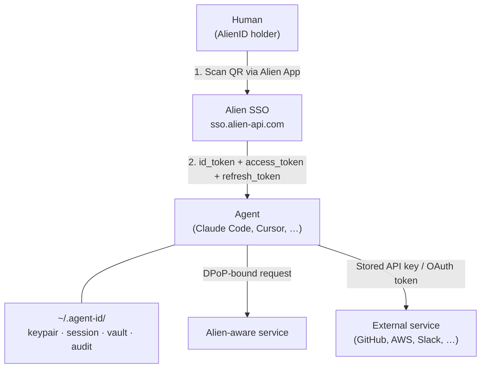
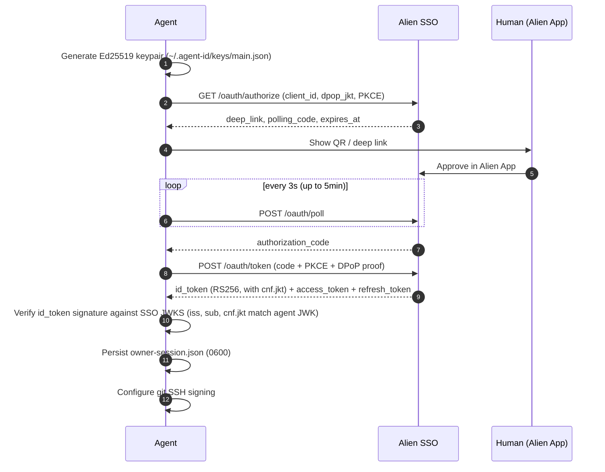
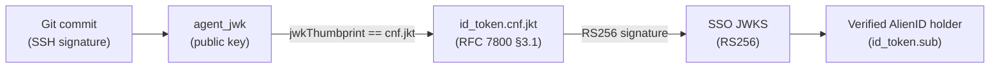
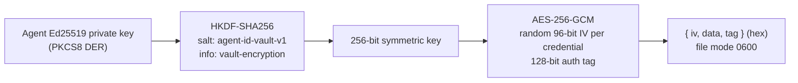

# Alien Agent SSO

A system for giving AI agents verifiable identity, service authentication, and secure credential storage — all
linked to a real human via the Alien Network.

## The problem

AI agents (Claude Code, Cursor, Copilot, custom scripts) operate without identity. They can't prove who authorized
them, can't authenticate to services on their own, and have no safe place to store credentials. Humans end up
pasting API keys into chat, hard-coding secrets in configs, or giving agents unrestricted access.

## What Agent SSO provides

1. **Cryptographic identity.** Each agent gets an Ed25519 keypair linked to a verified human owner through Alien
   Network SSO. The human scans a QR code once; the agent has a permanent, verifiable identity.
2. **Service authentication.** Agents present an SSO-issued `at+jwt` access token plus a fresh RFC 9449 DPoP
   proof per request. Any service that imports the verifier (`@alien-id/sso-agent-id` / `alien-sso-agent-id`)
   accepts the pair — no API keys, no shared secrets, no pre-registration.
3. **Credential vault.** Encrypted storage (AES-256-GCM) for external service credentials. The encryption key
   is derived from the agent's private key via HKDF-SHA256. Only that specific agent instance can decrypt its
   own vault.
4. **Signed git commits.** Every commit is SSH-signed and carries trailers that trace back to the agent and its
   human owner. The v3 proof bundle embedded as a git note (`refs/notes/agent-id`) makes verification
   self-contained — anyone with the commit and the note can verify the chain.

## Architecture



The agent uses a standard OIDC + OAuth 2.0 + RFC 9449 flow. Discovery is at
`<sso>/.well-known/openid-configuration`; from there the agent reads the authorization, token, userinfo, and
JWKS URLs and the supported DPoP signing algorithms. The flow uses PKCE (S256) and an Alien-extended
QR-and-poll variant of the authorization-code grant so a human can approve on a separate device.

Once the agent holds a DPoP-bound `refresh_token`, it can keep its session alive by exchanging the refresh
token for a new `access_token` on demand. The refresh stays bound to the same `cnf.jkt` for the life of the
binding, so the agent never has to re-run the QR flow until the human revokes its authorization in the
Alien App.

## How to give an agent these capabilities

### The skill files

The toolkit ships as five focused skill files in this repository:

- `skills/alien-id-setup/SKILL.md` — bootstrap or re-auth the identity.
- `skills/alien-id-commit/SKILL.md` — SSH-signed git commits with provenance trailers.
- `skills/alien-id-verify/SKILL.md` — verify provenance on any commit (standalone; auditor-friendly).
- `skills/alien-id-auth/SKILL.md` — DPoP-signed calls to Alien-aware services + discovery.
- `skills/alien-id-vault/SKILL.md` — encrypted credential storage for external services.

Each is written as agent-facing instructions — the agent reads it and follows the steps autonomously.

To give any AI agent these capabilities, point it directly at the skill matching the task.

### Claude Code

Add to your project's `CLAUDE.md`:

```markdown
## Agent Identity

Before making git commits or accessing authenticated services, read and follow the skill files under
`/path/to/agent-id/skills/` to obtain your Alien Agent ID. Invoke the skill matching the task:
`alien-id-setup`, `alien-id-commit`, `alien-id-verify`, `alien-id-auth`, `alien-id-vault`.
```

Or install via the Claude Code marketplace:

```text
/plugin marketplace add alien-id/agent-id
/plugin install alien-agent-id@alien-agent-id
/reload-plugins
```

Then invoke `/alien-id-setup` inside Claude Code to bootstrap; it will surface the QR code and wait for
your Alien App approval. After bootstrap, use the matching skill for each task (`/alien-id-commit`,
`/alien-id-verify`, `/alien-id-auth`, `/alien-id-vault`).

The plugin bundles an MCP server (`bin/mcp-server.mjs`) registered automatically via `.mcp.json`.
Skills call typed tools (`mcp__alien-agent-id__status`, `mcp__alien-agent-id__git_commit`, …) instead
of shelling out to the CLI. The CLI is still available as a fallback for environments where MCP isn't
wired up.

### Other agents

Any agent that can run shell commands and read files can use this system. The agent needs:

- **Node.js 18+** available in the shell
- **Read access** to the skill files and the CLI files
- **Shell access** to run `node bin/cli.mjs <command>`

Instruct the agent — system prompt, instructions file, initial message, whatever the platform supports — to
read the skill matching the task: `skills/alien-id-{setup,commit,verify,sso,vault}/SKILL.md`.

### CI/CD

```yaml
- name: Bootstrap agent identity
  env:
    ALIEN_PROVIDER_ADDRESS: ${{ secrets.ALIEN_PROVIDER_ADDRESS }}
  run: node /path/to/agent-id/bin/cli.mjs bootstrap
```

`bootstrap` blocks waiting for QR approval. For attended CI (a developer watches the run), the QR / deep link
is printed. For unattended CI, pre-bootstrap on the runner and persist `~/.agent-id/` across runs.

### Environment variables

| Variable | Purpose |
| --- | --- |
| `ALIEN_PROVIDER_ADDRESS` | Provider address (avoids the `--provider-address` flag) |
| `AGENT_ID_STATE_DIR` | Custom state directory (default `~/.agent-id`) |

The provider address can also be set in `bin/default-provider.txt` next to the CLI.

## SSO flow in detail

### Bootstrap sequence



### What the agent gets

After bootstrap the agent holds:

- **Ed25519 keypair** — signs DPoP proofs, audit-log entries, and git commits.
- **`id_token` (RS256 JWT from Alien SSO)** — the chain attestation. Carries `sub` (the human), `iss`, `aud`,
  and `cnf.jkt` (RFC 7800 §3.1) committing the agent key thumbprint. The signature is the only ground truth; no
  separate agent-self-signed envelope exists.
- **`access_token` (RFC 9068 `at+jwt`)** — short-lived, DPoP-bound. Used per-request against Alien-aware
  services.
- **`refresh_token`** — sticky to the same `cnf.jkt`. Renews `access_token` without human interaction. Refresh
  re-verifies the new `id_token` (subject, `cnf.jkt`) before persisting.
- **SSH signing config** — git is configured to sign all commits with the agent's key.

### Trust chain



Every link is cryptographically verifiable. The v3 proof bundle (`{ version: 3, id_token, agent_jwk }`)
embedded as a git note makes verification self-contained — no access to the agent's local state needed.

## Credential vault

### Overview

The vault stores credentials for external services (GitHub, AWS, Slack, etc.) encrypted with a key derived from
the agent's Ed25519 private key. This means:

- Credentials are encrypted at rest (AES-256-GCM).
- Only the agent that stored them can decrypt them.
- The encryption key never leaves the agent's machine.
- If the agent's keypair is deleted, the credentials are irrecoverable.

### How credentials get into the vault

The skill instructs the agent to **never accept a secret pasted into chat** — anything pasted there is recorded
in the agent's transcript. The agent offers the human three options, in decreasing order of safety:

| Method | Secret in `ps`? | Shell history? | Chat transcript? |
| --- | --- | --- | --- |
| `--credential-file <path>` | No | No | No |
| `--credential-env <VAR>` | No | Depends on shell | No |
| stdin pipe | No | The `echo` line, yes | No |
| `--credential <value>` | Yes | Yes | No |
| Paste in chat | No | No | Yes |

### Vault encryption



## Service authentication

### Wire format (RFC 9449 DPoP)

Per request the agent sends two headers:

```text
Authorization: DPoP <access_token>
DPoP: <proof JWT>
```

The access token is an Alien SSO-issued `at+jwt` (RFC 9068). Its standard claims carry the owner ↔ agent chain:

| Claim | Meaning |
| --- | --- |
| `sub` | Owner's AlienID address |
| `aud` | Target service identifier |
| `iss` | `https://sso.alien-api.com` |
| `exp` | Access-token expiry |
| `cnf.jkt` | JWK SHA-256 thumbprint of the agent's Ed25519 public key (RFC 7800 §3.1) |

The agent generates the per-request proof for a specific method + URL:

```bash
node bin/cli.mjs auth-header --url https://service.example.com/api/whoami --method GET
# → Authorization: DPoP <access_token>
# → DPoP: <proof JWT>
```

Service-side verification walks RFC 9449 §4.3:

1. Exactly one `Authorization: DPoP <at>` and one `DPoP: <proof>` header.
2. Proof is a JWS with `typ=dpop+jwt`, `alg=EdDSA`, and an OKP/Ed25519 `jwk` (no private `d`) in the header.
3. EdDSA signature over the proof verifies against the embedded JWK.
4. `htm` equals the request method byte-for-byte; `htu` equals the reconstructed `<origin><pathname>` (no
   query, no fragment).
5. `iat` is within ±`PROOF_MAX_AGE_SEC` (default 30s); `jti` not seen before.
6. Parse the access token; validate `typ`/`alg`, verify signature against SSO JWKS.
7. Claim checks: `iss == expectedIss`, optional `aud` allow-list, `exp > now`, non-empty `sub`.
8. RFC 9449 §6.1: `at.cnf.jkt === jwkThumbprint(proof.header.jwk)`.
9. RFC 9449 §4.3 step 10: `proof.ath === b64url(sha256(access_token))`.

Owner identity, agent identity, and proof-of-possession all come from signed standard claims. No custom
envelope, no key pre-registration. See [INTEGRATION.md](INTEGRATION.md) for service-side integration patterns
and SDK examples.

### External services (GitHub, AWS, Slack)

External services don't know about Agent ID tokens. The agent authenticates to them using credentials stored
in the vault:

```bash
TOKEN=$(node bin/cli.mjs vault-get --service github | jq -r .credential)
curl -H "Authorization: Bearer $TOKEN" https://api.github.com/user/repos
```

The credential is decrypted in memory, used for the API call, and never written to disk in plaintext.

## Files in this repository

| Path | Purpose |
| --- | --- |
| `skills/alien-id-setup/SKILL.md` | Bootstrap or re-auth the Alien Agent ID |
| `skills/alien-id-commit/SKILL.md` | SSH-signed git commits with provenance trailers |
| `skills/alien-id-verify/SKILL.md` | Verify provenance on any commit (standalone) |
| `skills/alien-id-auth/SKILL.md` | DPoP-signed calls to Alien-aware services + discovery |
| `skills/alien-id-vault/SKILL.md` | Encrypted credential storage (GitHub, AWS, …) |
| `bin/cli.mjs` | CLI tool — all agent operations (shared backend) |
| `bin/mcp-server.mjs` | Model Context Protocol server — exposes every CLI subcommand as a typed tool |
| `.mcp.json` | Auto-registers the MCP server when the plugin is loaded in Claude Code |
| `bin/lib.mjs` | Core library — crypto, OIDC, DPoP, vault, verifier (no runtime deps) |
| `bin/qrcode.cjs` | Vendored QR code generator (terminal output) |
| `bin/default-provider.txt` | Default SSO provider address |
| `examples/demo-service.mjs` | Reference DPoP-verifying HTTP service (~426 LOC, SDK-free) |
| `examples/dev-sso.mjs` | Local SSO that auto-approves authorize requests for end-to-end testing |
| `tests/` | Unit + integration test suites |
| `docs/AGENT-SSO.md` | This document — system overview for humans |
| `docs/INTEGRATION.md` | Service-side integration guide |
| `README.md` | Project overview |
| `CHANGELOG.md` | Release history |

## Quick reference

```bash
# Bootstrap (one command, requires human QR scan once)
node bin/cli.mjs bootstrap

# Check status
node bin/cli.mjs status

# Store a credential securely
echo 'ghp_xxx' > /tmp/tok && chmod 600 /tmp/tok
node bin/cli.mjs vault-store --service github --type api-key --credential-file /tmp/tok
rm /tmp/tok

# Retrieve a credential
node bin/cli.mjs vault-get --service github

# Generate the two-header pair for a request
node bin/cli.mjs auth-header --url https://service.example.com/api/whoami --method GET

# Sign a git commit with provenance
node bin/cli.mjs git-commit --message "feat: something" --push

# Verify a commit's provenance chain
node bin/cli.mjs git-verify --commit HEAD

# Start the demo service
node examples/demo-service.mjs
```
