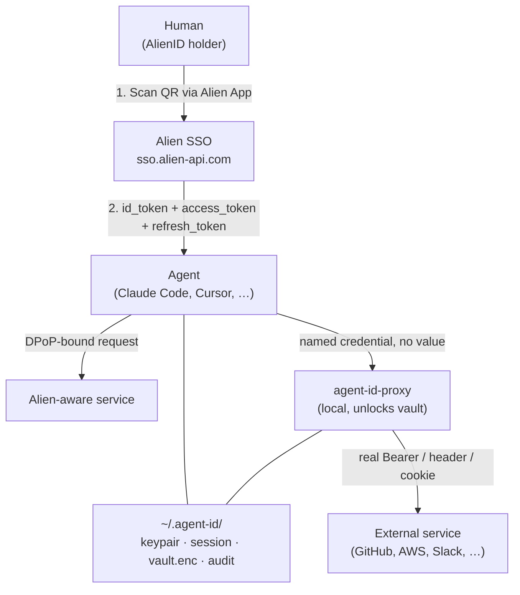
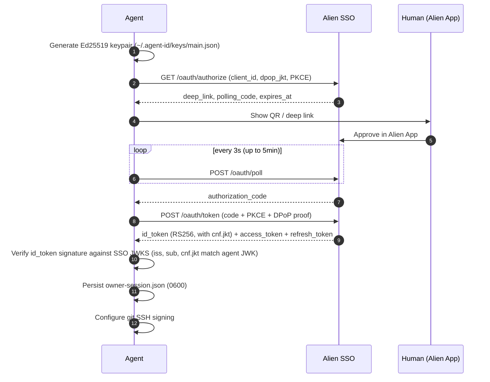
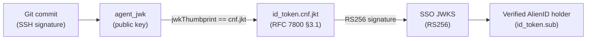
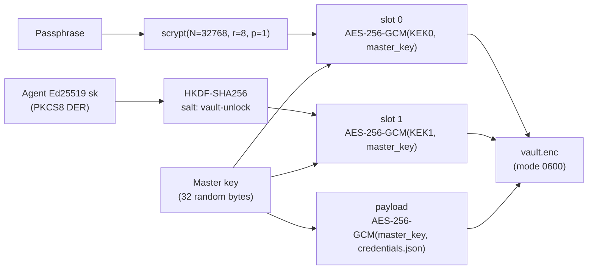

# Alien Agent SSO

A system for giving AI agents verifiable identity, service authentication, and secure credential storage — all
linked to a real human via the Alien Network.

## The problem

AI agents (Claude Code, Cursor, Copilot, custom scripts) operate without identity. They can't prove who authorized
them, can't authenticate to services on their own, and have no safe place to store credentials. Humans end up
pasting API keys into chat, hard-coding secrets in configs, or giving agents unrestricted access.

## What Agent SSO provides

1. **Cryptographic identity.** Each agent gets an Ed25519 keypair linked to a verified human owner through Alien
   Network SSO. The human scans a QR code once; the agent has a permanent, verifiable identity.
2. **Service authentication.** Agents present an SSO-issued `at+jwt` access token plus a fresh RFC 9449 DPoP
   proof per request. Any service that imports the verifier (`@alien-id/sso-agent-id` / `alien-sso-agent-id`)
   accepts the pair — no API keys, no shared secrets, no pre-registration.
3. **Credential vault + proxy.** Portable encrypted store (`vault.enc`) for external-service credentials, with
   a LUKS-style slot construction (passphrase + agent-key). A companion process, `agent-id-proxy`, holds the
   unlocked vault in memory and injects credentials into outbound HTTP requests by name — the **agent never
   sees the value**. See [VAULT-PROXY.md](VAULT-PROXY.md).
4. **Signed git commits.** Every commit is SSH-signed and carries trailers that trace back to the agent and its
   human owner. The v3 proof bundle embedded as a git note (`refs/notes/agent-id`) makes verification
   self-contained — anyone with the commit and the note can verify the chain.

## Architecture



The agent uses a standard OIDC + OAuth 2.0 + RFC 9449 flow. Discovery is at
`<sso>/.well-known/openid-configuration`; from there the agent reads the authorization, token, userinfo, and
JWKS URLs and the supported DPoP signing algorithms. The flow uses PKCE (S256) and an Alien-extended
QR-and-poll variant of the authorization-code grant so a human can approve on a separate device.

Once the agent holds a DPoP-bound `refresh_token`, it can keep its session alive by exchanging the refresh
token for a new `access_token` on demand. The refresh stays bound to the same `cnf.jkt` for the life of the
binding, so the agent never has to re-run the QR flow until the human revokes its authorization in the
Alien App.

## How to give an agent these capabilities

### The skill file

This repository ships as a marketplace of five focused plugins, each with its own agent-facing skill:

- `plugins/agent-id-core/skills/agent-id-core/SKILL.md` — bootstrap + session lifecycle + sign/verify on the local audit trail.
- `plugins/agent-id-git/skills/agent-id-git/SKILL.md` — SSH-signed commits with provenance trailers and v3 proof notes.
- `plugins/agent-id-vault/skills/agent-id-vault/SKILL.md` — portable encrypted credential vault for external-service secrets.
- `plugins/agent-id-proxy/skills/agent-id-proxy/SKILL.md` — local credential-injecting HTTP proxy that pairs with the vault.
- `plugins/agent-id-auth/skills/agent-id-auth/SKILL.md` — DPoP-signed calls to Alien-aware services.

Together they replace the monolithic `alien-agent-id` skill from 3.x. `agent-id-core` is required by the others; `agent-id-proxy` depends on `agent-id-vault`. Install only the plugins you need.

### Claude Code

Add to your project's `CLAUDE.md`:

```markdown
## Agent Identity

Before making git commits or accessing authenticated services, install the Alien Agent ID
plugins (`/agent-id-core` for bootstrap, `/agent-id-git` for signed commits, `/agent-id-auth`
for DPoP-signed service calls, `/agent-id-vault` for credential storage) and run
`/agent-id-core` to obtain your bound identity.
```

Or install via the Claude Code marketplace:

```text
/plugin marketplace add alien-id/agent-id
/plugin install agent-id-core@alien-agent-id      # required
/plugin install agent-id-git@alien-agent-id       # for signed commits
/plugin install agent-id-auth@alien-agent-id      # for DPoP-signed service calls
/plugin install agent-id-vault@alien-agent-id     # for credential storage
/plugin install agent-id-proxy@alien-agent-id     # for credential injection at runtime
/reload-plugins
```

Then invoke `/agent-id-core` inside Claude Code; it will run the bootstrap, surface the QR
code, and wait for your Alien App approval. Once bound, run `/agent-id-git` to wire up SSH
signing for git commits.

### Other agents

Any agent that can run shell commands and read files can use this system. The agent needs:

- **Node.js 18+** available in the shell
- **Read access** to each plugin's `SKILL.md` and `bin/cli.mjs`
- **Shell access** to run `node plugins/agent-id-<NAME>/bin/cli.mjs <command>`

Instruct the agent — system prompt, instructions file, initial message, whatever the platform supports — to
read each plugin's `SKILL.md` and follow the bootstrap steps in `agent-id-core` first.

### CI/CD

```yaml
- name: Bootstrap agent identity
  env:
    ALIEN_PROVIDER_ADDRESS: ${{ secrets.ALIEN_PROVIDER_ADDRESS }}
  run: node /path/to/agent-id/plugins/agent-id-core/bin/cli.mjs bootstrap
```

`bootstrap` blocks waiting for QR approval. For attended CI (a developer watches the run), the QR / deep link
is printed. For unattended CI, pre-bootstrap on the runner and persist `~/.agent-id/` across runs.

### Environment variables

| Variable | Purpose |
| --- | --- |
| `ALIEN_PROVIDER_ADDRESS` | Provider address (avoids the `--provider-address` flag) |
| `AGENT_ID_STATE_DIR` | Custom state directory (default `~/.agent-id`) |

The provider address can also be set in `plugins/agent-id-core/bin/default-provider.txt` next to the core CLI.

## SSO flow in detail

### Bootstrap sequence



### What the agent gets

After bootstrap the agent holds:

- **Ed25519 keypair** — signs DPoP proofs, audit-log entries, and git commits.
- **`id_token` (RS256 JWT from Alien SSO)** — the chain attestation. Carries `sub` (the human), `iss`, `aud`,
  and `cnf.jkt` (RFC 7800 §3.1) committing the agent key thumbprint. The signature is the only ground truth; no
  separate agent-self-signed envelope exists.
- **`access_token` (RFC 9068 `at+jwt`)** — short-lived, DPoP-bound. Used per-request against Alien-aware
  services.
- **`refresh_token`** — sticky to the same `cnf.jkt`. Renews `access_token` without human interaction. Refresh
  re-verifies the new `id_token` (subject, `cnf.jkt`) before persisting.
- **SSH signing config** — git is configured to sign all commits with the agent's key.

### Trust chain



Every link is cryptographically verifiable. The v3 proof bundle (`{ version: 3, id_token, agent_jwk }`)
embedded as a git note makes verification self-contained — no access to the agent's local state needed.

## Credential vault + proxy

> Full architecture, threat model, and per-type materialization rules live in **[VAULT-PROXY.md](VAULT-PROXY.md)**. This section is a summary.

### Overview

External-service credentials (GitHub PATs, OpenAI keys, cookies, TOTP seeds, …) live in a single encrypted file at `~/.agent-id/vault.enc`. A companion process, `agent-id-proxy`, holds the unlocked vault in memory and **injects credentials into outbound HTTP requests by name** so the agent never sees the value.

The vault uses a LUKS-style slot construction:

- A random 32-byte **master key** AES-256-GCM-encrypts the credential payload.
- Each **slot** wraps the master key with a different KEK derivation:
  - **passphrase slot** — `KEK = scrypt(passphrase, salt, N=32768, r=8, p=1)`. Portable; entered via `/dev/tty` so it never enters the agent's stdin pipe.
  - **agent-key slot** — `KEK = HKDF-SHA256(agent_ed25519_sk, "vault-unlock")`. Fast unattended unlock on the machine that owns the agent key.

Either slot decrypts the same payload, so the vault is **copyable between machines** (passphrase on first use, optionally bind a new agent key for fast unlock thereafter).

### How credentials get into the vault

`agent-id-vault add --name <N> --type <T> --domains <H[,H…]>` plus type-specific value-input flags. The skill instructs the agent to **never accept a secret pasted into chat**. Value-input channels in decreasing order of safety:

| Method | Secret in `ps`? | Shell history? | Chat transcript? |
| --- | --- | --- | --- |
| `--<field>-file <path>` | No | No | No |
| `--<field>-env <VAR>` | No | Depends on shell | No |
| stdin pipe | No | The `echo` line, yes | No |
| `--<field> <value>` | Yes | Yes | No |
| Paste in chat | No | No | Yes |

### Vault format



### Idle auto-lock

After 12 h of no proxy traffic (configurable via `--idle-timeout`), the master key is zeroed in memory and the decrypted records are dropped. Subsequent requests return `401 vault_locked`; restart the proxy to re-unlock. Mirrors 1Password's default.

## Service authentication

### Wire format (RFC 9449 DPoP)

Per request the agent sends two headers:

```text
Authorization: DPoP <access_token>
DPoP: <proof JWT>
```

The access token is an Alien SSO-issued `at+jwt` (RFC 9068). Its standard claims carry the owner ↔ agent chain:

| Claim | Meaning |
| --- | --- |
| `sub` | Owner's AlienID address |
| `aud` | Target service identifier |
| `iss` | `https://sso.alien-api.com` |
| `exp` | Access-token expiry |
| `cnf.jkt` | JWK SHA-256 thumbprint of the agent's Ed25519 public key (RFC 7800 §3.1) |

The agent generates the per-request proof for a specific method + URL:

```bash
node plugins/agent-id-auth/bin/cli.mjs header --url https://service.example.com/api/whoami --method GET --raw
# → Authorization: DPoP <access_token>
# → DPoP: <proof JWT>
```

Service-side verification walks RFC 9449 §4.3:

1. Exactly one `Authorization: DPoP <at>` and one `DPoP: <proof>` header.
2. Proof is a JWS with `typ=dpop+jwt`, `alg=EdDSA`, and an OKP/Ed25519 `jwk` (no private `d`) in the header.
3. EdDSA signature over the proof verifies against the embedded JWK.
4. `htm` equals the request method byte-for-byte; `htu` equals the reconstructed `<origin><pathname>` (no
   query, no fragment).
5. `iat` is within ±`PROOF_MAX_AGE_SEC` (default 30s); `jti` not seen before.
6. Parse the access token; validate `typ`/`alg`, verify signature against SSO JWKS.
7. Claim checks: `iss == expectedIss`, optional `aud` allow-list, `exp > now`, non-empty `sub`.
8. RFC 9449 §6.1: `at.cnf.jkt === jwkThumbprint(proof.header.jwk)`.
9. RFC 9449 §4.3 step 10: `proof.ath === b64url(sha256(access_token))`.

Owner identity, agent identity, and proof-of-possession all come from signed standard claims. No custom
envelope, no key pre-registration. See [INTEGRATION.md](INTEGRATION.md) for service-side integration patterns
and SDK examples.

### External services (GitHub, AWS, Slack, …)

External services don't know about Agent ID tokens. The agent uses credentials stored in the vault — but it does so by **name**, through the proxy, never reading the value itself:

```bash
# Start the proxy once
node plugins/agent-id-proxy/bin/cli.mjs start

# Agent calls a local URL; proxy substitutes the real credential
curl http://localhost:48771/github-pat/api.github.com/user/repos
# upstream sees: Authorization: Bearer ghp_xxx...
# agent transcript sees: the credential NAME, the URL, and the response
```

The credential value is decrypted in proxy memory at injection time, used for the upstream HTTPS request, and never written to disk in plaintext. The agent's transcript, prompt cache, and tool-call envelopes never contain the credential.

See [VAULT-PROXY.md](VAULT-PROXY.md) for the URL-rewrite request flow, per-type materialization rules, and threat model.

## Files in this repository

| Path | Purpose |
| --- | --- |
| `plugins/agent-id-core/` | Shared library (crypto, v3 bundle, universal verifier, SignatureEngine, OIDC, state I/O) + bootstrap/lifecycle CLI + qrcode + `default-provider.txt`. Required by every other plugin. |
| `plugins/agent-id-git/` | SSH-signed commits with provenance trailers + v3 proof note; verify any commit. |
| `plugins/agent-id-vault/` | Portable encrypted credential vault. Single file (`vault.enc`) with LUKS-style slot construction (passphrase + agent-key). Typed, domain-scoped records. |
| `plugins/agent-id-proxy/` | Local credential-injecting HTTP proxy. Agent calls `http://<proxy>/<credname>/<host>/<path>`; proxy materializes the credential by type and forwards over real HTTPS. |
| `plugins/agent-id-auth/` | DPoP-signed calls to Alien-aware services + service-manifest discovery. |
| `.claude-plugin/marketplace.json` | Plugin marketplace manifest (lists all five plugins). |
| `examples/demo-service.mjs` | Reference DPoP-verifying HTTP service (~426 LOC, SDK-free) |
| `examples/dev-sso.mjs` | Local SSO that auto-approves authorize requests for end-to-end testing |
| `tests/` | Unit + integration test suites |
| `docs/AGENT-SSO.md` | This document — system overview for humans |
| `docs/INTEGRATION.md` | Service-side integration guide |
| `README.md` | Project overview |
| `CHANGELOG.md` | Release history |

## Quick reference

```bash
# Bootstrap (one command, requires human QR scan once)
node plugins/agent-id-core/bin/cli.mjs bootstrap

# Wire up SSH signing for git commits
node plugins/agent-id-git/bin/cli.mjs setup

# Check status
node plugins/agent-id-core/bin/cli.mjs status

# Initialize the credential vault (one-time)
node plugins/agent-id-vault/bin/cli.mjs init --passphrase-file /tmp/pass

# Add a credential
echo 'ghp_xxx' > /tmp/tok && chmod 600 /tmp/tok
node plugins/agent-id-vault/bin/cli.mjs add --name github-pat --type bearer \
  --domains '*.github.com,api.github.com' --value-file /tmp/tok
rm /tmp/tok

# Start the proxy, then use the credential by name (no value in the agent transcript)
node plugins/agent-id-proxy/bin/cli.mjs start &
curl http://localhost:48771/github-pat/api.github.com/user/repos

# Generate the two-header pair for a request
node plugins/agent-id-auth/bin/cli.mjs header --url https://service.example.com/api/whoami --method GET

# Sign a git commit with provenance
node plugins/agent-id-git/bin/cli.mjs commit --message "feat: something" --push

# Verify a commit's provenance chain
node plugins/agent-id-git/bin/cli.mjs verify --commit HEAD

# Start the demo service
node examples/demo-service.mjs
```
