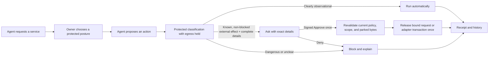
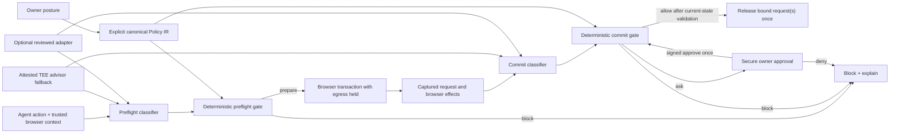

# Capability policy product requirements

Status: proposed requirements for the capability broker owner experience. This
document defines the product behavior and interface first, then the enforcement
and trust model required to make those promises true.
[CAPABILITY-BROKER.md](CAPABILITY-BROKER.md) remains the reference for the
current policy kernel and enforcement invariants.

The product gives an owner a simple permission plan for:

> one agent + one account or credential + one service.

The owner should always be able to answer three questions without understanding
HTTP or policy JSON:

1. What may the agent do automatically?
2. What will ask me for an exact one-time approval?
3. What will always be blocked?

## 1. End-to-end user experience

### 1.1 Connect an agent to a service

1. An agent asks to use a service account, for example a research assistant
   asking to use the owner's LinkedIn work account.
2. The secure Frame cryptographically authenticates the exact agent command and
   identifies the account or credential, service, and origin scope.
3. Phase 1 automatically uses Universal Protected Mode and the TEE advisor.
   No service adapter is required. When reviewed adapter support ships, exact
   covered actions may use adapter facts without changing the owner's posture.
   Neither the owner nor the agent designs endpoint rules.
4. The secure owner surface offers the owner's reusable default and three simple
   choices:
   - **Browse only**
   - **Browse + ask before changes** — recommended
   - **Block this site**
5. The owner sees a permission plan showing what runs automatically, what asks,
   what blocks, and what happens to anything unclear.
6. The owner can review representative examples, open Advanced technical
   details, or confirm the plan with trusted device authentication.
7. The broker installs the reviewed plan atomically before the agent receives
   access to the authenticated browser profile.

A manual login may occur in a human-only bootstrap context. There must be no
unrestricted agent automation window between login and policy activation.

### 1.2 Use the service for clearly safe reading

1. The agent proposes a browser action such as opening the feed or viewing a
   profile.
2. The protected browser captures the command and relevant page context.
3. In Phase 1, the attested TEE advisor classifies the action. When reviewed
   adapters ship, an exact covered action may use adapter facts; every uncovered
   action or field continues to use the advisor.
4. The browser prepares the action with outbound effects held. The actual
   request and browser effects are classified again before release.
5. The deterministic broker allows the transaction without interrupting the
   owner only when both passes establish a completely observational or
   local-only effect, with no disclosure, external change, dangerous effect, or
   unresolved fact.

“Read automatically” therefore means the action was Adapter-verified or
TEE-classified as observational and accepted by the deterministic broker. The
detail view preserves that provenance; advisor-backed output is not described
as verified. It never means “allow GET” or “block POST”: a GET may mutate state
and a POST may be used to read.

### 1.3 Propose a known external change

For an action such as liking a post, publishing content, sending a message, or
submitting a form:

1. The browser prepares the action while egress remains held.
2. The classifier identifies the external effect and the broker verifies that
   the destination, audience, content or value summary, causal chain, and exact
   request are complete.
3. Under **Browse + ask before changes**, the owner receives an exact approval
   card. Under **Browse only**, the action is blocked.
4. The owner may **Deny** or **Approve once**. Changing the standing policy is a
   separate action.
5. The trusted owner channel signs the exact action manifest, approver/device,
   nonce, and expiry.
6. Immediately before release, the broker revalidates the current principal,
   credential revision, policy generation, classifier measurement, context,
   exact parked bytes, nonce, expiry, and signed approval.
7. Approval releases one exact action once. Without an adapter that means one
   exact request. A future reviewed adapter may define a complete atomic
   multi-request transaction; the TEE advisor alone cannot create a bundle.
8. Any change invalidates the approval and prevents release.

### 1.4 Encounter a dangerous or unclear action

Financial commitments, credential or security changes, permission changes,
destructive actions, sensitive disclosures, and unsupported effects are blocked
in Universal Protected Mode.

An unknown, incomplete, conflicted, or causally ambiguous action is also
blocked. It is never converted into an approval prompt merely because the owner
is present.

The owner and agent receive:

- a plain-language reason;
- the policy posture that caused the result;
- whether classification came from an adapter or the TEE advisor;
- whether anything was sent;
- whether credential material was released; and
- safe next steps.

The agent must not retry, split, rephrase, change endpoints, or switch tools to
circumvent the decision.

### 1.5 Review, change, or revoke access

The owner can open a Policy Center to:

- review active plans by agent, service, account, and credential;
- see recent use, decisions, pending approvals, expiry, and budgets;
- compare semantic before/after policy versions;
- inspect signed receipts;
- revoke or expire a plan;
- restore a reviewed version as a new policy generation;
- block changes for this service/account, block this agent for this exact scope,
  or start a separately confirmed global agent block; and
- see whether policy or revocation changes reached every enforcement point.

Every mutation requires owner consent. A failed or stale change leaves the
previous policy active.

### 1.6 Owner-visible flow

This is the normal flow under **Browse + ask before changes**. Browse only turns
the Ask branch into Block; Block this site blocks all authenticated automation.



## 2. Settled MVP product decisions

### 2.1 Decision summary

| Topic | Settled decision | What the owner experiences |
| --- | --- | --- |
| Scope | Every installed plan is bound to an exact agent, account or credential, service, and origin scope. | A global preset can be reused, but each service receives its own scoped plan. |
| Choices | Browse only, Browse + ask before changes, or Block this site. Custom is under Advanced. | No HTTP, path, or JSON policy authoring is required. |
| Default | Browse + ask before changes is the recommended reusable default. | “Read when clearly safe. Ask for known external changes with complete details. Block dangerous or unclear actions.” |
| Unknown services | Universal Protected Mode applies automatically without a reviewed adapter. | No adapter setup is required. Supported, fully observable actions remain usable; unsupported actions block. |
| Automatic actions | Only completely classified observational or local-only actions can run automatically. | Safe reading and navigation do not create routine prompts. |
| Approval | Ask is available only for a known external effect with complete critical values and exact request binding. | The owner sees what will happen before approving it once. |
| Hard blocks | Financial, credential, security, permission, destructive, sensitive-disclosure, unsupported, and genuinely unclear actions block in Universal MVP. | Dangerous or unverifiable actions do not become approval prompts. |
| TEE advisor | The attested advisor is an MVP dependency and the fallback for every action or field not covered by a trusted adapter. | Unknown services receive semantic protection from day one. |
| Service adapters | Phase 1 does not depend on service adapters. Reviewed adapters are optional Phase 2 precision overlays that can improve labels, reduce inference, and define atomic transactions. | Adapter absence is informational, not a setup failure. |
| Authority | The explicit canonical policy and deterministic broker make the decision. Classifier output is signed evidence and a recommendation. | A model or website cannot override a deny or expand scope. |
| Presentation | Every trusted surface renders the same closed Render Manifest. | Browser, mobile, and CLI do not invent different summaries. |
| Technical detail | Canonical policy JSON, hashes, measurements, matcher details, and receipts remain under Advanced and export. | The primary flow stays concise without sacrificing auditability. |
| Failure | An unhealthy trusted boundary blocks agent automation and retains the previous policy. | The product never silently falls back to broad or method-based access. |

### 2.2 Owner postures

| Posture | Allow automatically | Ask every time | Block |
| --- | --- | --- | --- |
| **Browse only** | Completely classified observational or local-only actions. | Nothing. | Every external effect, disclosure, dangerous action, and unknown. |
| **Browse + ask before changes** | The same completely classified observational or local-only actions. | Known external effects with complete target, audience, content/value summary, causal provenance, and exact request binding. | Financial, credential, security, permission, destructive, sensitive disclosure, unsupported, incomplete, ambiguous, and unknown actions. |
| **Block this site** | Nothing. | Nothing. | All authenticated agent automation. |
| **Custom (Advanced)** | May narrow, constrain, or reorganize authority within deterministic ceilings. | May add stricter approval requirements. | Cannot bypass Universal MVP hard blocks without a reviewed service definition, adapter, and separately approved product capability. |

The setting for **Anything else / unclear actions** is always visible and always
**Block** in Universal Protected Mode.

Ordinary owner-intended content, such as a composed message or form response,
may Ask when destination, audience, content summary, causal provenance, and
exact request are complete. Credentials, authentication/recovery material,
secrets, protected financial identifiers, and data marked sensitive by owner or
enterprise policy Block in Universal MVP. The advisor cannot downgrade a
sensitive classification.

### 2.3 Roles and boundaries

- The **owner** chooses posture, constraints, and policy changes.
- The **agent** may request an action, suggest a trusted preset, or ask the Frame
  to discover an already trusted service package.
- A **service adapter** may provide reviewed deterministic facts only for its
  exact signed scope.
- The **TEE advisor** provides typed classifications and recommendations for
  uncovered actions or fields.
- The **deterministic broker** applies the canonical policy, hard ceilings,
  revocation, budgets, exact-once rules, and final decision.
- The **Frame** captures context, maintains the causal boundary, holds and
  releases egress, protects credentials, renders trusted owner UI, and signs
  receipts.

The agent cannot author trusted semantics, call the advisor directly, provide
the owner-facing renderer or copy, confirm owner-sensitive actions, or create a
policy from observed endpoints.

### 2.4 Product boundaries

The MVP does not:

- treat button labels, screenshots, page text, HTTP methods, or model prose as
  authority;
- let a one-time approval become an “always allow” rule;
- weaken a hard deny because an adapter, advisor, page, or agent recommends it;
- require a universal natural-language policy language;
- allow an imported or legacy unclassified Allow/Ask rule in Universal Mode; or
- claim that attestation proves model correctness or policy quality.

## 3. Interface and language requirements

### 3.1 Canonical user language

Primary policy outcomes are always:

- **Allow automatically**
- **Ask me every time**
- **Block**

Primary runtime states are:

- Preparing securely
- Running automatically
- Approval required
- Approved once
- Blocked by policy
- Blocked because the effect is unclear
- Owner denied
- Approval expired
- Secure protection unavailable
- Delivery could not be verified

Primary screens use the implementation-neutral status **Secure protection
active**. Development surfaces use **Development simulation · not attested**.
Detail views show the more precise provenance:

- **Adapter-verified** — facts from an approved, versioned service adapter;
- **TEE-classified** — typed facts and recommendation from the attested advisor;
- **Transport details only** — technical request facts without trusted human
  semantics; and
- **Page context (untrusted)** — screenshots, accessibility data, and site labels
  that aid explanation but cannot grant authority.

“Nothing was sent” may appear only when the egress gate proves
`commitStatus: not_sent`. Otherwise the product says:

> Delivery could not be verified. The agent will not retry.

### 3.2 First connection and preset choice

Entry condition: an authenticated service is ready for an agent, but no active
plan exists for the exact scope.

Required content:

- service and normalized origin;
- account or credential alias;
- requesting agent and assurance;
- reusable default posture;
- the three preset choices;
- concise Allow / Ask / Block consequences;
- `Anything unclear: Block`;
- advisor health and adapter availability under **How this is protected**; and
- Advanced policy details as a secondary path.

Primary action: **Use protected default**.

Secondary actions: **Review choices**, **Block this site**, and
**Customize… (Advanced)**.

```text
SECURE PROTECTION ACTIVE · Protect LinkedIn — Work account
Agent: Research assistant
linkedin.com

Use your protected default?

Read when clearly safe.
Ask for known external changes with complete details.
Block dangerous or unclear actions.

[Use protected default]

Review choices:
  Browse only
  Browse + ask before changes — selected
  Block this site
  Customize… (Advanced)

Anything unclear: BLOCK
[How this is protected]
```

Adapter absence is not shown as a warning. The detail view may say:

> TEE advisor active · No dedicated LinkedIn adapter installed

### 3.3 Permission-plan review and policy changes

The policy review screen must show:

- exact agent, account or credential, service, origins, and duration;
- every effective Allow and Ask capability family;
- hard blocks and the unclassified-action result;
- constraints, budgets, audiences, amounts, recipients, and time bounds;
- all wildcards, exceptions, fallbacks, and scope broadening;
- the provenance of semantic facts;
- complete effective/rendered coverage;
- representative action simulation; and
- Advanced canonical JSON, package hash, policy epoch, measurements, and
  contributing grant IDs.

Technical details may collapse; effective authority may not. A permissive item
must never disappear behind “and N more.” If the client cannot render every
effective authority atom, confirmation is disabled.

Policy changes show a semantic before/after diff. Widenings, removed
constraints, new origins, wildcard scope, legacy fallback, and changed
classifiers are pinned as warnings and require fresh trusted authentication.

```text
BROWSE + ASK                              8 / 8 rules represented

Clearly safe reading                  ALLOW AUTOMATICALLY
Known ordinary external changes       ASK EVERY TIME
Financial or security actions         BLOCK
Credential, secret, or policy-sensitive disclosure  BLOCK
Destructive actions                    BLOCK
Unknown, ambiguous, or incomplete     BLOCK
Off-service credential use            BLOCK

Anything unclear: BLOCK
Source: TEE advisor · No dedicated service adapter

[Test examples] [How this is protected] [Advanced]
[Cancel]                                      [Confirm]
```

### 3.4 Exact action approval

Entry condition: commit classification has established a known external effect
with complete authority-relevant values and the standing posture requires Ask.

The approval card must show:

- requesting agent and assurance;
- service and account;
- semantic action and visible effect;
- recipient, destination, audience, target, amount/currency/fees, merchant,
  content/attachment summary, or recurring terms as applicable;
- the policy row that requires approval;
- exact-once scope and expiry;
- classifier provenance;
- untrusted page context separately from trusted facts; and
- technical binding and attestation under Advanced.

Primary actions are **Deny** and **Approve once**. **Change policy…** starts a
separate policy-edit ceremony and cannot approve the pending action.

Any unresolved uncertainty about effect, causal chain, destination, audience,
content or value, request set, or another critical field produces Block instead
of an enabled approval card.

```text
LinkedIn · Work account                     Expires in 00:42

Research assistant wants to LIKE A POST
This reaction will be visible to others.

Reaction: Like
Post author: A. Example
Audience: Public

Policy: Known external changes → Ask every time
Classification: TEE-classified
Page snapshot: untrusted context

This approval releases this exact action once.
Scope: 1 request · no service adapter

[Why?] [Advanced]
[DENY]                                  [APPROVE ONCE]
                    Change policy…
```

The MVP production owner surface is the secure browser. The current development
phone simulator is a deterministic `approve|deny` test adapter selected at
startup. It exercises parking, digest binding, exact-once release, denial, and
timeout mechanics; it renders no approval UI, performs no owner judgment, and
is not authentication. The Alien mobile app must render the same manifest and
approval semantics when the production mobile channel ships in Phase 2.

### 3.5 Block and failure feedback

Owner-facing feedback leads with the result and reason:

- **Blocked by Browse only.** Liking a post is visible to others.
- **Blocked because the effect could not be verified.**
- **You denied this action.**
- **Automation paused because secure protection is unavailable.**
- **Delivery could not be verified. The agent will not retry.**

Agent-facing feedback is structured, sanitized, and actionable:

```json
{
  "outcome": "blocked",
  "code": "POLICY_DENIED",
  "action": {
    "id": "effect.external-side-effect",
    "title": "Likely action: Like a LinkedIn post",
    "titleSource": "tee-advisor"
  },
  "classificationSource": "tee-advisor",
  "decisionStage": "commit",
  "transaction": {
    "id": "transaction:...",
    "causalStatus": "bound",
    "preflightClassificationId": "classification:...",
    "commitClassificationId": "classification:..."
  },
  "explanation": "Blocked by Browse only: reactions are externally visible.",
  "policy": {
    "summaryId": "universal.browse-only",
    "epoch": 5
  },
  "commitStatus": "not_sent",
  "credentialReleased": false,
  "nextSteps": ["abandon", "request_policy_review"],
  "receiptId": "decision:..."
}
```

Feedback must distinguish policy deny, unknown effect, incomplete preview,
approval required, owner denial, timeout or offline owner channel, stale action,
changed policy, advisor failure, vault lock, attestation failure, and ambiguous
commit.

Safe next steps are limited to waiting for an already-pending approval,
requesting one policy review, handing control to the human outside agent
automation, or abandoning the action.

### 3.6 Policy Center

The Policy Center lists plans by agent, service, account, and credential. Each
entry shows:

- current posture and `Anything unclear` result;
- active policy epoch and enforcement status;
- advisor measurement and adapter version when present;
- last use and recent decisions;
- pending approvals;
- expiry and budget status;
- version history and semantic diffs;
- signed receipts;
- revocation propagation; and
- **Block changes for this account** and **Block this agent on this service**
  actions, plus a separately confirmed **Block this agent everywhere** control.

Clearing a policy must show the authority that would remain. It is never
presented merely as “remove policy.”

### 3.7 Surface capability matrix

| Capability | Secure browser | Dev phone simulation | Alien app | Agent channel | CLI / hosted |
| --- | --- | --- | --- | --- | --- |
| Initial preset choice | MVP | — | Phase 2 | May launch only | Textual fallback |
| Permission-plan review | MVP | — | Phase 2 | Read-only status | Closed-schema text |
| Exact approval | MVP | Deterministic `approve|deny` test adapter | Phase 2 | Wait/result only | Hosted owner channel only |
| Policy edit | MVP | — | Phase 2 constrained | May request only | Hosted owner channel only |
| History and revoke | MVP basic | — | Phase 2 full | Read-only status | Administrative fallback |
| Emergency block | MVP | — | Phase 2 | No | Administrative fallback |
| Advanced JSON/hash | MVP | — | Optional detail | No secrets | Expert `--json` |

All trusted owner-facing surfaces consume the same closed Render Manifest and
consent envelope. The development simulator is explicitly not an owner-facing
surface. Unsupported components, locale versions, or terminal truncation block
the ceremony rather than producing a partial summary.

The secure browser UI is isolated from the protected website and the agent. It
uses no untrusted HTML, JavaScript, Markdown, CSS, or remote assets. The renderer
owns layout, icons, localization, and controls; callers provide only
closed-schema fields and trusted resource keys.

### 3.8 Accessibility and localization

- Target WCAG 2.2 AA for browser and mobile surfaces.
- Support complete keyboard and screen-reader operation, logical focus, high
  contrast, reduced motion, and at least 44px mobile touch targets.
- Never encode a decision by color alone.
- Preserve critical facts as structured text even when a screenshot is shown.
- Use signed locale resources with stable capability, component, reason, and
  policy IDs across locales.
- Isolate bidirectional text and show ambiguous domains in normalized Unicode
  plus punycode.
- Do not silently translate domains, fingerprints, currency codes, identifiers,
  exact values, or receipt IDs.
- Pair relative expiry with absolute local time.

## 4. Normative functional requirements

### 4.1 Policy setup and management

- **POL-001:** The owner can choose Browse only, Browse + ask before changes, or
  Block this site for any exact service scope. Custom is available under
  Advanced.
- **POL-002:** The owner can set a reusable default that is instantiated
  separately for each normalized service/origin scope.
- **POL-003:** The primary review shows agent, service/account, duration, every
  capability family, its decision and constraints, and `Anything unclear`.
- **POL-004:** Every policy mutation provides an effective semantic before/after
  diff and identifies widening.
- **POL-005:** Every effective Allow/Ask, wildcard, exception, fallback, and
  removed constraint is visible; no permissive authority may be truncated.
- **POL-006:** The owner can simulate representative actions before install.
- **POL-007:** Canonical IR/JSON, package hash, epoch, compiler, classifier,
  adapter, and renderer versions remain available under Advanced and export.
- **POL-008:** Clear/removal renders the resulting effective fallback.
- **POL-009:** Install, change, restore, expiry, and revocation create a new
  generation and report propagation status.
- **POL-010:** Invalid, stale, unsupported, or unrenderable changes are rejected
  atomically and leave the previous policy active.

### 4.2 Universal Protected Mode

- **GEN-001:** An attested TEE advisor is an MVP dependency and supplies typed
  semantic classification for every action or field outside exact trusted
  adapter coverage.
- **GEN-002:** Automatic Allow requires a complete observational/local-only
  classification with no external effect, disclosure, dangerous class, or
  unresolved attribute.
- **GEN-003:** Ask requires a known external effect, complete critical values,
  causal provenance, and exact request binding.
- **GEN-004:** Financial, credential, security, permission, destructive,
  sensitive-disclosure, unsupported, incomplete, conflicted, ambiguous, and
  unknown actions Block in Universal MVP.
- **GEN-005:** Classifier confidence alone never permits an action; explicit
  uncertainty is treated as unknown.
- **GEN-006:** The advisor or exact-scope adapter classifies both preflight
  intent and commit effects. Preflight Allow never authorizes egress.
- **GEN-007:** Agent-caused egress remains held until commit classification and
  broker re-evaluation.
- **GEN-008:** Browser instrumentation causally tags synchronous and
  asynchronous descendants of each agent action.
- **GEN-009:** Background traffic is isolated and cannot borrow a foreground
  approval or carry tainted data under an operational lease.
- **GEN-010:** Missing attestation, classifier mismatch, unavailable causal
  attribution, unavailable taint tracking, or unavailable hold/release blocks
  automation without heuristic fallback.
- **GEN-011:** Installing or upgrading an adapter cannot widen posture without a
  new owner-reviewed policy generation.
- **GEN-012:** The agent cannot author semantic definitions, endpoint rules,
  trusted summaries, or owner confirmation.
- **GEN-013:** The advisor remains the active fallback while any enabled scope
  lacks complete reviewed adapter coverage. Removing it requires either complete
  coverage for that scope or blocking the uncovered scope.
- **GEN-014:** Every command is cryptographically bound to the calling Agent ID
  and channel using DPoP, mTLS, an attested channel, or an equivalent
  proof-of-possession mechanism verified inside the Frame. A caller-supplied
  principal string is never sufficient.

### 4.3 Exact action approval

- **ACT-001:** The approval binds agent, principal, credential revision, policy
  epoch/hash, preflight digest, causal transaction ID, commit/request digest,
  runtime Render Manifest digest, classifier measurement, registered approver
  and device identity, approval signature, nonce, and expiry.
- **ACT-002:** Every effect category declares required preview fields; missing
  or ambiguous fields disable approval and Block.
- **ACT-003:** Trusted classifier facts and untrusted page context are visually
  and programmatically separate.
- **ACT-004:** Approve once consumes one exact action once and cannot create a
  reusable bearer grant. Without an adapter the action contains one exact
  request; an adapter-defined action displays and binds its complete request
  count.
- **ACT-005:** Only an approved adapter may define an atomic multi-request
  transaction, and it must bind every constituent request.
- **ACT-006:** Context, request, target, origin, policy, credential, classifier,
  or model changes invalidate approval.
- **ACT-007:** Unsupported mutable transactions abort instead of resuming from a
  stale state.
- **ACT-008:** A background request is independently decided and can never use a
  foreground approval.
- **ACT-009:** Concurrent foreground actions or ambiguous initiator chains are
  rejected or quarantined.
- **ACT-010:** After a signed approval returns and immediately before release,
  the broker revalidates current principal proof, credential revision, policy
  generation, classifier/adapter measurement, action and manifest digests,
  exact parked bytes, nonce, expiry, revocation, and one-time-use state.

### 4.4 Trusted rendering

- **REN-001:** Browser, mobile, CLI, and hosted owner channels render one closed
  Render Manifest schema.
- **REN-002:** Every normalized authority atom maps to a visible component; the
  client verifies coverage before enabling confirmation.
- **REN-003:** Unsupported components, schema, locale, or incomplete coverage
  block approval.
- **REN-004:** Renderers accept no arbitrary markup, code, styling, or remote
  assets from agents, adapters, models, policies, or websites.
- **REN-005:** Cross-surface conformance vectors produce identical decisions,
  component IDs, warnings, and effective/rendered counts.
- **REN-006:** Pagination and responsive layouts cannot hide authority.

### 4.5 Feedback and audit

- **FBK-001:** Every outcome has a stable reason code and a localized,
  plain-language explanation.
- **FBK-002:** Feedback states decision stage, causal status, commit status,
  credential-release status, policy generation, provenance, and safe next
  steps.
- **FBK-003:** `not_sent` is reported only when proven. An unknown commit stops
  the transaction and suppresses retry.
- **FBK-004:** Agent feedback is sanitized and does not expose secrets,
  sensitive predicates, raw request bodies, or unnecessary private preview
  values.
- **AUD-001:** Policy-change receipts bind before/after package hashes and
  epochs, manifest digest, classifier and renderer measurements, owner/device,
  nonce, time, result, and previous receipt.
- **AUD-002:** Runtime receipts bind policy generation, capability, classifier,
  action, transaction, and runtime-manifest digests, causal status,
  classification IDs, approver/device identity when applicable, outcome, and
  commit status.
- **AUD-003:** Feedback cannot approve an action or mutate policy.

## 5. Enforcement model supporting the experience

### 5.1 Components and authority flow

The product experience depends on five versioned layers:

1. **Universal semantic policy** maps stable human effect categories to the
   owner's selected posture.
2. **TEE advisor** supplies typed classifications for uncovered service
   semantics.
3. **Service Capability Packages** optionally supply reviewed definitions and
   deterministic adapter facts.
4. **Canonical Policy IR and deterministic broker** provide the only authority
   source and final decision.
5. **Render Manifest, consent, and receipts** bind what the owner saw and chose
   to what the broker enforced.



A classifier supplies facts; it does not release credentials or network
traffic. The broker owns final composition, and the Frame owns the gate.

### 5.2 Universal semantic ontology

At minimum, classifiers produce these service-independent effects:

| Effect | Meaning |
| --- | --- |
| `observational` | View, search, navigate, or inspect with no known external effect. |
| `localOnly` | A UI change proven not to leave the protected browser. |
| `externalSideEffect` | Communicate, react, publish, submit, follow, save, or otherwise change externally visible state. |
| `dataDisclosure` | Send account, user, clipboard, file, form, or derived data to a destination. |
| `financial` | Purchase, subscribe, transfer, trade, donate, or create a paid commitment. |
| `securitySensitive` | Change password, MFA, recovery, permission, session, identity, or credentials. |
| `destructive` | Delete, revoke, cancel, or cause a difficult-to-reverse change. |
| `unknown` | The effect, destination, causal provenance, or critical values cannot be established. |

Adapters may refine these classes into capabilities such as `social.react`,
`mail.send`, or `commerce.purchase`. The universal owner posture remains
authoritative.

### 5.3 Classifier selection

For each preflight and commit pass:

1. The Frame uses an allowlisted adapter only when its signed service, origin,
   action, version, and field coverage exactly match.
2. Every uncovered action or field goes to the attested TEE advisor.
3. If neither source establishes a complete result, classification is unknown
   and the broker blocks it.
4. Disagreement, stale measurements, or changed classifier versions force
   reclassification or Block.

Adapter installation improves precision and may reduce prompts. It cannot widen
the plan silently or suppress advisor fallback outside exact coverage.

### 5.4 Advisor output

The advisor returns a signed typed envelope containing:

- semantic action and effect classes;
- reversibility/finality and affected audience;
- sources and destinations of disclosed data;
- financial, security, destructive, and sensitive flags;
- critical values required for review;
- references into trusted command context, browser snapshot, and captured
  transaction;
- explicit unknowns and contradictions;
- expected network and browser effects;
- Allow, Ask, or Block recommendation; and
- bindings to model/runtime/prompt/ontology measurements, context/action/policy
  digests, nonce, and expiry.

Free-form rationale may explain the result but cannot grant authority. Numeric
confidence is diagnostic only.

### 5.5 Two-stage browser transaction

```text
IDLE → PREFLIGHT_HELD → PREPARED_WITH_EGRESS_HELD → COMMIT_HELD
     → ALLOW_RELEASE_ONCE | ASK_PENDING | DENY | AMBIGUOUS_BLOCKED
```

**Preflight**

Before executing the gesture, the Frame captures the authenticated agent
command, target element, origin and frame, bounded accessibility snapshot,
optional screenshot, relevant non-secret form values, and recent action
history. The classifier may block immediately or permit local preparation with
egress held. Preflight never grants final one-time approval.

**Commit**

The browser performs the local action inside a bounded transaction. Outbound
requests, redirects, navigation, downloads, uploads, permission prompts, window
opens, clipboard/file operations, and observable DOM effects are captured or
held. The classifier evaluates the actual transaction and binds it to preflight.
The broker then re-applies hard policy.

Without an adapter, every request is decided and released separately. If the
actual effect differs, values are missing, server state has changed, exact bytes
cannot be bound, or safe resume is impossible, the transaction aborts rather
than sending ambiguous data.

If the broker returns Ask, the parked transaction remains unreleased while the
trusted owner channel signs the exact runtime manifest. When the response
returns, it goes back through the commit gate. The broker performs ACT-010
revalidation immediately before any bound request is released.

### 5.6 Background and operational traffic

The owner should approve a user-level action, not every telemetry POST. This is
safe only with causal separation:

- each agent command opens one transaction ID;
- event, timer, frame, worker, and network descendants are attributed to it;
- pre-existing background traffic is classified separately;
- only one foreground transaction is active per page/context; and
- ambiguous overlap remains held or blocked.

Every released request still receives an independent broker decision.
Background traffic never borrows foreground approval.

A bounded operational lease requires proof that traffic:

- is service-originated and not causally descended from the agent action;
- remains within the credential's exact origin boundary;
- matches bounded destination, schema, size, rate, and lifetime limits; and
- carries no agent-provided, vault-derived, clipboard, file, form, or newly
  entered tainted data.

Optional analytics should be dropped when the service still functions.

Service workers, WebSocket, WebTransport, WebRTC, workers, opaque or unsupported
binary/batched/oversized payloads, unsupported redirects, and unobservable
browser effects remain blocked until the measured gate can mediate them. A new
origin is a new decision.

If causal attribution, taint tracking, or hold/release is unavailable, agent
automation blocks. The product may offer a human-only browser handoff outside
agent control, but owner approval cannot authorize an unbounded transaction.

## 6. Policy and presentation data

### 6.1 Service Capability Package

A Service Capability Package is an optional, signed, versioned, origin-bound,
declarative precision overlay. It contains no executable HTML, JavaScript,
Markdown, or arbitrary styling.

A package may include:

- stable capability definitions and versions;
- service and origin scope;
- signed localized resource keys;
- effect and reversibility classes;
- supported decisions and safe defaults;
- adapter ID/version/measurement;
- typed constraint schemas;
- critical approval fields and redaction rules;
- risk and step-up requirements;
- permitted templates; and
- migration and rollback rules.

Definitions are trusted product metadata, not policy authority. A definition or
adapter upgrade that changes meaning requires a new reviewed policy generation.

### 6.2 Canonical Policy IR and package

The canonical explicit Policy IR is the sole input to enforcement. Compilation
expands every authority-significant default, including method, host, path,
query, port, principal, time, priority, constraints, unmatched behavior, and
conflict-resolution inputs.

The signed package binds:

- explicit Policy IR;
- owner posture and template version;
- cryptographically authenticated agent principal, proof-of-possession method,
  channel binding, and assurance;
- account/credential and revision;
- exact origin scope;
- universal ontology and typed-output schema;
- advisor model epoch, weights, prompt, and runtime measurements;
- browser action gate, causal collector, taint tracker, normalizer, transaction
  gate, renderer, and receipt signer measurements;
- capability-definition and adapter digests when present;
- current and proposed policy epoch/hash;
- locale-resource digest;
- package schema/compiler version; and
- nonce and expiry.

The package hash, not display copy, identifies the installed policy.

### 6.3 Closed Render Manifest

A trusted presentation compiler creates a closed Render Manifest from the
validated package.

```json
{
  "version": 1,
  "ceremony": "policy.replace",
  "resource": {
    "service": "LinkedIn",
    "accountAlias": "Work account",
    "origin": "https://www.linkedin.com"
  },
  "principal": {
    "displayName": "Research assistant",
    "canonicalId": "agent:jkt:...",
    "assurance": "attested"
  },
  "posture": {
    "templateId": "universal.browse-ask",
    "headline": "Read when clearly safe; ask for known external changes",
    "unclassifiedDecision": "deny"
  },
  "groups": [
    {
      "id": "effect.external-change",
      "decision": "ask",
      "source": "universal-ontology",
      "grantIds": ["universal-external-change-ask"]
    }
  ],
  "coverage": {
    "effectiveAtoms": 8,
    "renderedAtoms": 8,
    "root": "sha256:..."
  },
  "technical": {
    "beforeEpoch": 4,
    "afterEpoch": 5,
    "packageHash": "sha256:...",
    "rendererVersion": 1,
    "ontologyDigest": "sha256:...",
    "advisorMeasurement": "sha256:...",
    "adapter": null
  }
}
```

Every normalized authority atom maps to at least one visible component. The
client verifies coverage equality before enabling confirmation.

A runtime action manifest additionally carries classification provenance,
preflight and commit classification IDs, causal status, critical values,
request commitment, policy generation, expiry, and whether approval is enabled.

## 7. Trust, security, and privacy

### 7.1 Production TEE/Frame boundary

The MVP production Frame must cover, or authenticate an inseparable measured
chain across:

- caller-principal authentication and channel binding;
- browser action and context capture;
- causal attribution and taint tracking;
- normalizer and universal ontology;
- advisor model weights, runtime, and system prompt;
- policy state, evaluator, and deterministic broker;
- credential gate;
- exact request hashing and transaction hold/release;
- trusted renderer and owner consent binding; and
- receipt signing.

Putting only model inference in a TEE is insufficient: an untrusted host could
forge context, bypass a deny, or send different bytes.

The fresh quote/report data binds the Frame signing key, current package and
policy hash, runtime action/manifest digest when applicable, nonce, and device
session. Advisor envelopes, consent responses, and receipts must verify under
that attested key or an explicitly attested subordinate key. An untrusted relay
cannot mix a valid quote from one Frame with another session or envelope.

The trusted owner surface verifies or presents this allowlisted attestation
before consent; the production Alien app verifies it directly when that channel
ships. Attestation proves which measured code ran. It does not prove that model
reasoning, translations, policy design, or a compromised display is correct.

### 7.2 Deterministic authority and precedence

The broker, not the advisor, owns:

- explicit owner and enterprise hard denies;
- principal, origin, credential, and time scope;
- hard-risk categories;
- budgets and constraints;
- revocation and current policy generation;
- exact-once consumption; and
- final decision composition.

Templates, UI copy, adapter facts, advisor output, screenshots, operator labels,
and page text are inputs or explanations. None is authority by itself.

### 7.3 Consent, install, and rollback integrity

Owner consent binds the intended operation, exact scope, before/after package
hashes and epochs, manifest digest, credential revision, advisor/adapter/
renderer measurements, device session, nonce, and expiry.

Exact-action consent separately signs the runtime Render Manifest digest,
action and parked-request commitment, current policy and credential generation,
registered approver/device identity, nonce, and expiry. The signed response is
an input to post-approval broker revalidation, not a release instruction by
itself.

The Frame recomputes the package and manifest immediately before atomic install.
Stale previous hash, replay, wrong device, changed package, unsupported field, or
incomplete rendering rejects the change and retains the previous policy.

Propagation and revocation remain visible until every persistent enforcement
point acknowledges the new generation.

### 7.4 Fail-closed conditions

Universal Protected Mode blocks on:

- advisor timeout, malformed typed output, uncertainty, or contradiction;
- unapproved or changed model, prompt, ontology, adapter, renderer, or runtime;
- stale or missing attestation;
- snapshot, target, origin, frame, or context drift;
- preflight/commit disagreement;
- missing critical values;
- causal ambiguity or concurrent foreground action;
- opaque, batched, oversized, or incomplete request capture;
- unsupported alternate transport, redirect, origin, or browser effect;
- policy, credential, adapter, or model generation change;
- revocation, duplicate/replayed approval, or expired nonce;
- inability to bind exact bytes; or
- unavailable causal, taint, credential, or egress gate.

It never falls back to GET/POST assumptions, broad legacy access, agent-authored
rules, or an untrusted local model.

### 7.5 Truthful outcome and retry behavior

The product may claim `not_sent` only when the egress gate proves that no
request was released. Ambiguous release status is `unknown`, stops the
transaction, and suppresses automatic retry.

The agent may not work around a deny by retrying, splitting the action,
rephrasing it, changing endpoints, switching tools, or using another network
channel.

### 7.6 Privacy

- Credentials and raw secrets never enter advisor input, page context, owner
  approval UI, ordinary logs, or receipts.
- Page and action context is minimized and remains inside the measured privacy
  boundary.
- Screenshots are optional, isolated from trusted controls, and labeled
  untrusted.
- Sensitive previews are encrypted and retention-limited.
- Snapshot/action retention, telemetry, training, or model improvement is off by
  default and requires separate informed consent.
- Reporting a bad classification does not approve the current action or mutate
  policy.

## 8. Acceptance and adversarial validation

### 8.1 LinkedIn without a service adapter

The MVP acceptance journey deliberately assumes no LinkedIn adapter:

1. The owner connects the research assistant to the LinkedIn work account.
2. The secure browser offers the reusable protected default without asking for
   HTTP rules or adapter installation.
3. The owner chooses Browse only.
4. Reading the feed and viewing profiles succeeds only after preflight and
   commit classification establish observational behavior, including when a
   read uses POST.
5. A Like attempt is blocked before egress with the explanation that reactions
   are externally visible.
6. The agent receives `POLICY_DENIED`, provenance, causal/commit status, safe
   next steps, and `commitStatus: not_sent` only when proven.
7. The agent does not retry or take an alternative path.
8. The owner changes to Browse + ask before changes.
9. A later Like attempt produces an exact one-request approval card; approving
   it releases that exact request once.
10. Publish asks only when content, audience, destination, and exact request are
    complete; otherwise it blocks.
11. Payments, account/security changes, destructive actions, and unknown effects
    block.
12. Independent background telemetry does not prompt the owner and cannot borrow
    the Like decision.
13. The browser renders the action facts. The development phone simulator
    deterministically exercises approve, deny, timeout, exact-digest, and
    exact-once mechanics without claiming UI or owner-authentication parity.
14. Installing a later LinkedIn adapter improves labels or transaction precision
    without widening the owner's posture.

### 8.2 Required validation families

**Policy and rendering**

- source/template → explicit IR → canonical bytes → package hash → Render
  Manifest → consent vectors;
- property testing that every authority-significant change changes a visible
  component and manifest digest or makes rendering fail;
- large policies, permissive final grants, wildcards, broad defaults, removed
  constraints, legacy fallback, priorities, shadowing, and conflicts;
- renderer, locale, definition, adapter, model, and policy substitution; and
- browser/mobile/CLI golden rendering and accessibility parity.

**Exact action and commit truth**

- denial proving no upstream release and accurate `commitStatus`;
- stale epoch, replay, duplicate approval, concurrent changes, and expiry;
- missing preview fields, changed request bytes, changed DOM effect, and
  preflight/commit disagreement;
- signed approval followed by changed principal proof, credential revision,
  policy generation, classifier measurement, manifest, parked bytes, nonce, or
  revocation, proving post-approval revalidation blocks release;
- multi-request action without an adapter, proving request-by-request decision;
- ambiguous release proving `unknown` status and suppressed retry; and
- policy change during a pending approval.

**Unknown-service and browser isolation**

- state mutation on GET and read-like behavior through POST;
- delayed timers, unrelated telemetry, and background traffic racing a gesture;
- ambiguous initiator chains and concurrent foreground actions;
- tainted data attempting to use an operational lease;
- opaque/batched/oversized bodies, redirect/new origin, service workers,
  WebSocket/WebTransport/WebRTC/workers, and unobservable effects; and
- unavailable causal attribution, taint tracking, or egress hold.

**Advisor, TEE, and privacy**

- model timeout, malformed result, uncertainty, prompt injection, and deceptive
  page context;
- stale or substituted weights, prompt, ontology, causal collector, gate,
  renderer, or Frame measurement;
- caller-principal spoofing, channel replay, and proof-of-possession mismatch;
- mixing a valid attestation quote, Frame signing key, advisor envelope,
  consent, receipt, or device session from different live sessions;
- attempts to expose credentials or private page content through feedback,
  logs, receipts, screenshots, or training; and
- shadow and veto evaluation corpora meeting launch thresholds before protected
  enforcement.

## 9. Delivery and migration

### Phase 1 — Universal Protected Mode MVP

- Secure-browser preset selection, permission-plan review, exact approval,
  feedback, basic Policy Center, and emergency block.
- Deterministic development phone simulator with explicit `approve|deny` mode
  for approval mechanics only; it is not a Render Manifest UI or owner
  authentication.
- Measured Frame boundary covering capture, causal/taint instrumentation,
  advisor, deterministic broker, credential gate, transaction hold/release,
  renderer, and receipt signing.
- Universal ontology and Browse only, Browse + ask, and Block site presets.
- Two-stage preflight/commit classification and exact single-request approval
  for known external effects on services without adapters.
- Canonical Policy IR/package, semantic diff, coverage proof, Advanced JSON,
  structured feedback, and signed receipts.
- Internal shadow and veto evaluation completed before protected enforcement.
- Fail-closed behavior whenever the trusted Universal Mode boundary is
  unavailable.

### Phase 2 — production mobile and service precision

- Production Alien app review, exact approval, history, revocation, and
  emergency controls.
- Signed capability and locale packages.
- Reviewed service adapters, typed constraints, and atomic transaction bundles.
- Enforcement propagation and multi-device anti-rollback.
- TEE advisor retained for every action or field outside reviewed adapter
  coverage.

### Phase 3 — broader coverage and controlled delegation

- Broader reviewed adapter and enterprise-definition coverage.
- Improved operational-traffic profiles and adapter/advisor disagreement
  monitoring.
- Live revocation, transparency, and audit services at scale.
- Additional owner-delegated categories only after category-specific evaluation
  and deterministic ceilings.

### Migration

Existing technical JSON and policy hashes remain available under Advanced and
export. The primary ceremony moves to the Render Manifest permission plan.

Legacy or imported policy that cannot be normalized and represented completely
is not silently summarized. It must be migrated to explicit IR or rejected; the
previous active policy remains installed until a valid owner-reviewed
replacement succeeds.

## 10. Open decisions

### MVP blockers

- What evaluation and red-team thresholds gate automatic observational Allow?
- Which operational traffic classes qualify for universal bounded leases?
- How are normalized service/origin scopes inherited from a global preset
  without accepting deceptive or credential-bearing cross-origin destinations?
- What snapshot/action fields may be retained for audit, for how long, and under
  which separate consent?

### Phase 2 decisions

- Which policy edits are safe on mobile and which require the desktop owner
  surface?
- Which widenings require biometric step-up or a second approver?
- Who reviews and signs first-party, partner, and enterprise Service Capability
  Packages?
- How are definition and adapter migrations reviewed, staged, and rolled back?
- How do enterprise ceilings compose with individual owner choices?

### Research

- What prompt rate is acceptable before a service adapter is required?
- Which reviewed adapters may safely coalesce requests into one semantic
  transaction?
- When is adapter coverage sufficient to block rather than advise on remaining
  unknown scope?
- Which additional capability categories can become owner-delegable without
  weakening Universal Mode hard blocks?
