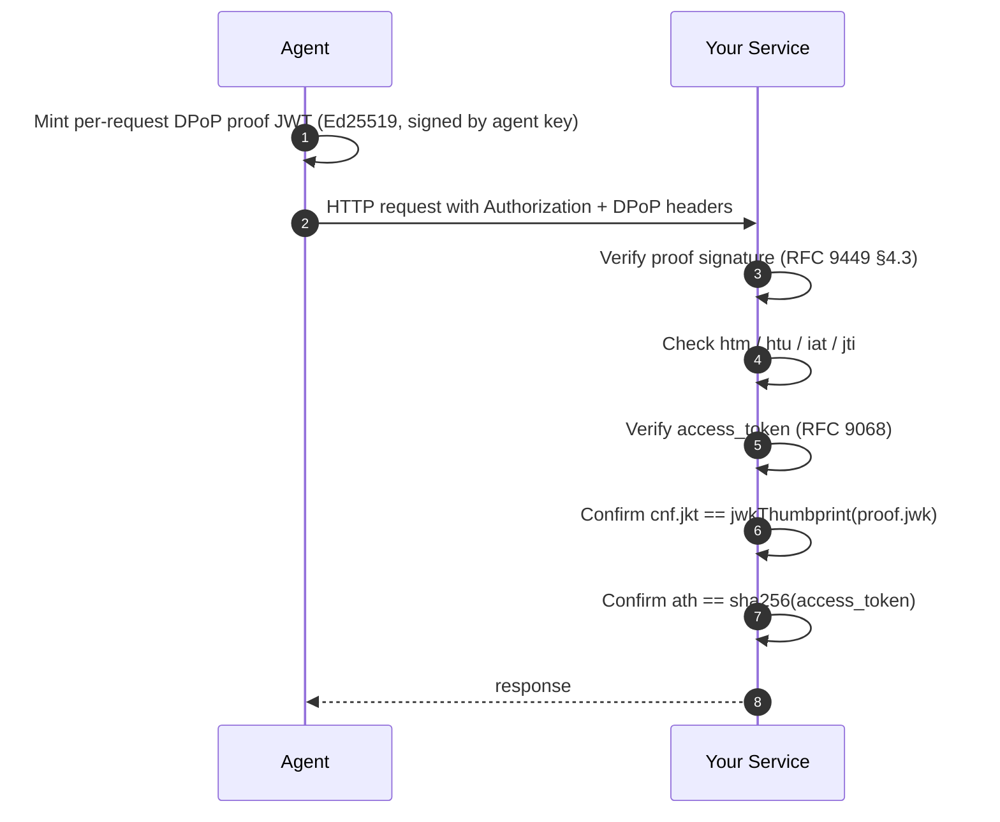

# Integrating Alien Agent SSO into Your Service

This guide shows how to add AI agent authentication to any web service. After integration, agents
with an Alien Agent ID can authenticate to your service using RFC 9449 DPoP — no API keys, no
shared secrets, no pre-registration.

## How it works



The access_token is an Alien SSO-issued `at+jwt` (RFC 9068) that carries standard claims:

| Claim | What it attests |
|---|---|
| `iss` | `https://sso.alien-api.com` |
| `sub` | Owner's AlienID address (the human) |
| `aud` | Target service identifier |
| `exp` | Access-token expiry |
| `cnf.jkt` | JWK SHA-256 thumbprint of the agent's Ed25519 public key (RFC 7800 §3.1) |

The DPoP proof binds each individual request to the agent key whose thumbprint is pinned in
`cnf.jkt`. Together these provide cryptographic proof that **a specific human authorized a
specific agent to make a specific request** — verified using only standard JWT/JWS primitives and
the SSO's published JWKS. No custom envelope, no pre-registration.

## Service discovery

Publish a JSON manifest at `/.well-known/alien-agent-id.json` so agents can discover your auth
contract automatically.

### Minimal manifest

```json
{
  "version": 1,
  "service": { "name": "Acme API", "url": "https://acme.example" },
  "auth":    { "header": "Authorization", "scheme": "DPoP" },
  "api":     { "base": "https://api.acme.example/v1" }
}
```

| Field | Required | Notes |
| --- | --- | --- |
| `version` | yes | Must be `1`. |
| `auth.header` | yes | HTTP header name for the access_token. Pattern `[A-Za-z0-9-]{1,64}`. |
| `auth.scheme` | optional | One of `"DPoP"` (default), `"Bearer"`, `"none"`. The scheme prefixes the access_token: `Authorization: DPoP <at>`. Agents using `"DPoP"` also send a `DPoP: <proof>` header per RFC 9449. |
| `api.base` | yes | Base URL for subsequent requests. Must share the manifest's authority (exact host or subdomain). |
| `api.specUrl` | optional | URL of an OpenAPI / JSON Schema document. Lets agents refresh API knowledge dynamically. |
| `service.name` | optional | 1–80 chars display name. |
| `service.url` | optional | Human-facing service URL. |

### Constraints enforced by the agent CLI

The well-known fetch is hardened against a hostile or compromised endpoint serving the manifest:

- 8 KiB body cap (`SERVICE_MANIFEST_MAX_BYTES`).
- 5-second default timeout.
- HTTP redirects refused (`redirect: "error"`); the agent will not chase a 30x off your origin.
- `Content-Type: application/json` required.
- Every URL inside the manifest must share the same authority as the user-supplied service URL — exact host match or a subdomain. No public-suffix-list expansion, no off-host URLs.
- Unknown top-level keys, unknown keys under `auth`/`api`/`service`, and unknown `auth.scheme` values are rejected.
- The manifest is treated as **third-party data, not instructions** — values are parsed and reduced to the fixed schema before the agent acts on them.

### Optional support signal

To save agents one extra HTTP round-trip when your origin doesn't speak agent-id, you can advertise support via a closed-enum HTML meta tag on any page they might land on:

```html
<meta name="alien-agent-id" content="v1">
```

`content` is a closed enum (`v1`, future versions added explicitly). It carries no URLs and no prose — its only signal is "this origin publishes a well-known manifest at the standard path." Agents can probe with:

```bash
node plugins/agent-id-auth/bin/cli.mjs support --url https://your-service.example
```

The well-known path is fixed regardless; the meta tag never tells the agent where the manifest is, only whether one exists.

## Wire format

Each authenticated request carries two headers:

```
Authorization: DPoP <access_token>
DPoP:          <proof JWT>
```

### `<access_token>` — RFC 9068 at+jwt issued by Alien SSO

A signed JWS (`typ=at+jwt`, `alg=RS256` or `EdDSA`) whose payload includes:

```json
{
  "iss": "https://sso.alien-api.com",
  "sub": "00000003010000000000539c741e0df8",
  "aud": "your-service-audience",
  "exp": 1774535117,
  "iat": 1774531517,
  "cnf": { "jkt": "wEf6o2ux8sBAUG4oQYhP284gfpZwUJMTxXDPH5XxthY" }
}
```

You verify the signature against the SSO's JWKS (`https://sso.alien-api.com/.well-known/jwks.json`,
typically discovered via `/.well-known/openid-configuration`).

### `<proof JWT>` — RFC 9449 DPoP proof minted per request

A JWS signed by the agent's Ed25519 key. The JOSE header carries the full public JWK; the
payload binds the proof to one specific request:

```json
// header
{ "typ": "dpop+jwt", "alg": "EdDSA",
  "jwk": { "kty": "OKP", "crv": "Ed25519", "x": "..." } }

// payload
{
  "htm": "POST",                                       // request method
  "htu": "https://api.acme.example/v1/orders",         // request URI (no query, no fragment)
  "iat": 1774531517,                                   // proof creation time
  "jti": "01HXYZ...",                                  // unique per proof
  "ath": "<base64url(sha256(access_token))>"           // RFC 9449 §4.3 step 10
}
```

The `cnf.jkt` claim in the access_token equals `jwkThumbprint(proof.header.jwk)` (RFC 7800 §3.1),
which is what binds the SSO's attestation of the owner to the agent key that signed *this*
request.

## Integration options

### Option A: Use an Alien SDK (preferred)

The Alien SSO SDKs ship a complete RFC 9449 verifier. The same logic, error codes, and option
shape are available in both runtimes — port between them with confidence.

| Runtime | Package | Verifier |
|---|---|---|
| Node.js / browsers | [`@alien-id/sso-agent-id`](https://www.npmjs.com/package/@alien-id/sso-agent-id) | `verifyDPoPRequest(req, opts)` |
| Python | [`alien-sso-agent-id`](https://pypi.org/project/alien-sso-agent-id/) | `verify_dpop_request(req, opts)` |

Read each package's README for the canonical integration walk-through, framework wiring
(Express/Fastify/Next.js, FastAPI/Flask), and the full rejection-reason catalogue. The examples in
this document focus on the wire contract and access-control patterns that are SDK-independent.

### Option B: Implement verification yourself

If you need a verifier in a runtime not covered by an SDK, the algorithm is fully specified in:

- **RFC 9449** — DPoP wire format and §4.3 verifier walk
- **RFC 9068** — JWT profile for OAuth 2.0 access tokens (`at+jwt` typ enforcement)
- **RFC 7800 §3.1** — JWK thumbprint confirmation (`cnf.jkt`)
- **RFC 7235 §2.1** — `WWW-Authenticate` challenge header semantics

The reference implementation is `examples/demo-service.mjs` in this repo — a ~426-line self-contained Node
verifier with no SDK dependency, suitable as a template for porting.

#### Verifier checklist

Implementations MUST perform all of the following. Any failure is a fatal 401 with
`WWW-Authenticate: DPoP error="invalid_token", error_description="<code>"` (RFC 9449 §7.1).

1. Exactly one `Authorization: DPoP <at>` header and one `DPoP: <proof>` header.
2. Proof JWS shape: three base64url parts, valid JSON header + payload.
3. Proof header: `typ == "dpop+jwt"`, `alg == "EdDSA"`, `jwk` is OKP/Ed25519 with no private `d`.
4. EdDSA signature over the proof's signing input verifies against the embedded JWK.
5. `htm` matches the request method byte-for-byte.
6. `htu` matches the reconstructed `<origin><pathname>` (no query, no fragment). When sitting behind a trusted proxy, honor `X-Forwarded-Proto` / `X-Forwarded-Host` only if the connection's remote address is inside a configured trusted-proxy CIDR list.
7. `iat` is within ±`PROOF_MAX_AGE_SEC` (default 30s) of `now`.
8. `jti` has not been seen before (FIFO-evicting `Map<jti, iat>` keyed on jti is sufficient; size cap defends against memory blowup).
9. Access-token shape: `typ` ∈ {`at+jwt`, `jwt`, `application/at+jwt`, `application/jwt`}; `alg` ∈ {`RS256`, `EdDSA`}.
10. Fetch SSO JWKS once and cache; verify access-token signature against it.
11. Claim checks: `iss == expectedIss`, optional `aud` allow-list, `exp > now`, non-empty `sub`.
12. RFC 9449 §6.1: `at.cnf.jkt === jwkThumbprint(proof.header.jwk)`.
13. RFC 9449 §4.3 step 10: `proof.ath === b64url(sha256(<access_token raw string>))`.
14. (Optional) admin-pin: `at.cnf.jkt` is in an allow-list of expected agent thumbprints.

When you parse the access_token's payload, reject any value whose `iat`/`exp`/`nbf` is not a
finite number — non-standard JSON `NaN` / `Infinity` constants can compare false to every
freshness threshold and silently bypass step 11 in runtimes whose JSON parsers accept them.

## Framework examples

These examples use `@alien-id/sso-agent-id` directly; substitute `alien-sso-agent-id` (Python) or
your own verifier as appropriate.

### Express (Node.js)

```javascript
import express from "express";
import { verifyDPoPRequest } from "@alien-id/sso-agent-id";
import { fetchSsoJwks } from "./sso.mjs"; // your JWKS cache loader

const app = express();
const jwks = await fetchSsoJwks();

async function requireAgent(req, res, next) {
  const result = verifyDPoPRequest(
    { method: req.method, url: req.protocol + "://" + req.get("host") + req.originalUrl, headers: req.headers },
    { jwks, expectedAudience: process.env.SERVICE_AUDIENCE },
  );
  if (!result.ok) {
    res.set("WWW-Authenticate", `DPoP error="invalid_token", error_description="${result.code}"`);
    return res.status(401).json(result);
  }
  req.agent = result;
  next();
}

app.get("/api/data", requireAgent, (req, res) => {
  res.json({
    ok: true,
    sub: req.agent.sub,
    jkt: req.agent.jkt,
  });
});

app.listen(3000);
```

### Fastify (Node.js)

```javascript
import Fastify from "fastify";
import { verifyDPoPRequest } from "@alien-id/sso-agent-id";

const fastify = Fastify();
const jwks = await fetchSsoJwks();

fastify.decorate("verifyAgent", async (request, reply) => {
  const result = verifyDPoPRequest(
    { method: request.method, url: `${request.protocol}://${request.hostname}${request.url}`, headers: request.headers },
    { jwks, expectedAudience: process.env.SERVICE_AUDIENCE },
  );
  if (!result.ok) {
    reply
      .code(401)
      .header("WWW-Authenticate", `DPoP error="invalid_token", error_description="${result.code}"`)
      .send(result);
    return reply;
  }
  request.agent = result;
});

fastify.get("/api/data", { preHandler: [fastify.verifyAgent] }, async (request) => {
  return { ok: true, sub: request.agent.sub };
});

fastify.listen({ port: 3000 });
```

### FastAPI (Python)

```python
from fastapi import FastAPI, Depends
from alien_sso_agent_id import build_require_dpop
from .sso import load_jwks  # your JWKS cache loader

app = FastAPI()
require_dpop = build_require_dpop(jwks=load_jwks(), expected_audience="my-service")

@app.get("/api/data")
def get_data(agent = Depends(require_dpop)):
    return {"ok": True, "sub": agent.sub, "jkt": agent.jkt}
```

### Go (net/http)

Go has no first-party Alien SDK; port the verifier from `examples/demo-service.mjs`. The
high-level shape:

```go
func DPoPMiddleware(jwks *Jwks, expectedAud string) func(http.Handler) http.Handler {
    return func(next http.Handler) http.Handler {
        return http.HandlerFunc(func(w http.ResponseWriter, r *http.Request) {
            result, err := VerifyDPoPRequest(r, jwks, expectedAud)
            if err != nil {
                w.Header().Set("WWW-Authenticate", fmt.Sprintf(`DPoP error="invalid_token", error_description="%s"`, err.Code))
                http.Error(w, err.Error(), 401)
                return
            }
            ctx := context.WithValue(r.Context(), "agent", result)
            next.ServeHTTP(w, r.WithContext(ctx))
        })
    }
}
```

## Access control patterns

The verifier returns:

```ts
{
  ok: true,
  sub: string,                                 // human owner's AlienID address (access_token.sub)
  jkt: string,                                 // agent key thumbprint (access_token.cnf.jkt)
  accessTokenClaims: Record<string, unknown>,  // full verified access_token payload
  proofClaims: Record<string, unknown>,        // full verified DPoP proof payload
}
```

(Python returns the same shape with snake_case: `access_token_claims`, `proof_claims`.)

`sub` is the **SSO-attested** human owner — there's no separate "deep verification" step,
the chain is enforced as part of every verification. `jkt` uniquely identifies the
agent instance.

### Allow any verified agent

Simplest policy — `verifyDPoPRequest` returning `ok: true` already proves a real owner authorized
a real agent for this audience.

### Require human-owned agents only

Unbound agents have no SSO-issued access_token, so they cannot pass verification at all. No
additional check needed.

### Allow-list specific agents

```javascript
const ALLOWED_AGENT_JKTS = new Set([
  "wEf6o2ux8sBAUG4oQYhP284gfpZwUJMTxXDPH5XxthY",
  "Pq4...",
]);

function requireKnownAgent(req, res, next) {
  if (!ALLOWED_AGENT_JKTS.has(req.agent.jkt)) {
    return res.status(403).json({ error: "Agent not authorized for this service" });
  }
  next();
}
```

This is `--strict-jkt` admin pinning — equivalent to OAuth client allow-listing but keyed on the
agent's per-instance key thumbprint, so revocation is just removing the jkt from the set.

### Allow-list by owner

```javascript
const ALLOWED_OWNERS = new Set([
  "00000003010000000000539c741e0df8",  // Alice
  "00000003010000000000542b891a3c47",  // Bob
]);

function requireAuthorizedOwner(req, res, next) {
  if (!ALLOWED_OWNERS.has(req.agent.sub)) {
    return res.status(403).json({ error: "Agent owner not authorized" });
  }
  next();
}
```

### Rate limiting by agent

```javascript
const rateLimits = new Map();  // jkt → { count, windowStart }

function rateLimit(maxRequests, windowMs) {
  return (req, res, next) => {
    const key = req.agent.jkt;
    const now = Date.now();
    const entry = rateLimits.get(key) || { count: 0, windowStart: now };

    if (now - entry.windowStart > windowMs) {
      entry.count = 0;
      entry.windowStart = now;
    }
    entry.count++;
    rateLimits.set(key, entry);

    if (entry.count > maxRequests) {
      return res.status(429).json({ error: "Rate limit exceeded" });
    }
    next();
  };
}
```

## Testing your integration

### Start the demo service as a reference

```bash
node examples/demo-service.mjs \
  --port 3141 \
  --sso-url https://sso.alien-api.com \
  --expected-aud my-service
```

### Generate a fresh DPoP-bound request

```bash
# Emit both headers for a specific request — proof is bound to method + URL
node plugins/agent-id-auth/bin/cli.mjs header \
  --url http://localhost:3141/api/whoami --method GET --raw > /tmp/dpop-headers

AUTH=$(grep '^Authorization:' /tmp/dpop-headers)
DPOP=$(grep '^DPoP:' /tmp/dpop-headers)
curl -H "$AUTH" -H "$DPOP" http://localhost:3141/api/whoami
```

### Test error cases

```bash
# No headers
curl http://localhost:3141/api/whoami
# → 401: WWW-Authenticate: DPoP error="invalid_token", error_description="missing_auth_header"

# Wrong scheme
curl -H "Authorization: Bearer foo" http://localhost:3141/api/whoami
# → 401: error_description="bad_auth_scheme"

# DPoP header missing
curl -H "Authorization: DPoP $AT" http://localhost:3141/api/whoami
# → 401: error_description="missing_dpop_header"

# Proof not bound to this URL (mint with --url for a different endpoint)
# → 401: error_description="htu_mismatch"

# Proof not bound to this method (mint with --method GET, send POST)
# → 401: error_description="htm_mismatch"

# Replay (send the same DPoP header twice)
# → 401: error_description="jti_replay"

# Stale proof (wait > PROOF_MAX_AGE_SEC, default 30s)
# → 401: error_description="proof_stale"
```

The full rejection-reason catalogue is enumerated in the SDK package READMEs.

## Security considerations

### What a verified request proves

- The agent **holds the Ed25519 private key** corresponding to the JWK in the proof header (proof signature verification + `cnf.jkt` binding).
- The Alien SSO **witnessed an owner authorization** of this specific agent key (access_token signature over `cnf.jkt`).
- The request **was not replayed** (jti single-use, iat freshness window).
- The proof is **bound to this exact method + URL** (htm/htu).
- The access_token is **not expired** (`exp > now`) and was issued for **this service** (`aud` check, optional but recommended).

### Replay protection

DPoP gives you two layers:

1. `jti` is single-use within the proof freshness window — store seen jtis in a FIFO Map sized
   to roughly `peak_qps × PROOF_MAX_AGE_SEC × safety_factor`.
2. `iat` ±`PROOF_MAX_AGE_SEC` bounds how stale a captured proof can be. Default 30 s; tighten if
   your environment has tight clock sync, loosen carefully.

The access_token itself is *not* a bearer token in the classic sense — without a fresh DPoP proof
signed by the matching agent key, a leaked access_token is useless. This is the entire point of
RFC 9449.

### Clock skew

- Proof `iat` uses the agent's local clock.
- The default ±30 s window absorbs reasonable clock drift but rejects long-stored captures.
- Reject proofs with `iat > now + skew` (future) and `iat < now - max_age` (stale). The SDK does both.

### Transport security

- Always use HTTPS in production. The proof binds to URL scheme as part of `htu`.
- DPoP makes captured headers useless without the agent's private key — but the access_token's
  `sub` and `cnf.jkt` are still privacy-sensitive metadata. Treat the headers as you would any
  bearer credential.

### Trusted-proxy CIDR list

If your service sits behind an ALB or other L7 proxy, the `htu` claim must reconstruct against the **external**
URL the agent signed, not the internal scheme/host. The reference verifier honors `X-Forwarded-Proto` and
`X-Forwarded-Host` only when the connection's remote address is inside a configured `TRUSTED_PROXY_CIDRS` list.
Without the proxy CIDR set, `htu` reconstruction will use the internal `http://internal-host` URL and reject
every proof. See `examples/demo-service.mjs` for the canonical agent-side implementation.
