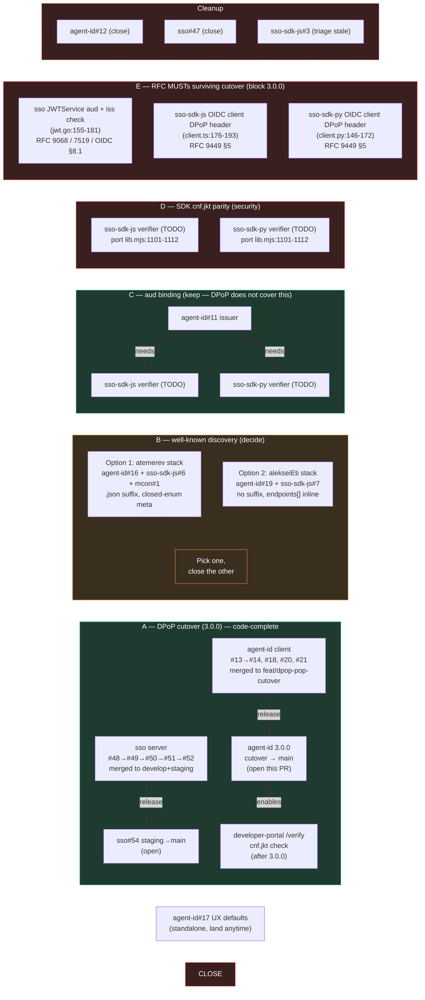

# Cross-repo PR review plan

Snapshot: 2026-05-07. Repos audited: `agent-id`, `sso`, `sso-sdk-js`, `sso-sdk-py`, `mcon`, `developer-portal`, `developer-portal-backend`.

## TL;DR

- **Workstream A (DPoP cutover): code-complete, not yet released.** All server + client + audit follow-ups merged. Only step left is `agent-id`: open PR `feat/dpop-pop-cutover` → `main` and cut **3.0.0**. SSO shipped through `develop` → `staging` (PR `sso#54`).
- **Workstream B (well-known discovery): two competing implementations across three repos. Pick one.** Both target the same Snyk W011 prompt-injection class but disagree on path, schema, and meta-tag format. Pre-existing duplicates carried over from before the DPoP work.
- **Workstream C (`aud` binding): keep — DPoP does NOT cover this path.** DPoP applies to SSO's `/oauth/*` endpoints only (`sso/internal/router/router.go:168,196`). On the third-party `Authorization: AgentID …` path, `cnf.jkt` is statically enforced as a key anchor (`lib.mjs:1078`: `cnf.jkt == thumbprint(proof.agent.publicKeyPem)`) but no fresh per-request DPoP proof is demanded (`lib.mjs:1062`). The token has no `aud` today (`lib.mjs:1796`), so a malicious Service A can lift the header and replay it at Service B — DPoP doesn't stop this; the missing piece is per-request liveness or audience binding. `aud` is the cheaper of the two. Land `#11` + both SDK verifier companions as a coherent triple.
- **Workstream D (SDK `cnf.jkt` parity): security gap, port the local check before integrators ship 3.0.0.** The cutover closes the agent-id forgery PoC at the *local* `verifyProofChain` (`agent-id/skills/alien-agent-id/lib.mjs:1101–1112` — rejects id_tokens missing or with mismatched `cnf.jkt`). The **published SDK verifiers** — `sso-sdk-js/packages/agent-id/src/index.ts:222–269` and `sso-sdk-py/packages/agent-id/src/alien_sso_agent_id/verify.py` `verify_agent_token_with_owner` — verify id_token RS256 + hash + `sub` but **do not** check `cnf.jkt`. Resource servers depending on `@alien-id/sso-agent-id` or `alien_sso_agent_id` to authenticate AgentID tokens remain forgery-vulnerable on 3.0.0 traffic. ~8-line port per language; treat as the highest-priority post-cutover item.
- **Workstream E (RFC MUSTs that survive the cutover): block 3.0.0 announcement on these.** Per Codex 2026-05-07 review, even after A/C/D ship, three RFC MUSTs remain unmet — see appendix for the full compliance matrix and source citations. (1) Server-side `aud` enforcement in `JWTService.VerifyAccessToken` / `VerifyIDToken` (`sso/internal/service/jwt.go:155–181` passes no `jwt.WithAudience(...)`) violates RFC 9068 §4 + RFC 7519 §4.1.3 + OIDC Core §8.1 pairwise (`/oauth/userinfo` echoes `claims.Audience[0]` without comparing it — `oauth_userinfo.go:109–121`). (2) Workstream C's SDK `aud` companion must add `expectedAudience` to `VerifyOptions` and the result types — adding `aud` to `payloadFields` alone enables *signing*, not *enforcement*. (3) Published core SDK OIDC clients send no `DPoP` header on `/oauth/token` exchange (`sso-sdk-js/packages/core/src/client.ts:176–193`, Python mirror), violating RFC 9449 §5 client conformance.
- **Standalone:** `agent-id#17` UX defaults — small, no deps, land anytime.
- **Cleanup:** close `#12` and `sso#47` (key_fingerprint stopgap, superseded by DPoP). Triage `sso-sdk-js#3` (stale dep audit, 5 weeks idle).

## What changed since the 2026-05-06 snapshot

| PR | Then | Now |
|---|---|---|
| `agent-id#13`, `sso#48` (DPoP drafts) | "Close on successor approval" | **Merged** (rolled up into v2 successors) |
| `agent-id#14` DPoP client + chain verifier | "Workstream A" | **Merged** into `feat/dpop-pop-cutover` |
| `agent-id#18` setup-owner-session CLI | "Stacked on `#14`, fold in" | **Merged** into `feat/dpop-pop-cutover` (separately, not folded) |
| `agent-id#20` RFC §5 token_type discard + hermetic test env | (audit follow-up) | **Merged** — closes RFC 9449 §5 client-side gap |
| `agent-id#21` RFC §9 RS nonce challenge handling | (audit follow-up) | **Merged** — adds 401 + structured `WWW-Authenticate` parsing |
| `sso#49` DPoP server | "Workstream A — deploy first" | **Merged** into `feat/dpop-integration` |
| `sso#50` DPoP `/oauth/*` integration | (composite branch) | **Merged** to `develop` |
| `sso#51` typ comment + case-sensitive `htm` | (audit follow-up) | **Merged** to `develop` |
| `sso#52` test env bootstrap helper | (audit follow-up) | **Merged** to `develop` |
| `sso#53` `develop` → `staging` | — | **Merged** |
| `sso#54` `staging` → `main` | — | **Open** (release-track sync, low review burden) |
| `agent-id#19`, `sso-sdk-js#7` | (not yet open) | **Open** — competing well-known implementation alongside `#16`/`#6` |
| `mcon#1` | "Workstream B publisher" | **Open** (no change) |
| `sso-sdk-js` + `sso-sdk-py` agent-id verifiers | (uninspected in 2026-05-06) | **Forgery-vulnerable** — no `cnf.jkt` check; new Workstream D (this audit) |

## All open PRs + outstanding TODOs

| Repo | PR | What | Lane | Status |
|---|---|---|---|---|
| agent-id | — | `feat/dpop-pop-cutover` → `main` (3.0.0) | A — release | **Open this PR** |
| agent-id | [#11](https://github.com/alien-id/agent-id/pull/11) | `aud` claim in agent token (issuer) | C — keep | Land with SDK companions |
| agent-id | [#12](https://github.com/alien-id/agent-id/pull/12) | key_fingerprint client | abandoned | **Close** |
| agent-id | [#16](https://github.com/alien-id/agent-id/pull/16) | well-known consumer (atemerev: `.json`, closed-enum meta) | B — option 1 | **Pick one** |
| agent-id | [#17](https://github.com/alien-id/agent-id/pull/17) | UX defaults | standalone | Land |
| agent-id | [#19](https://github.com/alien-id/agent-id/pull/19) | well-known consumer (alekseiEti: no `.json`, endpoints[]) | B — option 2 | **Pick one** |
| sso | [#47](https://github.com/alien-id/sso/pull/47) | key_fingerprint server | abandoned | **Close** |
| sso | [#54](https://github.com/alien-id/sso/pull/54) | `staging` → `main` release sync | release-track | Land when DPoP is ready for prod |
| sso-sdk-js | [#3](https://github.com/alien-id/sso-sdk-js/pull/3) | dep audit bumps | stale | Triage |
| sso-sdk-js | [#6](https://github.com/alien-id/sso-sdk-js/pull/6) | well-known publisher (atemerev) | B — option 1 | **Pick one** |
| sso-sdk-js | [#7](https://github.com/alien-id/sso-sdk-js/pull/7) | well-known publisher (alekseiEti) | B — option 2 | **Pick one** |
| mcon | [#1](https://github.com/alien-id/mcon/pull/1) | well-known publisher (atemerev) | B — option 1 | Pairs with `#16`+`#6` |
| sso-sdk-js | TODO | `aud` in `verifyAgentToken` `payloadFields` + `expectedAudience` in `VerifyOptions` + result type (`packages/agent-id/src/index.ts:100–109`, `types.ts:27–37`) | C companion | Open with `#11`. Codex 2026-05-07: signing alone is insufficient — verifier MUST enforce per RFC 7519 §4.1.3 |
| sso-sdk-py | TODO | `aud` in `verify_agent_token` `payload_fields` + `expected_audience` in `VerifyOptions` + result type (`packages/agent-id/src/alien_sso_agent_id/verify.py:102–110`, `types.py:26–45`) | C companion | Open with `#11`. Same rationale as JS row |
| sso-sdk-js | TODO | `cnf.jkt` enforcement in `verifyAgentTokenWithOwner` (`packages/agent-id/src/index.ts:222–269`) | **D — security** | Port from `lib.mjs:1101–1112`. Land with or before 3.0.0 SDK companion |
| sso-sdk-py | TODO | `cnf.jkt` enforcement in `verify_agent_token_with_owner` (`packages/agent-id/src/alien_sso_agent_id/verify.py`) | **D — security** | Port from `lib.mjs:1101–1112`. Land with or before 3.0.0 SDK companion |
| sso | TODO | `JWTService.VerifyAccessToken/VerifyIDToken` MUST validate `aud` (and `iss`) (`sso/internal/service/jwt.go:155–181`) | **E — RFC 9068 / 7519 / OIDC §8.1** | Pass `jwt.WithAudience(self_audience)` and an issuer check. `/oauth/userinfo` (`oauth_userinfo.go:109–121`) currently echoes `aud` without comparison. Block 3.0.0 announcement |
| sso-sdk-js | TODO | Send `DPoP` proof header on `/oauth/token` exchange (`packages/core/src/client.ts:176–193`) | **E — RFC 9449 §5** | OIDC SPA path currently sends no proof — non-conformant DPoP client |
| sso-sdk-py | TODO | Same — Python core OIDC client (`packages/core/src/alien_sso/client.py:146–172`) | **E — RFC 9449 §5** | Mirror of JS |
| developer-portal | TODO | `/verify` page H1 fix + `cnf.jkt` check | A follow-up | Open after 3.0.0 |
| sso-sdk-js | Future | DPoP RS verifier (`@alien-id/sso/server` subpath, `verifyDPoPRequest`) | future | Server-side acceptance of SSO-issued DPoP-bound access tokens. Must check `aud == providerAddress` and `cnf.jkt == thumbprint(proof.jwk)`. Not on agent-id critical path |
| sso-sdk-py | Future | DPoP RS verifier (`alien_sso.server`, `verify_dpop_request`) | future | Mirror of JS. Same `aud` + `cnf.jkt` requirements |
| sso-sdk-js | Future | Legacy SSO AT verifier (`verifyLegacySsoAccessToken`) | future | EdDSA Ed25519 path. Pick legacy key from `/oauth/jwks` by `kid`, verify signature, check `exp`. Used by miniapps. Pure addition; client-side OIDC path untouched |
| sso-sdk-py | Future | Legacy SSO AT verifier (`verify_legacy_sso_access_token`) | future | Mirror of JS |
| sso | TODO | Unify legacy `aud` to `providerAddress` in `access_token.go:117–121` | hygiene | Today the web flow sets `aud = session.AuthorizationCode` (one-time random); miniapp flow already sets `aud = providerAddress`. Inconsistency is latent foot-gun. Verifier change unnecessary — session-based provider check at `access_token.go:289` already gives equivalent guarantee. Note: legacy SDK verifier (Future row) cannot make `aud` mandatory until this lands |

## Layout



## Workstream B — pick one

The two stacks are **not interchangeable**; they make different tradeoffs:

| Dimension | Option 1 (atemerev) | Option 2 (alekseiEti) |
|---|---|---|
| Path | `/.well-known/alien-agent-id.json` | `/.well-known/alien-agent-id` |
| Meta tag | `<meta name="alien-agent-id" content="v1">` (closed enum, no URL, no prose) | Hoisted `AGENT_HINT` const, kept on `data-agent-id` of `SignInButton` |
| Schema | `{version, auth: {header, scheme}, api: {base, specUrl?}, service?}` | `{version, auth_endpoint, header_name, api_base_url, endpoints?}` |
| Endpoint discovery | Pointer (`api.specUrl` → OpenAPI) | Inline `endpoints[]` (≤100, validated path/method/auth) |
| W011 prompt-injection mitigation | **Strongest** — drops `data-agent-id` and prose meta entirely | Partial — keeps a string attribute on a button |
| Coverage | 3 repos coherent (`agent-id#16` + `sso-sdk-js#6` + `mcon#1`) | 2 repos (`agent-id#19` + `sso-sdk-js#7`); no `mcon` companion |
| Same-authority rule | Stricter ("same authority", no PSL dependency) | Same-registrable-domain (relies on PSL) |
| Body cap | 8 KiB | 64 KiB |
| Tests | 50 cases / 11 suites in `test-well-known-manifest.mjs` | 39 cases in `test-discover.mjs` |

**Recommendation:** Option 1, with one carve-out — if you want endpoints inline (the `endpoints[]` ergonomics from Option 2 are a real win for agents that don't fetch OpenAPI), bolt that field onto Option 1's schema as a pre-merge amendment to `agent-id#16` rather than swallow Option 2's looser meta-tag posture. Option 1's whole point is closing W011; Option 2 only closes it halfway.

If the maintainer prefers Option 2 (e.g. for the `endpoints[]` shape alone), then the `data-agent-id`/`AGENT_HINT` retention needs a separate hardening pass before merging.

## Review order

1. **`agent-id` 3.0.0 release** — open `feat/dpop-pop-cutover` → `main`. Body: short changelog (RFC 9449 cutover, RFC 7800 cnf binding, breaking changes). Wait for `sso` to clear `staging`/`main` (PR `#54`) before announcing. Release notes MUST flag the SDK parity gap (Workstream D) so integrators know not to pin a verifier that's still missing the check.
2. **`sso#54`** — release-track sync `staging` → `main`. Trivial review; just confirms what's already on `develop`+`staging`.
3. **Workstream D pair (security)** — `cnf.jkt` enforcement in `@alien-id/sso-agent-id` and `alien_sso_agent_id`. Port `lib.mjs:1101–1112` verbatim into `verifyAgentTokenWithOwner` / `verify_agent_token_with_owner`. Land same week as 3.0.0 release; until they ship, the published forgery PoC reproduces against any third-party server using these verifiers.
4. **Workstream E (RFC compliance, blocks 3.0.0 announcement)** — three RFC MUSTs surviving the cutover. (a) `JWTService.VerifyAccessToken` / `VerifyIDToken` MUST validate `aud` (RFC 9068, RFC 7519, OIDC §8.1 pairwise) and `iss` — pass `jwt.WithAudience(...)` and verify the issuer matches `s.Issuer`. (b) `@alien-id/sso` and `alien_sso` OIDC core clients MUST send a `DPoP` proof header on `/oauth/token` exchange (RFC 9449 §5) — currently they don't. (c) Workstream C must also expose `expectedAudience` in `VerifyOptions` (already merged into the C row). Items (a) and (b) are independent of the cutover and do not require it as a prerequisite — open them in parallel.
5. **Workstream C triple** — `agent-id#11` + JS verifier companion + Py verifier companion. Land together (or with verifier-tolerant grace period). Closes cross-service replay on the third-party AgentID auth-header path.
6. **Workstream B decision** — review `#16`/`#19` side-by-side, agree on the path/schema, then close the loser stack across all three repos.
7. **`agent-id#17`** — small, no deps. Land.
8. **Cleanup PRs** — close `#12`, `sso#47`, ping `sso-sdk-js#3`.
9. **`developer-portal /verify` follow-up** — re-anchor `verifyProof` binding-signature to `proof.agent.publicKeyPem`, add `cnf.jkt == thumbprint(proof.agent.publicKeyPem)`. Open after agent-id 3.0.0 ships and dev-portal can pin to `@alien-id/sso-agent-id ≥ 3.0` *with* Workstream D landed. Same-class fix as D, different consumer.
10. **(Future) DPoP RS verifier in core SDKs** — `@alien-id/sso/server` + `alien_sso.server`. Server-side `verifyDPoPRequest` for resource servers that want to consume SSO-issued DPoP-bound access tokens directly (not via the AgentID envelope). Port from `sso/internal/service/dpop_verifier.go`. Concrete signatures + placement decided — see appendix. Not on agent-id critical path; schedule when an integrator actually needs it.

## Cross-cutting notes

- **DPoP cutover has zero rollback channel by design.** SSO must reach `main` (PR `sso#54`) before agent-id 3.0.0 starts hitting prod, because the new client strictly rejects responses without `token_type=DPoP` (RFC 9449 §5). Order: `sso#54` → agent-id `feat/dpop-pop-cutover` → `main` → tag/release.
- **`#11` (`aud`) and DPoP do NOT overlap on the third-party API surface.** DPoP applies only to SSO's `/oauth/*` endpoints (token issuance, refresh) where SSO requires a fresh `htu`-bound proof per request. On the `Authorization: AgentID …` auth-header path, `cnf.jkt` *is* enforced statically — the verifier at `agent-id/skills/alien-agent-id/lib.mjs:1078` requires `cnf.jkt == thumbprint(proof.agent.publicKeyPem)` to pass — but no fresh DPoP proof is demanded on the inbound request (`lib.mjs:1062`). The token also carries no `aud` (`lib.mjs:1796`). The combination means a malicious Service A can lift the header and replay it at Service B: the static anchor still matches, no liveness proof is checked, no audience rejects. Closing this needs either per-request DPoP on the third-party path *or* `aud` binding; `aud` is cheaper and is what `#11` delivers. Treat `#11` + JS/Py verifier companions as a single triple to land together. SSO server has no role — it never sees the auth-header agent token, and its own OIDC/JWT tokens already carry `aud` (`sso/internal/service/jwt.go:102,132`).
- **`developer-portal-backend` open PRs (`#61`, `#67`) are unrelated** to any of this and don't verify agent tokens. Excluded from this plan.
- **`agent-id#13` and `sso#48` already merged** (rolled up into `#14` / `#49` v2 successors); previous plan called for closing them on successor approval, but the successors carried them along.
- **The local `verifyProofChain` and the published SDK verifier are NOT at parity on `cnf.jkt`.** The cutover closes the agent-id forgery PoC at `agent-id/skills/alien-agent-id/lib.mjs:1101–1112` (local CLI's `verifyProofChain`). It does NOT close it at the published SDK verifiers — `sso-sdk-js/packages/agent-id/src/index.ts:222–269` and the Python port. The PoC's exploit (substitute attacker's Ed25519 keypair across the binding payload + proof bundle while reusing a stolen `id_token` verbatim) fails on the local verifier because step 9 catches the mismatch between the stolen token's `cnf.jkt` and the attacker's pubkey thumbprint; on the published SDK verifier there is no step 9, so it still passes. Until Workstream D lands, any third-party resource server that depends on `@alien-id/sso-agent-id` or `alien_sso_agent_id` to authenticate AgentID tokens remains forgery-vulnerable on 3.0.0 traffic. Same-class issue as the developer-portal `/verify` follow-up — both are "consumer-side `cnf.jkt` checks the cutover did not auto-propagate."
- **DPoP support in the core SDKs is decoupled from the agent-id critical path.** The agent-id auth-header (`Authorization: AgentID …`) and the OIDC DPoP scheme (`Authorization: DPoP …` + `DPoP` proof header) are different surfaces. agent-id doesn't need DPoP RS verification in `@alien-id/sso` / `alien_sso` to function; that work is for resource servers that want to skip the AgentID envelope and accept SSO-issued DPoP-bound access tokens directly. Tracked as "Future" in the TODOs table; not blocking 3.0.0.
- **Backend `cnf.jkt` enforcement is correct; backend `aud` enforcement is a MUST violation (upgraded by Codex 2026-05-07 review).** `/oauth/token` (`oauth_token.go:155–174`) and `/oauth/userinfo` (`oauth_userinfo.go:87–107`) hand DPoP proofs to `DPoPVerifier` and reject if `proof.thumbprint != claims.Cnf.Jkt` — RFC 9449 binding is enforced. **However**, `JWTService.VerifyAccessToken` / `VerifyIDToken` (`jwt.go:155–192`) only validate signature + temporal claims; `golang-jwt/v5` does not check `aud` unless `WithAudience(...)` is passed, and SSO doesn't pass it. `oauth_userinfo.go:109–113` echoes `claims.Audience[0]` back without verifying it. Initial reading: "defensible federation-readiness gap." Codex correction: this is a **MUST violation under RFC 9068 §4 + RFC 7519 §4.1.3 + OIDC Core §8.1 pairwise**. Pairwise-`sub` semantics (a single human appears as different `sub` values to different providers) collapse without `aud` enforcement — accepting a wrong-`aud` token mixes pairwise namespaces across providers, which is an identity-isolation failure, not a federation-readiness nicety. Promoted from "Optional" to **Workstream E** in the TODOs table; blocks 3.0.0 announcement.
- **Legacy SSO `aud` is inconsistent at issuance and unchecked at verification, but equivalent guarantee comes from a session-based provider check.** Two issuance paths: `/sso/access_token/exchange` (web) sets `aud = session.AuthorizationCode` (a one-time random — semantically meaningless, `access_token.go:117–121`); `/sso/authorize-miniapp` sets `aud = providerAddress` correctly (`authorize_miniapp.go:116–120`). Verify (`access_token.go:151–322`) does NOT check `payload.Audience`; instead `sessionData.ProviderAddress.Hex() == provider.AccountAddress.Hex()` (`access_token.go:289`) confirms the session was authorized for the calling provider via chain-side lookup. Equivalent guarantee in normal operation. Recommended fix: unify legacy `aud = providerAddress` across both flows; do NOT add an `aud` check in the verifier (the session check is stronger). Tracked as "TODO hygiene".
- **The SDK does not currently support legacy SSO at all.** Grepped both `sso-sdk-js/packages/core/src/` and `sso-sdk-py/packages/core/src/`: zero references to `/sso/`, `/access_token`, `legacy`, or `miniapp`. Whatever consumes legacy ATs (miniapps and other clients) calls those endpoints directly without an SDK helper. Adding `verifyLegacySsoAccessToken` (EdDSA Ed25519, picks legacy key from `/oauth/jwks` by `kid`) is purely additive — the client-side OIDC SPA path is untouched. Tracked as "Future".

## Appendix — SDK API surface, versioning, and compliance matrix (Codex 2026-05-07 review)

### Placement decisions

- **JS DPoP RS verifier:** new subpath export `@alien-id/sso/server` on the existing `@alien-id/sso` package (additive — package today exports only `"."` per `sso-sdk-js/packages/core/package.json:2-17`). Folding into `@alien-id/sso-agent-id` is wrong semantically — that package is scoped to AgentID envelope verification (`sso-sdk-js/packages/agent-id/package.json:2-23`).
- **Python DPoP RS verifier:** new submodule `alien_sso.server` inside the `alien-sso` core package. Pre-1.0 (`sso-sdk-py/packages/core/pyproject.toml:1-4`), so additive submodule is easy.
- **Legacy SSO AT verifier (EdDSA):** **same package, separate function.** `@alien-id/sso/server` exports `verifyLegacySsoAccessToken(...)` alongside `verifyDPoPRequest(...)`; Python mirror at `alien_sso.server.verify_legacy_sso_access_token(...)`. Must be a separate function — legacy tokens are `Alg: "EdDSA"` / `Typ: "JWT"` with no DPoP proof path (`sso/internal/service/jwt.go:237-260`, `sso/internal/handler/access_token.go:202-209`). Caveat: legacy `aud` is unreliable until the issuance inconsistency is resolved (`access_token.go:117-121` vs `authorize_miniapp.go:116-120`); the legacy verifier cannot make `aud` mandatory until that lands.

### `audience` is mandatory, not optional

For both `verifyDPoPRequest` and `verifyAgentTokenWithOwner`:

- RFC 9068 §4: RS "MUST validate" `aud`.
- RFC 7519 §4.1.3: principal not identified by `aud` "MUST reject" the JWT.
- OIDC Core §8.1 (pairwise `subject_type`): `sub` is per-(user, provider). Skipping `aud` collapses pairwise namespaces — an identity-isolation failure, not a federation nicety.

Therefore the SDKs **MUST** throw at construction / verification time if the caller does not pass `expectedAudience` (`audience` in JS, `expected_audience` in Python). No silent default. No "warn and continue."

### TypeScript signature for `verifyDPoPRequest`

```ts
export interface VerifyDPoPRequestInput {
  method: string;
  url: string | URL;
  authorization?: string | null;
  dpopProof?: string | null;
}

export interface VerifyDPoPRequestOptions {
  audience: string; // MANDATORY — throw if empty (RFC 9068 MUST; pairwise-sub isolation)
  issuer?: string;
  jwksResolver: (args: { issuer: string; kid?: string }) => Promise<{ keys: JWK[] }>;
  consumeJti?: (args: {
    jti: string;
    iat: number;
    jkt: string;
    expiresAt: number;
  }) => Promise<"fresh" | "replay">;
  noncePolicy?: {
    required?: boolean;
    expectedNonce?: string;
    issueNonce?: () => Promise<string> | string;
  };
  clockSkewSec?: number; // default 5
  acceptedAlgs?: readonly string[]; // default ["EdDSA"]
}

export interface VerifyDPoPRequestSuccess<ATClaims = Record<string, unknown>> {
  ok: true;
  accessToken: string;
  accessTokenClaims: ATClaims;
  dpopClaims: { htm: string; htu: string; iat: number; jti: string; ath: string; nonce?: string };
  proofJkt: string;
  tokenJkt: string;
}

export interface DPoPChallenge {
  status: 401;
  scheme: "DPoP" | "Bearer";
  error: "invalid_token" | "use_dpop_nonce";
  errorDescription?: string;
  dpopNonce?: string;
  algs?: readonly string[];
  headers: Record<string, string>; // pre-built WWW-Authenticate and DPoP-Nonce headers
}

export type VerifyDPoPRequestResult<ATClaims = Record<string, unknown>> =
  | VerifyDPoPRequestSuccess<ATClaims>
  | { ok: false; challenge: DPoPChallenge };

export async function verifyDPoPRequest<ATClaims = Record<string, unknown>>(
  input: VerifyDPoPRequestInput,
  options: VerifyDPoPRequestOptions,
): Promise<VerifyDPoPRequestResult<ATClaims>>;
```

The `challenge.headers` map carries pre-built `WWW-Authenticate` (RFC 9449 §7.1) and optional `DPoP-Nonce` (§9) strings. Callers attach them to their own response objects — no framework coupling.

### Python signature for `verify_dpop_request`

```python
from typing import Any, Awaitable, Callable, Literal, Mapping, TypedDict

class VerifyDPoPRequestInput(TypedDict, total=False):
    method: str
    url: str
    authorization: str | None
    dpop_proof: str | None

class VerifyDPoPRequestOptions(TypedDict):
    audience: str          # MANDATORY — raise ValueError if empty
    issuer: str | None
    jwks_resolver: Callable[[str, str | None], Awaitable[Mapping[str, Any]]]
    consume_jti: Callable[[str, int, str, int], Awaitable[Literal["fresh", "replay"]]]
    nonce_policy: Mapping[str, Any] | None
    clock_skew_sec: int    # default 5
    accepted_algs: tuple[str, ...]  # default ("EdDSA",)

class DPoPChallenge(TypedDict):
    status: int            # 401
    scheme: Literal["DPoP", "Bearer"]
    error: Literal["invalid_token", "use_dpop_nonce"]
    error_description: str | None
    dpop_nonce: str | None
    algs: tuple[str, ...] | None
    headers: dict[str, str]  # pre-built WWW-Authenticate and DPoP-Nonce

async def verify_dpop_request(
    input: VerifyDPoPRequestInput,
    options: VerifyDPoPRequestOptions,
) -> dict[str, Any]:
    """Returns either {"ok": True, "access_token_claims": ..., "dpop_claims": ...,
                       "proof_jkt": ..., "token_jkt": ...}
       or {"ok": False, "challenge": DPoPChallenge}."""
```

`async def` matches the existing core package async posture (`sso-sdk-py/packages/core/src/alien_sso/client.py:65-76`, `116-176`).

### Versioning

| Package | Current | Bump | Rationale |
|---|---|---|---|
| `@alien-id/sso-agent-id` | `1.0.2` (`sso-sdk-js/packages/agent-id/package.json:2-4`) | **`2.0.0`** | `cnf.jkt` enforcement (Workstream D) rejects pre-cutover tokens — breaking by definition |
| `@alien-id/sso` | `1.0.33` (`sso-sdk-js/packages/core/package.json:2-17`) | **`1.1.0`** | `./server` subpath is purely additive. Keep mandatory `audience` on the new API surface only — retrofitting it onto an existing export would be breaking and require `2.0.0` |
| `alien-sso` (Python core) | `0.1.0` (`sso-sdk-py/packages/core/pyproject.toml:1-4`) | **`0.2.0`** | Pre-1.0, additive submodule |
| `alien-sso-agent-id` (Python) | (current) | **`2.0.0`** | Same as JS — `cnf.jkt` enforcement is breaking |

### Compliance matrix

| Standard | Status | Note | Citation |
|---|---|---|---|
| RFC 9449 §4.3 — proof JWT structure | PARTIAL | SSO server checks all required proof fields; published JS/Py core SDKs expose no RS verifier surface | `sso/internal/service/dpop_verifier.go:113-220`; `sso-sdk-js/packages/core/src/index.ts:1-2` |
| RFC 9449 §5 — `token_type=DPoP` | PARTIAL — **MUST violation on SDK clients** | SSO issues DPoP-bound tokens; local agent-id client enforces `token_type`; published core SDK clients send no `DPoP` header and accept any `token_type` | `agent-id/skills/alien-agent-id/lib.mjs:731-739`; `sso-sdk-js/packages/core/src/client.ts:176-193` |
| RFC 9449 §7.1 — RS request verification | PARTIAL | `/oauth/userinfo` enforces DPoP proof and emits `WWW-Authenticate`; deliberate deviation: "wrong scheme" and "no token" share the same challenge path | `sso/internal/handler/oauth_userinfo.go:68-106` |
| RFC 9449 §9 — RS nonce challenge | PARTIAL (no MUST violation) | Local agent-id client parses and retries `use_dpop_nonce`; SSO RS never emits §9 nonce challenges; RS nonces are optional, so end-to-end support is incomplete but not non-conformant | `agent-id/skills/alien-agent-id/lib.mjs:803-858`; `sso/internal/handler/oauth_userinfo.go:139-147` |
| RFC 7800 `cnf` claim | PARTIAL — **MUST violation in SDK verifiers** | SSO issues `cnf.jkt`; local verifier enforces it; published JS/Py AgentID verifiers never inspect `cnf` | `sso/internal/service/jwt.go:119-120`; `sso-sdk-js/packages/agent-id/src/index.ts:266-310` |
| RFC 9068 JWT-AT `aud` MUST | NON-COMPLIANT — **MUST violation on backend** | SSO mints `aud`; `JWTService.VerifyAccessToken()` passes no `WithAudience`; `userinfo` echoes `aud` without comparison | `sso/internal/service/jwt.go:155-161`; `sso/internal/handler/oauth_userinfo.go:109-121` |
| RFC 7519 `aud`/`iss`/`sub` | PARTIAL — **MUST violation on `aud`** | `sub` checked in AgentID chain; `aud` checked in OIDC client helpers; server-side JWT verification never requires `aud` or `iss` | `sso-sdk-js/packages/core/src/client.ts:307-310`; `sso/internal/service/jwt.go:155-181` |
| OIDC Core §8.1 pairwise subject | PARTIAL — **MUST violation** | SSO mints pairwise `sub` + `aud`; OIDC clients reject wrong `aud`; but `JWTService` does not enforce `aud`, and AgentID verifiers have no `aud` option — accepting a wrong-`aud` token collapses pairwise namespaces | `sso/internal/service/jwt.go:136-140`, `155-181`; `sso-sdk-js/packages/agent-id/src/types.ts:27-37` |

### MUST violations that survive A/C/D and require Workstream E

1. **RFC 9068 + RFC 7519 `aud` MUST on the server side** — `JWTService.VerifyAccessToken()` and `VerifyIDToken()` pass no `WithAudience`. Independent of the cutover; fix in the Go server.
2. **OIDC Core §8.1 pairwise** — follows from #1; any path skipping `aud` validation collapses pairwise namespaces and breaks per-provider identity isolation.
3. **RFC 9449 §5 client conformance** — published core SDK OIDC clients still don't send a `DPoP` proof header during `/oauth/token` exchange; remain non-conformant DPoP clients until the core client is updated.
